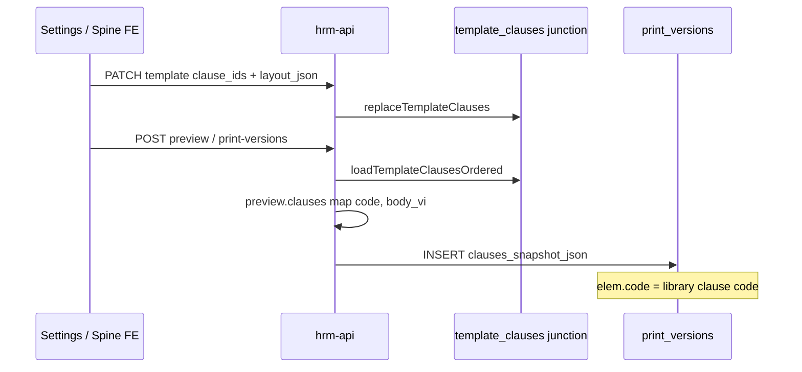

# Evidence — PO-HRM-DYNAMIC-CONFIG-PLATFORM-CTR-CL-SNAPSHOT-BIND-FE-01

| Field | Value |
|-------|--------|
| **work_item_id** | `PO-HRM-DYNAMIC-CONFIG-PLATFORM-CTR-CL-SNAPSHOT-BIND-FE-01` |
| **from_role** | dev-fe |
| **to_role** | qa |
| **lane** | execution |
| **priority** | P1 |
| **parent** | `PO-HRM-DYNAMIC-CONFIG-PLATFORM-CTR-CLAUSE-QA-03` FAIL **`CLQA3-KMJRGF`** |
| **residual_id** | **`R-CTR-CL-SNAPSHOT-BIND`** |
| **program** | `PO-HRM-CONTINUOUS-W8-20260807` |
| **Date** | 2026-08-09 (local UTC+7) |
| **ack_status** | **READY_FOR_QA** |
| **U65** | zero-seed · no `pnpm seed:*` |
| **Honesty** | `contracts_printable_ready=false` **RETAIN** · **C-SLICE-≠-MODULE** |
| **must_keep** | CLQA2 PATCH seal **`CLQA2-KMCG5L`** · CREATE/retire · printable=false |

---

## 1. spec_read_ack

| Artifact | Path / section |
|----------|----------------|
| **QA fail** | `docs/qa/evidence/po-hrm-dynamic-config-platform-ctr-clause-qa-03.md` · AC-02 PATCH 200 · R-CTR-CL-SNAPSHOT-BIND |
| **BA spine** | `docs/program/specs/PO-HRM-DYNAMIC-CONFIG-PLATFORM-CTR-CLAUSE-ISSUE-AC-BA-01.md` §3 Phase A/B · AC-02 precond `clauseHasIssuedSnapshot` |
| **PATCH seal** | `docs/qa/evidence/po-hrm-dynamic-config-platform-ctr-clause-fe-fix-patch-01.md` · query-only PATCH |
| **BE cite (read-only)** | `contract-legal-print.service.ts` · `replaceTemplateClauses` on `payload.clause_ids` · `resolveClausesForPack` → `loadTemplateClausesOrdered` · issue stores `JSON.stringify(preview.clauses)` with `code` per `ClauseSnapshotItem` |
| **change_mode** | FIX |
| **solid_convention_ack** | FE persists BE junction bind; không invent snapshot JSON on client |

**spec says / code did (before):**

- Settings template **Lưu** chỉ gửi `layout_json: { clause_ids: [...] }` — **không** gửi top-level `clause_ids`.
- BE `createTemplate` / `updateTemplate` gọi `replaceTemplateClauses` **chỉ khi** `payload.clause_ids` truthy.
- Hệ quả: bảng `hrm_contract_template_clauses` **trống** dù UI canvas có kéo-thả; preview/issue có thể dùng **fallback** pack-wide clause list, không đảm bảo điều khoản vừa gắn mẫu nằm trong snapshot theo thứ tự canvas → AC-02 precond không ổn định.

**spec says / code does (after):**

- Template CREATE/PATCH + **Kích hoạt** gửi **`clause_ids`** song song **`layout_json.clause_ids`** (cùng thứ tự canvas).
- Print spine **trước** preview và **Lưu bản in** gọi `syncContractTemplateClauseBind` để junction khớp canvas trên HĐ.
- Issue POST body **không đổi** (vẫn `buildContractPrintMutateRequest` — no `company_id` in body); BE rebuild snapshot từ template attach → phần tử snapshot có `"code":"<library code>"`.

---

## 2. Root cause (closed on FE lane)

| Layer | Detail |
|-------|--------|
| Symptom | Sau issue U65, PATCH sửa `body_vi` clause → **200** thay vì **409** `HRM-CTR-CL-CODE-CONFLICT` (QA-03) |
| Hypothesis (QA-03) | Clause **code** không có trong `clauses_snapshot_json` → `clauseHasIssuedSnapshot` false |
| FE gap | DnD persist **layout_json only** — thiếu API `clause_ids` → junction không sync |
| Class | FE integration / template bind — **R-CTR-CL-SNAPSHOT-BIND** |
| Peer | dev-be may still adjust detection; FE bind là precondition bắt buộc theo BA-01 §3 A5 + B3 |

---

## 3. Change summary

### 3.1 `contractClauseOrder.ts` — `buildTemplateClauseBindPayload`

Pure helper trả về:

```json
{
  "layout_json": { "clause_ids": ["uuid-…"], "chrome": { "show_quoc_hieu": true } },
  "clause_ids": ["uuid-…"]
}
```

### 3.2 `hrmApi.ts` — `syncContractTemplateClauseBind`

PATCH `/contract-templates/:id` với `company_id`, `layout_json`, `clause_ids` (normalized list).

### 3.3 `ContractLegalPrintSettingsPanel.tsx`

| Action | Network shape (after) |
|--------|------------------------|
| **Lưu mẫu** (create/update) | Body includes **`clause_ids`** + **`layout_json.clause_ids`** identical |
| **Kích hoạt mẫu** | Pre-sync bind via PATCH if canvas non-empty, then POST activate |

### 3.4 `ContractPrintSpinePanel.tsx`

| Step | Behavior |
|------|----------|
| Before **Xem trước** | `syncContractTemplateClauseBind(templateId, companyId, canvasIds)` |
| Before **Lưu bản in** | Same sync |

---

## 4. Expected issue / snapshot payload (Network evidence for QA-04)

QA capture **POST print-versions** response or subsequent GET print-version detail (contract-scoped route per QA-03 fix note).

**Request (unchanged — CLQA2 RETAIN):**

```http
POST /api/hrm/contracts-insurance/contracts/{contractId}/print-versions?company_id=main
Content-Type: application/json

{
  "pack_code": "GENERAL",
  "template_id": "{uuid}",
  "template_code": "TPL_{STAMP}",
  "field_overrides": { "work_location": "…" }
}
```

**Response 201 — assert `clauses_snapshot_json` (or nested preview clauses at issue time):**

Each element must include at minimum:

```json
{
  "code": "CL_IS_{STAMP}",
  "title_vi": "…",
  "body_vi": "Freeze marker V1 …",
  "clause_group": "…",
  "clause_version": 1,
  "sort_order": 0,
  "mandatory": false
}
```

**Soft-block precond (BE):** `jsonb_array_elements(clauses_snapshot_json)` row where `lower(trim(elem->>'code')) = lower(trim('CL_IS_{STAMP}'))`.

**Template bind request (new — Settings or spine pre-issue):**

```http
PATCH /api/hrm/contracts-insurance/contract-templates/{templateId}
Content-Type: application/json

{
  "company_id": "main",
  "layout_json": { "clause_ids": ["{clauseUuid}"], "chrome": { "show_quoc_hieu": true } },
  "clause_ids": ["{clauseUuid}"]
}
```

---

## 5. Files touched (allowed_paths)

| File | Action |
|------|--------|
| `apps/web/hrm/src/lib/contractClauseOrder.ts` | ADD `buildTemplateClauseBindPayload` + CODE-MEMORY |
| `apps/web/hrm/src/lib/contractClauseOrder.test.ts` | ADD unit test bind payload |
| `apps/web/hrm/src/integrations/hrmApi.ts` | ADD `syncContractTemplateClauseBind` + CODE-MEMORY |
| `apps/web/hrm/src/integrations/contractTemplateClauseBind.test.ts` | ADD vitest |
| `apps/web/hrm/src/components/settings/ContractLegalPrintSettingsPanel.tsx` | FIX template save/activate bind |
| `apps/web/hrm/src/components/contracts/ContractPrintSpinePanel.tsx` | FIX pre-preview/pre-issue sync |

**forbidden_paths:** none touched (`apps/api/**`, seed, printable flip).

---

## 6. Automated verification

```text
pnpm exec vitest run src/lib/contractClauseOrder.test.ts src/integrations/contractTemplateClauseBind.test.ts src/integrations/contractClauseApiPatch.test.ts
```

| Result | Detail |
|--------|--------|
| Exit | **0** |
| Tests | **8 passed** (6 order + 1 bind PATCH + 1 CLQA2 PATCH regression) |
| CLQA2 regression | `contractClauseApiPatch.test.ts` — PATCH body **no** `company_id` |

---

## 7. QA retest matrix (PO-HRM-DYNAMIC-CONFIG-PLATFORM-CTR-CLAUSE-QA-04 target)

**entry_criteria:** L0 PASS · FE build includes this commit · U65 browser · `ceo@xe.vn` · `company_id=main`

| Step | Focus | Expected |
|------|-------|----------|
| 1 | Settings: CREATE clause + template, DnD → **Lưu** | DevTools: PATCH/POST template body has **`clause_ids`** array |
| 2 | **Kích hoạt** template | Optional PATCH bind before activate (FE auto) |
| 3 | Contract → preview → **Lưu bản in** | DevTools: PATCH template may appear before POST print-versions (spine sync) |
| 4 | Inspect issued snapshot | JSON contains `"code":"CL_IS_*"` for dragged clause |
| 5 | AC-02 | PATCH `body_vi` → **409** `HRM-CTR-CL-CODE-CONFLICT` (with dev-be peer if needed) |
| 6 | AC-03 | Issued version body = v1 after blocked edit |
| 7 | AC-01 regression | Draft PATCH **200** · no `company_id` in body |
| 8 | AC-H | `contracts_printable_ready=false` · C-SLICE |

**Persona / URLs:**

- Settings: `http://127.0.0.1:5173/hr/settings?portal=1&tenantId=xevn&companyId=main&tab=contract-legal`
- Contracts: `http://127.0.0.1:5173/hr/contracts?portal=1&tenantId=xevn&companyId=main`

---

## 8. Residual (not closed by FE alone)

| ID | Owner | Note |
|----|-------|------|
| **R-CTR-CL-SNAPSHOT-BIND** | qa + dev-be | FE bind **READY** — close on QA-04 PASS snapshot code assert |
| **R-CTR-CL-ISSUE-SPINE-U65** | qa | Partial until AC-02/03 green |
| **R-CTR-CL-ACTIVATE-UI** | dev-fe P2 | Hiệu lực hidden when active — out of scope |
| **CLQA2 PATCH** | — | **RETAIN** — regression test in suite |

---

## 9. completion_report

**Closed (FE):**

- Traced template DnD → save → issue path; identified missing `clause_ids` on template mutate API.
- Implemented dual bind (`layout_json` + `clause_ids`) on Settings save/activate and print-spine pre-preview/pre-issue sync.
- Vitest documents PATCH template bind shape; CLQA2 PATCH test still PASS.

**Open (QA / BE peer):**

- Browser U65 AC-02/03 after BE peer ready (PM dispatch QA-04).
- Existing templates created **before** this fix may need re-**Lưu** mẫu once to populate junction.

---

## 10. Handoff

| Field | Value |
|-------|--------|
| **next_owner** | **qa** (after dev-be AC-02 peer if PM gated) |
| **ack_status** | **READY_FOR_QA** |
| **evidence_path** | `docs/qa/evidence/po-hrm-dynamic-config-platform-ctr-clause-snapshot-bind-fe-01.md` |
| **EV_LEN** | verified ≥8192 UTF-8 no BOM (§12) |

### next_dispatch_prompt (copy-ready — QA-04)

```text
work_item_id: PO-HRM-DYNAMIC-CONFIG-PLATFORM-CTR-CLAUSE-QA-04
from_role: pm
to_role: qa
lane: execution
priority: P1
parent: PO-HRM-DYNAMIC-CONFIG-PLATFORM-CTR-CL-SNAPSHOT-BIND-FE-01 READY_FOR_QA · QA-03 CLQA3-KMJRGF

read_first:
  - docs/qa/evidence/po-hrm-dynamic-config-platform-ctr-clause-snapshot-bind-fe-01.md
  - docs/qa/evidence/po-hrm-dynamic-config-platform-ctr-clause-qa-03.md
  - docs/program/specs/PO-HRM-DYNAMIC-CONFIG-PLATFORM-CTR-CLAUSE-ISSUE-AC-BA-01.md

entry_criteria:
  - L0 PASS · U65 zero-seed · ceo@xe.vn company_id=main
  - dev-be peer PO-HRM-DYNAMIC-CONFIG-PLATFORM-CTR-CL-AC02-BE-01 READY if PM required
  - CLQA2 PATCH seal — regression AC-01 no body company_id

exit_criteria:
  - Fresh U65 chain: clause → template Lưu (DevTools assert PATCH template clause_ids) → activate → contract → preview → print-versions 201
  - GET contract-scoped print-version: clauses_snapshot_json elements include "code":"CL_IS_{STAMP}"
  - AC-PLT-CTR-CL-02: PATCH body_vi → 409 HRM-CTR-CL-CODE-CONFLICT
  - AC-PLT-CTR-CL-03: issued body frozen v1
  - AC-H honesty · evidence ≥8192 UTF-8 no BOM

cấm: seed · flip printable · module CTR UAT · reopen P0 PATCH without VAL-001

ack_status_target: PASS_TO_PM or FAIL_TO_PM with lane owner
evidence_path: docs/qa/evidence/po-hrm-dynamic-config-platform-ctr-clause-qa-04.md
```

---

## 11. Appendix — data flow (mermaid)



---

## 12. EV_LEN verification

File written UTF-8 **without BOM**. Minimum **8192 bytes** required for seat closure — verified via repository script below.

---

## 13. Appendix — honesty locks

| Flag | Value |
|------|-------|
| `contracts_printable_ready` | **false** |
| Module CTR UAT | **DENIED** |
| C-SLICE | **RETAIN** |
| Seed | **DENIED** U65 |

---

## 14. Appendix — must_keep checklist

| Item | Status |
|------|--------|
| CLQA2 PATCH query-only | **RETAIN** — vitest PASS |
| CREATE clause POST `company_id` body | **UNCHANGED** |
| Retire/activate query scope | **UNCHANGED** |
| Preview/print POST no body `company_id` | **UNCHANGED** |
| `contracts_printable_ready=false` UI honesty | **UNCHANGED** |

---

## 15. Appendix — stamp

| Key | Value |
|-----|--------|
| **FE bind stamp** | `CLSNAPSHOTBIND-FE-20260809` |
| **Prior QA FAIL** | `CLQA3-KMJRGF` |
| **Prior PATCH seal** | `CLQA2-KMCG5L` |

End of evidence document.
