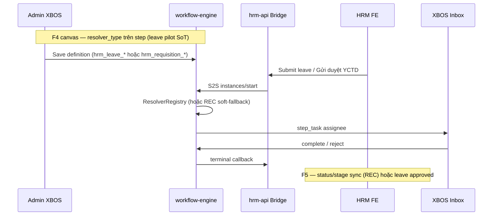

# SA-HRM-SETTINGS-REC-WF-01 — Sponsor answers (governance)

| Field | Value |
|-------|--------|
| **work_item_id** | `SA-HRM-SETTINGS-REC-WF-01` |
| **from_role** | `sa` |
| **to_role** | `pm` |
| **lane** | governance |
| **date** | 2026-07-23 |
| **change_mode** | ADD (docs only) |
| **cấm** | `apps/**` · seed · deploy · Phase1/PROD claim |
| **ADR** | `docs/decisions/ADR-HRM-SETTINGS-SOT-REC-WF-COMPANY-20260723.md` |
| **TechSpec** | `docs/hrm/TECHSPEC.md` §18 |
| **ack_status** | **PASS_TO_PM** |

---

## Executive summary (4 câu sponsor)

| # | Câu hỏi | Trả lời ngắn (evidence-backed) |
|---|---------|--------------------------------|
| **1** | QT tuyển dụng HRM đã **ăn theo từng công ty** chưa? | **Một phần — chưa đủ SoT «1 QT / công ty».** Spawn + callback theo entity/`company_id` **có**; lọc `applyingEntityId` (group vs member) **có**; nhưng definition lookup = `tenant_id` + `workflow_code` (không partition `company_id`). Demo/QC thường để **Toàn tập đoàn**. To-be = ADR Option B (**planned**). |
| **2** | Linh hoạt Bay.vn/Luxury (chức danh / cấp trên / song song) — đã sửa chưa? | **Đã bắt đầu sửa, chưa đủ parity.** ADR F4 Accepted; `ResolverRegistry` + leave pilot GWC (`direct_manager`); canvas REC có soft `position_template` / `parallel_group`. **Gap:** F4 **C-03** live leave position/parallel còn mở; REC spawn **soft-fallback `GROUP_APPROVER`** khi resolve fail — **không** claim benchmark DONE. |
| **3** | Settings master-data SoT XBOS vs HRM CRUD? | **XBOS = SoT master tập đoàn** (`DANH_MUC` §1). HRM = pull snapshot + **extension** (không SoT mã master mới). Sponsor Settings CRUD + filter/search = **To-be UX trên snapshot/extension** (Option S3) — **chưa** FR SRS đủ; **cấm** HRM fork SoT độc lập. |
| **4** | Tham chiếu luồng khách? | Delta `CUSTOMER_DEMO_HRM_DELTA_20260620.md` **§4 F4** (WF động, pilot nghỉ) + **§6 F6** (JD library/dashboard — khác REC-WF bridge). ADR F4 leave · ADR REC-WF bridge Option A · program F4/F6 **QC GWC**. |

**Verdict product:** **NOT DONE** · **NOT** Bay.vn UI copy · **NOT** Phase1/PROD.

---

## 1) REC-WF — theo từng công ty? (spec says / code does)

### Spec says

| Artifact | Claim |
|----------|--------|
| BA delta REC-WF | QT định nghĩa trên **XBOS**; spawn từ HRM; scope Group CEO rollup + filter ĐVTV |
| Bridge ADR | Option A HRM spawn; reuse F4 resolver; must_keep UF-HRM-12 / F6 |
| Apply-scope CODE-MEMORY | Empty/`holding`/`main` = **group-wide**; member UUID/slug = bound; **Group CEO holding spawn vẫn OK** khi member-bound |

### Code does (read-only)

| Check | Evidence |
|-------|----------|
| Lookup active def | `findActiveDefinitionByCode(tenantId, workflowCode)` — **không** filter `company_id` row |
| Apply filter | `definitionAppliesToSpawnScope` + graph `applyingEntityId` |
| HRM spawn | `RecruitmentWorkflowBridge` → S2S start; company slug/holding normalize |
| QC canvas | `qc-bm-j-rec-wf-01-canvas-01-20260722.md` — applying scope left **Toàn tập đoàn** (must_keep spawn) |
| Member spawn | `BM-BE-REC-WF-SPAWN-MEMBER-01` jest + bus — member apply không chặn Group CEO |

**Kết luận Q1:** «Ăn theo công ty» ở mức **spawn scope + applyingEntity filter** = **có**. «Mỗi công ty một quy trình graph riêng làm SoT» = **chưa** (planned ADR Option B).

---

## 2) Linh hoạt resolver (Bay.vn/Luxury mức) — team đã sửa?

### Spec says

| Artifact | Claim |
|----------|--------|
| Delta §4 F4 | Benchmark = mức automation (chức danh, cấp trên, song song) — **không** copy UI |
| ADR F4 §1.3 | Consumer pilot = **`hrm_leave_approval`** — **not recruit** |
| Program | F4 QC **GWC**; **C-03** live leave position/parallel **còn mở**; F6 GWC riêng |

### Code does

| Layer | As-is | Gap vs benchmark |
|-------|-------|------------------|
| XBOS `ResolverRegistry` | 5 `resolver_type` + jest AC-CD-F4-02..04 | Live leave position/parallel U65 chưa đóng C-03 |
| Leave bridge | Spawn + manager resolve TEXT company_id | Pilot GWC AC-CD-F4-01/02; picker/create residuals riêng |
| REC spawn | Cùng registry; **soft fallback** `GROUP_APPROVER` on resolve fail | Fail-closed escalate như leave = **planned R2** |
| Canvas | REC presets + BM-03 soft resolver select | Không = full Bay.vn parity |

**Kết luận Q2:** Team **đã** implement registry + leave pilot + REC canvas soft types. **Còn gap** rõ — **không** nói «đã xong theo góp ý khách».

### Benchmark map (flexibility only)

| Luxury/Bay.vn (ý khách) | XeVN contract | Status |
|-------------------------|---------------|--------|
| Phê duyệt theo chức danh | `position_template` | Engine+UI soft; live leave **OPEN** |
| Cấp trên trực tiếp | `direct_manager` | Leave pilot **GWC**; REC reuse |
| Song song | `parallel_group` all/any | Jest+canvas; live leave **OPEN** |
| Copy UI / data model ngoài | — | **Out of scope** |

---

## 3) Settings master-data — kiến trúc SoT

| Layer | Owner | As-is | To-be (sponsor Settings) |
|-------|-------|-------|--------------------------|
| Master tập đoàn (chức danh, loại nghỉ, vị trí chuẩn, TD §37–42) | **XBOS** | `DANH_MUC` §1; sync → HRM | Giữ SoT |
| Snapshot HRM | HRM | `GET settings-catalogs` + `sync-from-xbos` | Giữ |
| Extension / request | HRM | overlay + governance WF | Giữ policy |
| Settings CRUD + filter/search picker | — | Gap SRS / orphan program | **S3:** UX CRUD trên L1/L2a; write = extension hoặc XBOS theo scope — **không** fork SoT |

**TechSpec §14.8:** mutate master tập đoàn **cấm** tại HRM — khớp Option S1/S3.

---

## 4) Tham chiếu luồng khách (delta + ADR)



| Luồng khách | Delta / ADR | Consumer |
|-------------|-------------|----------|
| WF động | §4 F4 · ADR-WORKFLOW-RESOLVER-DYNAMIC | **Leave** pilot |
| JD + dashboard TD | §6 F6 · CD-FB-09 | Recruitment CRUD/funnel |
| Bridge QT TD | BA delta + ADR REC-WF bridge | Plan / requisition / candidate pipeline |

---

## As-is / To-be / Gap / Owner

| Topic | As-is | To-be | Gap | Owner wave |
|-------|-------|-------|-----|------------|
| REC-WF per company | Group-wide def + applyingEntity filter; spawn by entity company | Option B: resolve active def by `workflow_code` × company partition | No 1-def-per-company SoT | BA AC → (sau sponsor) **dev-be** |
| Resolver linh hoạt | Registry; leave DM GWC; REC soft-fallback | R2 fail-closed + close F4 C-03 | C-03 + REC fallback | BA promote §16.2 → **qa** then **dev** |
| Settings master | XBOS SoT + HRM pull/extension | Settings CRUD UX + filter/search; no free-text SoT | FR/AC SRS thiếu | **ba-process** + **ba-data** |
| F6 JD/dashboard | QC GWC CD-FB-09 | Keep; không đè | Confirm SRS khách | ba-docs optional |
| Bay.vn UI | Out of scope | Out of scope | — | — |

---

## Evidence index (read)

| Path | Role |
|------|------|
| `docs/program/HRM_SRS_ORPHAN_SETTINGS_RECWF_PROGRAM.md` | Wave charter |
| `docs/program/deltas/CUSTOMER_DEMO_HRM_DELTA_20260620.md` §4 §6 | Khách F4/F6 |
| `docs/decisions/ADR-WORKFLOW-RESOLVER-DYNAMIC-20260620.md` | Pilot leave |
| `docs/decisions/ADR-XBOS-HRM-RECRUITMENT-WORKFLOW-BRIDGE.md` | REC Option A |
| `docs/decisions/ADR-HRM-SETTINGS-SOT-REC-WF-COMPANY-20260723.md` | **This wave ADR** |
| `docs/program/P1-CUSTOMER-DEMO-HRM-FEEDBACK-PROGRAM.md` | F4/F6/CD-FB-09 status |
| `docs/qa/evidence/xhrm-rec-wf-qc-01-20260719.md` | REC submit GWC early |
| `docs/qa/evidence/qc-bm-j-rec-wf-01-canvas-01-20260722.md` | Canvas + group-wide apply |
| `docs/qa/evidence/cd-fb-07-wf-dynamic-qc-20260719.md` | F4 leave GWC |
| `apps/api/xbos-api/.../workflow-apply-scope.ts` | applyingEntity semantics |
| `apps/api/xbos-api/.../workflow-engine.service.ts` `findActiveDefinitionByCode` | No company partition |
| `apps/api/hrm-api/.../recruitment-workflow.bridge.ts` | Spawn Option A |
| `apps/api/hrm-api/.../leave-workflow.bridge.ts` | F4 leave pattern |
| `docs/hrm/DANH_MUC_XBOS_CHO_HRM.md` §1 | Catalog ownership |

---

## Completion contract

**completion_report:** Closed SA governance `SA-HRM-SETTINGS-REC-WF-01`. Answered 4 sponsor questions with code/docs evidence. ADD ADR Settings SoT (S1/S3) + REC-WF Option B planned + resolver R2 planned. TechSpec §18 pointer. **No** `apps/**`. **No** product DONE / Bay.vn parity claim.

**Residuals (governance — not Dev):**

1. BA promote SRS: Settings CRUD + filter/search; REC-WF per-company AC (Option B).
2. BA-D catalog_key matrix.
3. Execution Dev **chỉ sau** sponsor — fail-closed REC + def×company.

**next_owner:** `pm` → `ba-process` (primary)

**next_dispatch_prompt:**

```text
work_item_id: BA-HRM-ORPHAN-TO-SRS-01
from_role: pm
to_role: ba-process
lane: governance
entry_criteria: SA PASS_TO_PM docs/qa/evidence/sa-hrm-settings-rec-wf-01-20260723.md · ADR-HRM-SETTINGS-SOT-REC-WF-COMPANY-20260723 Accepted · program HRM_SRS_ORPHAN_SETTINGS_RECWF_PROGRAM.md
exit_criteria: (1) ADD-only SRS team (+ khách pointer nếu cần) FR/BR/AC cho Settings master CRUD + filter/search picker (cấm free-text SoT); (2) ADD AC REC-WF binding per company_id = ADR Option B To-be (không claim code DONE); (3) cite F4 pilot leave vs REC planned R2; (4) evidence docs/qa/evidence/ba-hrm-orphan-to-srs-01-YYYYMMDD.md; ack_status PASS_TO_PM
spec_ref: DANH_MUC §1 · TECHSPEC §14.8 §18 · delta F4/F6 · ADR-HRM-SETTINGS-SOT-REC-WF-COMPANY-20260723 · orphan ORPHAN_BUSINESS_VS_SRS_SIMPLE.md
cấm: apps/** · seed · deploy · Dev dispatch · Phase1/PROD
parallel_optional: BA-HRM-SETTINGS-MASTER-DATA-01 (ba-data) field→catalog_key matrix cùng ngày
```

**evidence_path:** `docs/qa/evidence/sa-hrm-settings-rec-wf-01-20260723.md`

**ack_status:** **PASS_TO_PM**
