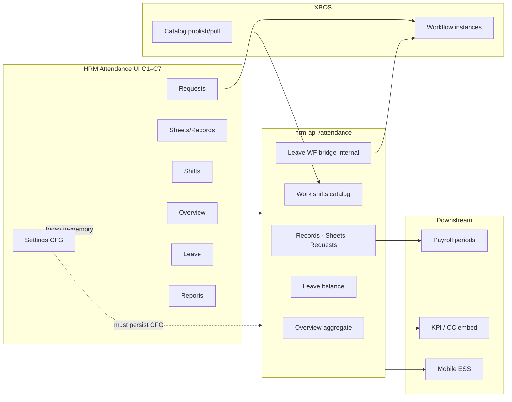

# HRM Attendance — Enterprise API × UI Map (U87 / M1)

| Meta | Value |
|------|--------|
| **work_item_id** | `PO-MFD-M1-ATT-ENTERPRISE-API-01` |
| **Owner** | SA (governance) |
| **Date** | 2026-08-04 |
| **Pilot path** | Command Center → HRM embed → `/hr/attendance` |
| **UI SoT** | `apps/web/hrm/src/pages/Attendance.tsx` |
| **API SoT (AS-BUILT)** | `apps/api/hrm-api/src/attendance/attendance.controller.ts` (+ `leave-workflow.controller.ts`) |
| **Spec SoT (depth)** | `docs/hrm/SRS.md` · `docs/hrm/TECHSPEC.md` §12.1 · §14.4–14.5 |
| **Client stub spec** | `docs/brand-new-documents-20270801/API_CONTRACT_VN.md` · `TECH_SPEC_VN.md` — **high-level only → SPEC_GAP vs Nest** |
| **Mindmap** | `HRM_CUSTOMER_CAPABILITY_MINDMAP.md` — Chấm công: IN giải trình/chốt · PARTIAL GPS/phân ca · GĐ2 FaceID/roster |
| **DOC-DELTA** | `PO-MFD-M2-ATT-CFG-DOC-01` — C7/G-CFG-RULES align ADR + M1 CFG GWC; retire in-memory/`cfgNotPersisted` · `uat_done: false` |

---

## 0. Executive — why Attendance is an enterprise spine

Attendance is not a standalone HR screen. For XeVN (holding + member companies, XBOS catalog governance, payroll batches, KPI ops):

| Downstream | What Attendance must supply | If Attendance is stub/mock |
|------------|----------------------------|----------------------------|
| **Payroll** | Paid days, OT hours, late/early, column aggregates on `attendance_sheets` / `attendance_records` | Wrong gross/net; locked period disputes |
| **Leave** | Approved leave reduces workdays; balance before submit; WF terminal updates status | Double booking, negative balance, inbox drift |
| **OT / cost** | Approved OT requests → payroll coefficients | OT cost invisible or manual Excel |
| **KPI / Command Center** | Overview rates, department rollups | CC dashboards lie while HTTP 200 |
| **WF (XBOS)** | Leave spawn + terminal callback; manager resolver | ESS approve without audit trail |
| **Mobile ESS** | Same BR as portal: check-in, update-request, scope headers | 409 scope / fake GPS (DOMAIN §4.3) |
| **Catalog (XBOS→HRM)** | Work shift codes, leave types (REF) — not hardcoded FE | Multi-entity payroll misclassification |

**Architecture invariant (GĐ1):** TXN flows use Nest `hrm-api` under `/api/hrm/attendance/*` with JWT scope; CFG must persist (company rules, geofence, OT factors); RPT reads TXN+CFG — never SoT.

---

## 1. Cluster map C1–C7

Legend — **recommend:** `BUILD` (new BE/FE) · `WIRE` (API exists, connect/harden FE) · `SPEC_GAP` (BA/contract delta) · `GĐ2-HOLD` (mindmap OUT / sponsor GĐ2)

| Cluster | UI surfaces (Attendance.tsx) | Primary data class |
|---------|------------------------------|-------------------|
| **C1** | Tab Overview, KPI cards, charts, «Chấm công ngay» CTA | RPT + TXN read |
| **C2** | Tab Chấm công: clock-in hub · sheets · records · weekly · summary* | TXN + sheet header |
| **C3** | Tab Ca: list · schedule* · overtime* | REF (work_shifts) · CFG schedule GĐ2 |
| **C4** | Tab Đơn từ: 9 request types | TXN + WF |
| **C5** | Tab Nghỉ phép (LeaveTab shell) | TXN leave + balance |
| **C6** | Tab Báo cáo (`AttendanceReportsTab`) | RPT (client aggregate) |
| **C7** | Tab Cài đặt: 9 sidebar + rules subtabs | CFG (+ REF columns) |

\* **summary** submenu sets same view as **records** (`attendanceViewMode=data`) — no dedicated summary API.

---

### C1 — Overview (`ATT-C1`)

| Field | Content |
|-------|---------|
| **enterprise_value** | Executive pulse for ops/KPI: headcount present/late/absent, trends, drill-down to fix payroll month-end. Links CC embed and manager actions (clock-in CTA). |
| **APIs exist** | `GET /attendance/overview` → `HRM-ATT-OVERVIEW-200` (`AttendanceOverviewService`) |
| **UI without API** | Time filter (`overviewTimeFilter`) is **local state only** — not passed to overview query (PARTIAL fidelity). |
| **API without UI** | — |
| **NFR** | **Scope:** query uses `resolveScopeContext` + company_id. **Idempotency:** read-only. **Audit:** overview is derived — audit belongs on underlying TXN mutations. |
| **Runtime (code)** | **PARTIAL** — hook `useAttendanceOverview` wired; filter semantics incomplete. |
| **OpenAPI / contract** | Detailed in `docs/hrm/TECHSPEC.md`; **missing** in `API_CONTRACT_VN.md` (3-line stub). |
| **uc_tc_map** | `HRM-AT-01`..`03` partial; overview-specific UC **UNMAPPED** in by-uc pack. |
| **recommend** | **WIRE** — pass period filter to API or document as display-only; **SPEC_GAP** — add overview F.1 to client API pack when ba-data syncs. |

---

### C2 — Sheets / records / weekly / clock-in (`ATT-C2`)

| Field | Content |
|-------|---------|
| **enterprise_value** | **Payroll SoT:** period sheet header + daily/hourly records = công chuẩn. **Leave/OT** consume grid columns. Empty honesty (AC-ATT-SHEET) prevents fake payroll closure. |
| **APIs exist** | `GET/POST/PATCH/DELETE /attendance/attendance-sheets` · `GET/POST /attendance/records` · `GET /attendance/records/:recordId` · `PATCH /attendance/records/:recordId/status` · `GET/POST/PATCH/DELETE /attendance/update-requests` (+ approve/reject/delete) |
| **UI without API** | Clock-in methods **FaceID** UI (panel) — mindmap **GĐ2**; no enterprise Face pipeline in GĐ1. **summary** label ≠ separate product surface. |
| **API without UI** | `GET /attendance/records/:recordId` — no FE deep-link by id (list-only). Update-request **PATCH** (edit draft) — verify tab wiring (likely partial). |
| **NFR** | **Scope:** records list/get use `toHrmListScopeContext`; update-request **mutates** use resolved `scope.companyId` (U78 fix). **Idempotency:** sheet create must reject duplicate period (BR-ATT-SHEET). **Audit:** status patch + update-request approve should log actor (verify service layer). |
| **Runtime** | **LIVE/PARTIAL** — sheets/records/weekly via hooks; clock-in via `CheckInOutWidget` → POST records; storm/reload fixes landed but QA must re-verify AC-ATT-SHEET-04/07. |
| **Scope parity flag** | List vs get-by-id both scoped — **OK** on records. Sheet CRUD uses query `company_id` — member portal must match JWT (test J-*). |
| **uc_tc_map** | `HRM-AT-01`..`06`, `HRM-AT-14` (sheet) — aligned in TECHSPEC §12.1. |
| **recommend** | **WIRE** — keep AC-ATT-SHEET QA as P0; **GĐ2-HOLD** FaceID surfaces; **BUILD** optional get-by-id for J-* deep link. |

---

### C3 — Shifts: list / schedule / overtime (`ATT-C3`)

| Field | Content |
|-------|---------|
| **enterprise_value** | **REF** work shift master drives roster, OT coefficients, payroll allocation. **Schedule/roster** = logistics-style staffing — mindmap PARTIAL/GĐ2. |
| **APIs exist** | `GET/POST/PATCH/DELETE /attendance/work-shifts` |
| **UI without API** | Submenus **schedule**, **overtime** only set `activeShiftType` — **same list UI** (no schedule/roster API). Office filter (`hanoi`/`hcm`) **hardcoded** — not REF from org units. |
| **API without UI** | — (shift CRUD wired on **list** only) |
| **NFR** | **Scope:** list resolves scope; **POST work-shifts** uses body only — verify company_id in DTO vs header (parity risk). **Idempotency:** unique (company, code). **Audit:** catalog mutations should emit platform audit (NFR baseline). |
| **Runtime** | **PARTIAL** — list CRUD LIVE via `useWorkShifts`; schedule/OT menu **STUB_UI**; infinite loop class fixed 2026-08-04 (hook deps). |
| **uc_tc_map** | Ca làm việc partially in `HRM-AT-07`/`08`; roster schedule **UNMAPPED**. |
| **recommend** | **WIRE** — P0 stabilize shifts tab + bulk delete QA; **GĐ2-HOLD** schedule/roster submenu until SRS+API; **SPEC_GAP** roster FR in mindmap PARTIAL row. |

---

### C4 — Requests (`ATT-C4`)

| Field | Content |
|-------|---------|
| **enterprise_value** | **WF + Payroll + Leave:** OT, business trip, late/early, attendance correction, shift change feed approved hours/days into payroll and KPI. |
| **APIs exist** | OT: `GET/POST …/overtime-requests` + approve/reject/delete · BT: `…/business-trip-requests` · LE: `…/late-early-requests` · SC: `…/shift-change-requests` · Update: see C2 |
| **UI without API** | **leave-summary**, **compensatory-summary**, **leave-plan** → reuse `LeaveTab` — no distinct aggregate APIs (PARTIAL product semantics). |
| **API without UI** | Internal: `GET /attendance/workflow-resolver/manager` · `POST /attendance/leave-workflow/terminal` (XBOS callback) — **by design** not portal UI. |
| **NFR** | **Scope gap (P0):** `leave-requests` approve/reject still pass `companyId ?? 'main'` from header — unlike update-request fix (U78). Member CEO/manager **409 risk**. OT create **no resolveScopeContext** on POST — body-only scope. **Idempotency:** double approve should 409. **Audit:** WF terminal callback required for leave final state. |
| **Runtime** | **LIVE** for wired tabs (`OvertimeRequestTab`, etc.); summary/plan menus **PARTIAL** (same Leave list). |
| **Mindmap** | OT module row **MISSING GĐ1** (whole module GĐ2 signal) — portal has OT requests anyway → **SPEC_GAP** vs mindmap, not “invent PASS”. |
| **uc_tc_map** | `HRM-AT-09`..`13` design coverage; compensatory/plan **UNMAPPED**. |
| **recommend** | **WIRE** P0 scope parity on leave/OT approve paths; **SPEC_GAP** OT GĐ1 scope in SRS vs UI; **BUILD** summary/plan read models or **GĐ2-HOLD** menus. |

---

### C5 — Leave tab in Attendance shell (`ATT-C5`)

| Field | Content |
|-------|---------|
| **enterprise_value** | Same as leave module: balance check, multi-step WF (L2 ladder **SPEC_GAP** BR-LEAVE-LADDER), payroll exclusion days. |
| **APIs exist** | `GET/POST /attendance/leave-requests` · approve/reject · `GET /attendance/leave-balance` |
| **UI without API** | **`leave-balance` not called from FE** (grep hrm web) — balance UX likely static or inferred (P0 enterprise gap). |
| **API without UI** | WF bridge (internal). |
| **NFR** | Leave create uses `resolveScopeContext` + submitter from JWT — good. Approve scope — see C4. Attach / sick ≥ N days — DOMAIN §4.2 traps. |
| **Runtime** | **PARTIAL** — list/create/approve wired; balance **BROKEN/PARTIAL** without API wire. |
| **uc_tc_map** | `HRM-AT-10` + leave UC; balance **`UNMAPPED`** in fidelity sense. |
| **recommend** | **WIRE** P0 `GET leave-balance` on LeaveTab create form; **SPEC_GAP** L2 ladder (existing SA note); QA U65 create→approve→F5. |

---

### C6 — Reports (`ATT-C6`)

| Field | Content |
|-------|---------|
| **enterprise_value** | Month-end HR/payroll reconciliation, export for finance — must match TXN, not Supabase/mock. |
| **APIs exist** | No dedicated `/attendance/reports/*` — **client aggregation** via `listAttendanceRecords`, `listEmployees`, `listLeaveRequests` (`useAttendanceReports`). |
| **UI without API** | Export dialog — verify POST export or client-only CSV (PARTIAL). |
| **API without UI** | Dedicated report endpoints in enterprise vendors — **GĐ2/BUILD** if performance requires server rollups. |
| **NFR** | **Scope:** uses `coerceHrmListCompanyId`. **Perf:** full-month fan-out bounded in hook — watch L0 at 1000+ NV. **Audit:** export action should log (future). |
| **Runtime** | **LIVE** aggregate — honest empty when no records. |
| **uc_tc_map** | `HRM-AT-04`/`05` adjacent; report UF **partial map**. |
| **recommend** | **WIRE** QA on export + large tenant; **BUILD** server-side report API only if perf gate fails — else keep RPT client class. |

---

### C7 — Settings (`ATT-C7`)

> **DOC-DELTA `PO-MFD-M2-ATT-CFG-DOC-01` (2026-08-04):** Rules Chung + work-sites admin persist **shipped** (ADR D2/D3 · M1 CFG GWC · commit `dc930c5` PATCH/POST 2xx). ~~in-memory / `cfgNotPersisted` / «API not shipped»~~ **SUPERSEDED**. Columns + D4 sidebars + tablet/proxy/auto still open. **`uat_done: false`.**

| Field | Content |
|-------|---------|
| **enterprise_value** | **CFG spine:** geofence, auto-checkout, rounding, standard days/month, OT rules, leave rules, request rules — wrong CFG → payroll systematic error across holding. |
| **APIs exist** | **`GET/PATCH /attendance/rules`** + **`GET/POST/PATCH/DELETE /attendance/work-sites`** (ADR D2/D3 · M1 CFG). Work shifts: see C3. Settings sidebar bulk (OT/leave-rules/…) **not** CFG SoT — ADR D4. |
| **UI without API** | Sidebar **employees, overtime, leave-rules, late-early, request-rules, users, roles, system** → honest stub / Settings pointer (ADR D4). Rules subtabs **tablet/proxy/auto** → stub. **Columns** table uses `getAttendanceColumnsData` — **i18n static**, not REF catalog. ~~Rules Save in-memory / `cfgNotPersisted`~~ **SUPERSEDED**. |
| **API without UI** | settings-catalogs for REF columns (XBOS pull); auto-checkout **duration job** GĐ2. |
| **NFR** | CFG **versioned per company** via `attendance_rules` row + audit timestamps; F5 must retain (GWC verified Chung). Holding override optional. |
| **Runtime** | **LIVE** (Rules→Chung persist path, GWC) + **STUB_UI** (D4 sidebars / tablet/proxy/auto) + **PARTIAL** (columns). |
| **Mindmap** | GPS PARTIAL→admin CRUD GWC; FaceID GĐ2 — banner OUT GĐ1. |
| **uc_tc_map** | **HRM-AT-14** covers CFG/sheets; D4 stubs remain UNMAPPED / HOLD. |
| **recommend** | **CLOSED** P0 rules+work-sites wire (M1 CFG GWC); columns P0-3 **ACCEPTED_AS_IS_P1** static i18n (`CFG-COLUMNS-01`); **GĐ2-HOLD** device/face/proxy + column mutate/REF-pull; keep D4 stubs honest. |

---

## 2. Cross-cutting architecture gaps

| ID | Gap | Severity | Owner lane |
|----|-----|----------|------------|
| **G-API-STUB** | `API_CONTRACT_VN.md` / `TECH_SPEC_VN.md` do not document Nest `/attendance/*` matrix (only generic check-in/out) | SPEC / QC | ba-data + sa |
| **G-SCOPE-LEAVE** | Leave/OT approve paths: header `companyId ?? 'main'` vs resolved scope (update-requests already fixed) | P0 | dev-be |
| **G-SCOPE-OT-POST** | `createOvertimeRequest` / some create handlers skip `resolveScopeContext` | P1 | dev-be |
| **G-CFG-RULES** | ~~Settings rules in-memory~~ → **CLOSED GWC** M1 CFG (PATCH rules 200 · ADR D2); residual columns/D4 stubs · DOC-01 retired `cfgNotPersisted` | P0→**closed slice** | — |
| **G-BALANCE** | `GET leave-balance` FE wire | P0→**closed wire** | see `PO-MFD-M2-ATT-WIRE-BALANCE-01` GWC |
| **G-MENU-STUB** | C3 schedule/OT, C7 sidebars, FaceID — menu fidelity false positive if only tab load tested | P0 QA | qa + dev-fe (hide or HOLD labels) |
| **G-OPENAPI** | No exported OpenAPI for hrm-api attendance module in client pack | P1 | sa + ba-data |
| **G-MINDMAP-OT** | Mindmap OT MISSING GĐ1 vs OT request UI live | SPEC_GAP | ba-process |
| **G-PARITY-GET** | `GET records/:id` unused — low priority deep link | P2 | dev-fe |

**Scope parity checklist (SA U19):** re-run `hrm-list-scope.spec.ts` + persona matrix after leave approve fix; block QC GO on open **G-SCOPE-LEAVE** for touched wave.

---

## 3. API inventory (AS-BUILT) — `/attendance` prefix

Base: `/api/hrm/attendance` (portal proxy). Methods below omit auth headers (`Authorization`, `x-tenant-id`, `x-company-id`).

| Method | Path | UI cluster | In API_CONTRACT_VN |
|--------|------|------------|--------------------|
| GET | `/overview` | C1 | No |
| GET/POST | `/records` | C2 | Partial (generic) |
| GET | `/records/:recordId` | C2 | No |
| PATCH | `/records/:recordId/status` | C2 | No |
| GET/POST/PATCH/DELETE | `/attendance-sheets` | C2 | No |
| GET/POST/PATCH/DELETE | `/update-requests` (+ approve/reject) | C2/C4 | No |
| GET/POST | `/leave-requests` (+ approve/reject) | C4/C5 | Partial (`/hrm/leave-requests` path mismatch) |
| GET | `/leave-balance` | C5 | No |
| GET/POST | `/overtime-requests` (+ approve/reject/delete) | C3/C4 | No |
| GET/POST | `/business-trip-requests` (+ …) | C4 | No |
| GET/POST | `/late-early-requests` (+ …) | C4 | No |
| GET/POST | `/shift-change-requests` (+ …) | C4 | No |
| GET/POST/PATCH/DELETE | `/work-shifts` | C3/C7 | No |
| GET | `/workflow-resolver/manager` | internal WF | No |
| POST | `/leave-workflow/terminal` | internal WF | No |

---

## 4. Mindmap alignment (Chấm công)

| Mindmap leaf | GĐ1 class | This map |
|--------------|-----------|----------|
| Giải trình & chốt công | IN | C2/C4 update-requests + sheets — **WIRE/BUILD** |
| GPS | PARTIAL | Clock-in GPS panel — LIVE UI, CFG geofence **STUB** (C7) |
| Phân ca & lịch | PARTIAL | Shifts list LIVE; **schedule STUB** |
| FaceID | GĐ2 | C2 clock-in panel — **GĐ2-HOLD** |

---

## 5. References

- Program: `docs/program/PO_MENU_FIDELITY_DEPTH_PROGRAM.md`
- Training §15: `docs/program/knowledge/PO_PM_SENIOR_TRAINING_PACK_20260804.md`
- Domain traps §4.3: `docs/program/knowledge/ENTERPRISE_HRM_XBOS_DOMAIN_NOTES_20260804.md`
- Design UC: `docs/qa/professional/by-uc/HRM-AT-01.md` … `HRM-AT-13.md`

---

*PO-MFD-M1-ATT-ENTERPRISE-API-01 · SA governance · no code · no seed · not Phase1 DONE*
