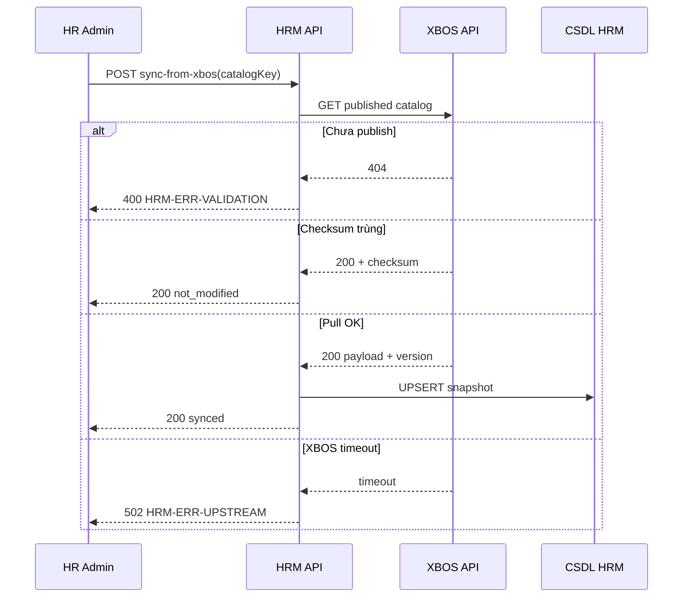

#### STT 257 — XBOS-DM-HRM-10: Đồng bộ danh mục xuống HRM

**Metadata (Thông tin chung):**

| Trường | Giá trị |
|---|---|
| STT | 257 |
| REQ-ID | REQ-SRS-M02-257 |
| ID | XBOS-DM-HRM-10 |
| Module | M02 — XBOS DANH MỤC HRM |
| Phân hệ / Lớp | XBOS → HRM |
| Nhóm nghiệp vụ | Đồng bộ danh mục |
| Mức ưu tiên | Cao |
| Trigger | Quản trị HRM kích hoạt pull sau publish XBOS |
| Phase | Phase 1 |
| Kênh | API / Web |
| API chính | `POST /api/hrm/settings-catalogs/sync-from-xbos` |

**Tác nhân chính:** Dịch vụ HRM (consumer)  
**Bên liên quan:** XBOS Catalog Governance; HR Admin (kích hoạt thủ công)  

**Điều kiện tiên quyết:**
- XBOS-DM-HRM-09 đã phát hành phiên bản catalog (`version`, `checksum`).
- HRM có `catalogKey` và quyền `settings-catalogs:sync`.
- UC-ECO-SCOPE-02: header `x-tenant-id`, `x-company-id` hợp lệ.

**Điều kiện sau khi thành công:**
- Bảng snapshot HRM cập nhật `checksum` khớp XBOS.
- UI Settings đọc từ bản sao local (không sửa khung chuẩn tập đoàn).

**Dữ liệu đầu vào và quy tắc kiểm tra:**

| Field | Type | Required | Validation rule |
|---|---|---|---|
| `Authorization` | string | Có | Bearer JWT HRM service account hoặc admin |
| `x-tenant-id` | string | Có | UUID tenant |
| `x-company-id` | string | Có | UUID company |
| `catalogKey` | string | Có | Khóa danh mục đã publish trên XBOS |
| `force` | boolean | Không | Bỏ qua so sánh checksum khi true |

**Dữ liệu đầu ra:**

- **Thành công:** `{ success: true, data: { version, checksum, itemCount, syncedAt } }`.
- **Side effect:** UPSERT snapshot + audit `catalog.sync.pull`.
- **Không đổi:** HTTP 200 `not_modified` khi checksum trùng.

**Luồng chính:**
1. HR Admin hoặc cron HRM gọi `POST /api/hrm/settings-catalogs/sync-from-xbos` với `catalogKey`.
2. HRM resolve tenant/company từ header (UC-ECO-SCOPE-02).
3. HRM gọi XBOS `GET /api/xbos/catalog-governance/.../published` (nội bộ).
4. So sánh `checksum` với snapshot local.
5. Nếu khác: ghi transaction snapshot + items.
6. Trả 200 kèm metadata phiên bản.

**Luồng thay thế / ngoại lệ:**
- **[A1]** Catalog chưa publish trên XBOS → 400 `HRM-ERR-VALIDATION`.
- **[A2]** Checksum trùng → 200 `not_modified`, không ghi DB.
- **[A3]** XBOS timeout → 502 `HRM-ERR-UPSTREAM`, giữ snapshot cũ.
- **[A4]** Sai tenant → 403 `HRM-ERR-FORBIDDEN`.
- **[A5]** Thiếu `catalogKey` → 400 `HRM-ERR-VALIDATION`.

**Ngoại lệ (hệ thống):**
- Retry XBOS tối đa 2 lần (exponential backoff 200ms, 500ms).
- Circuit breaker mở sau 5 lỗi liên tiếp — trả 503 tạm thời.

**Quy tắc nghiệp vụ:**

| ID | Điều kiện | Hành động |
|---|---|---|
| BR-CAT-01 | Khung chuẩn | Chỉ XBOS publish; HRM không sửa schema gốc |
| BR-CAT-03 | Pull | HRM chỉ pull phiên bản `PUBLISHED` |
| BR-ECO-SCOPE-02 | Mọi đọc/ghi | Filter tenant + company |

**Mã lỗi:**

| Code | HTTP | Message (VI) | Khi nào |
|---|---|---|---|
| HRM-ERR-VALIDATION | 400 | Thiếu hoặc sai catalogKey | DTO |
| HRM-ERR-FORBIDDEN | 403 | Không đủ quyền sync | RBAC |
| HRM-ERR-UPSTREAM | 502 | Không kết nối XBOS | Timeout XBOS |
| HRM-SYNC-001 | 502 | Đồng bộ thất bại | Payload lỗi từ XBOS |
| HRM-ERR-INTERNAL | 500 | Lỗi hệ thống | DB/exception |

**Sơ đồ tuần tự:**

**Tiêu chí nghiệm thu:**
- Sau publish XBOS, pull cập nhật đúng `version` và `checksum` trên HRM staging.
- Checksum trùng không ghi DB thừa.
- Hai tenant khác nhau không thấy snapshot chéo.
- Audit có `catalogKey`, `version`, `userId`, `x-request-id`.

**Kiểm chứng:** Kiểm thử đồng bộ danh mục sau publish XBOS · Demo pull trên Cổng HRM · Đối chiếu BRD — XeVN Ecosystem OS (danh mục).

---
