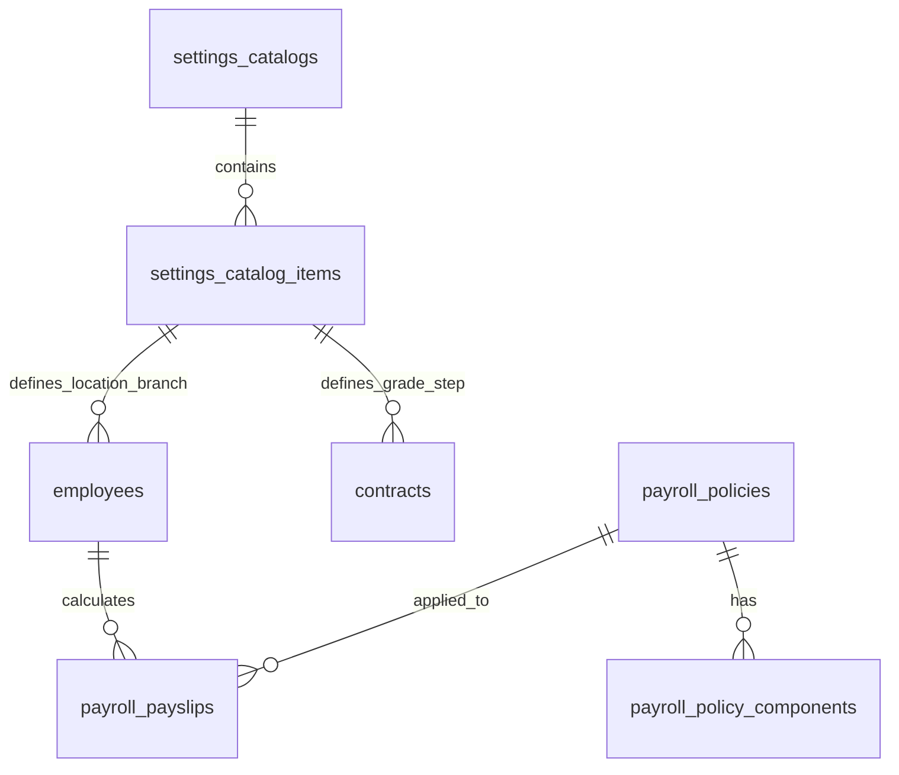

# DB_DESIGN: DATABASE SCHEMA FOR POLICY ELIGIBILITY & MASTER SETTINGS INTEGRATION

**Document Code:** XEVN-DB-DESIGN-HRM-POLICY-ELIGIBILITY-v1.0  
**Database:** PostgreSQL (`xevn_hrm`)  
**Status:** APPROVED  

---

## 1. ERD SCHEMA RELATIONS

## 2. CHI TIẾT CÁC BẢNG DỮ LIỆU

### 2.1 Bảng `settings_catalog_items` (Master Data Catalog Items)
- `id` (UUID, Primary Key)
- `catalog_code` (VARCHAR(64)) — e.g. `'locations'`, `'branches'`, `'job_titles'`, `'pay_steps'`
- `code` (VARCHAR(64), UNIQUE per catalog)
- `name` (VARCHAR(255))
- `params` (JSONB) — e.g. `{ "region_multiplier": 1.0, "base_allowance": 500000 }`
- `status` (VARCHAR(32)) — `'active'`, `'inactive'`

### 2.2 Bảng `payroll_policies` (Policy Configurations)
- `id` (UUID, Primary Key)
- `company_id` (VARCHAR(64))
- `pay_group_code` (VARCHAR(64)) — e.g. `'GRADE'`, `'LUONG'`, `'THUONG'`, `'STEP_PROG'`
- `name` (VARCHAR(255))
- `status` (VARCHAR(32)) — `'DRAFT'`, `'ACTIVE'`, `'INACTIVE'`
- `version` (INT)
- `scope` (VARCHAR(64)) — `'global'`, `'location'`, `'branch'`, `'department'`, `'position'`, `'individual'`
- `effective_from` (DATE)
- `effective_to` (DATE)

### 2.3 Bảng `payroll_policy_components` (Policy Details & Conditions)
- `id` (UUID, Primary Key)
- `policy_id` (UUID, Foreign Key -> `payroll_policies.id`)
- `component_type` (VARCHAR(64)) — e.g. `'step_only_table'`, `'grade_step_matrix'`, `'fixed_amount'`, `'formula_based'`
- `params` (JSONB) — Lưu trữ `{ conditions: [...], calculation_rules: {...}, steps: [...] }`
