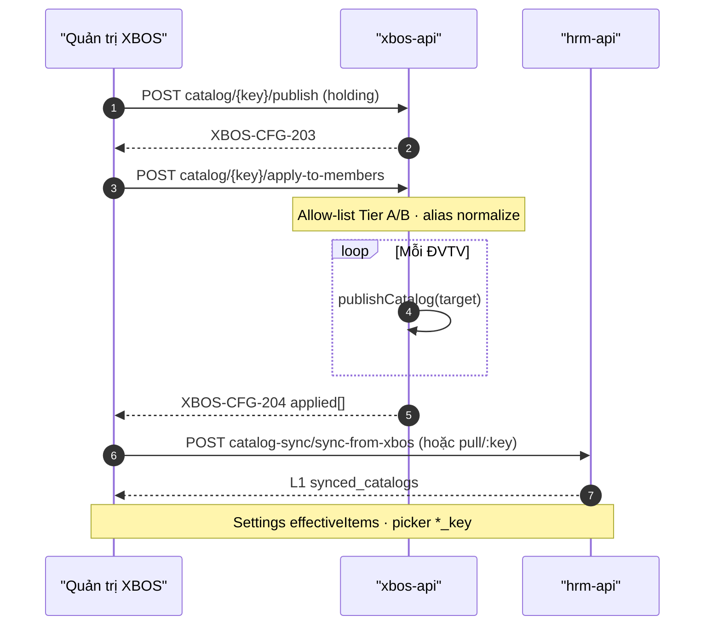

# API_DESIGN — XBOS apply-to-members expand (E-XBOS-CTRL-SPEC)

| Field | Value |
|-------|--------|
| **work_item_id** | `SA-ERP-XBOS-CTRL-SPEC-01` |
| **change_mode** | ADD · F.1 full for apply (supersedes CATALOG_GOV §8 F.1-lite cite for this op) |
| **ref_srs** | **XBOS-DM-HRM-07** copy library → member · G-BM-REC-01 · **PENDING_SYNTH** BA Diễn biến formal |
| **ref_techspec** | `docs/xbos/TECHSPEC_XBOS_APPLY_TO_MEMBERS_EXPAND.md` |
| **ref_db** | `docs/xbos/DB_DESIGN_XBOS_APPLY_TO_MEMBERS_EXPAND.md` |
| **parent_api** | `docs/xbos/API_DESIGN_XBOS_CATALOG_GOV.md` (publish/get/list must_keep) |
| **consumer_api** | `docs/hrm/API_DESIGN_HRM_SETTINGS_CATALOG.md` F/G · `API_DESIGN_HRM_SETTINGS_E1B.md` |
| **OpenAPI** | `docs/api/openapi/xbos-api.yaml` → `configSyncApplyCatalogToMembers` |
| **Runtime** | `ConfigSyncService.applyCatalogToMembers` |
| **Date** | 2026-07-28 |
| **Dev** | **HOLD** until sponsor chốt SPEC |

> **Envelope:** Nest `ok(data, code, message)`.  
> **U65:** cấm bootstrap/seed trong evidence nghiệm thu.  
> **No new URL** — expand allow-list + alias normalize + OpenAPI description only.

---

## 0. Common

| Item | Value |
|------|--------|
| Base | `/api/xbos/config-sync` |
| Auth | Bearer JWT and/or `x-internal-api-key` |
| Scope write | `resolveScopeContext` JWT∩body — mismatch **409** `SCOPE_CONTEXT_MISMATCH` |
| Scope group read | `main` → `holding` |
| Key normalize | `trim().toLowerCase()`; then alias → storage key; then allow-list check |

---

## 1. Endpoint — Apply catalog to members (F.1)

### Identity

| Item | Value |
|------|--------|
| Method / path | `POST /api/xbos/config-sync/catalog/{catalogKey}/apply-to-members` |
| operationId | `configSyncApplyCatalogToMembers` |
| Success | **200** · code **`XBOS-CFG-204`** |
| AS-IS allow-list | `job_titles` \| `recruitment_channels` \| `job_grades` |
| P0 / P1 target allow-list | BA §2.1–2.2 · TechSpec §2.1 (P0 min; P1 gated) |

### Mục đích

Cho phép quản trị tập đoàn **sao chép (fan-out)** một danh mục L0 đã publish tại phân vùng nguồn (thường holding) xuống **một hoặc nhiều phân vùng công ty thành viên**, để HRM tại từng ĐVTV có thể **pull** cùng mã chuẩn — thực hiện UC **XBOS-DM-HRM-07** / gap **G-BM-REC-01**, không thay thế publish một công ty.

### Nghiệp vụ xử lý

1. Normalize `{catalogKey}`; resolve alias → **canonical** for allow-list (`hr_decision_types` → `decision_types` per BA).
2. If canonical ∉ active phase allow-list (AS-IS today; **P0** after chốt; **P1** when unlocked) → **400** `XBOS-CFG-005` + `allowed[]`.
3. Resolve **write key** = source L0 header key actually loaded (SA-DEC-WRITE-01 — may remain `hr_decision_types` if that is the live source row).
4. Normalize source `tenantId` / `companyId` from body; resolve write scope (JWT∩body).
5. Build `targets[]` from `targets` and/or same-tenant `memberCompanyIds[]` — require ≥1 target (`XBOS-VAL-011/012`).
6. Load source preferring `hrm` assignment, else `xbos` (`XBOS-CFG-001` / `002`).
7. For each target: `publishCatalog` with **write key** (upsert; version/checksum/audit).
8. Return `{ applied: [{ tenantId, companyId, version, checksum }], … }` under `XBOS-CFG-204`.

**Does not:** start catalog-governance WF; write HRM `synced_catalogs`; replace BM positions API.

### Tham chiếu bước SRS

| UC / FR | Diễn biến (logical) | API role |
|---------|---------------------|----------|
| **FR-XBOS-CTRL-01** / **XBOS-DM-HRM-07** | BA Diễn biến #1–7 | **This endpoint** |
| **UC-XBOS-02/05** | Publish trước khi fan-out (precondition) | `POST …/publish` |
| **FR-XBOS-CTRL-02** / UC-HRM-06/08 | HRM đồng bộ sau fan-out | HRM catalog-sync (**consumer**) |
| **BR-HRM-MD-01** | Consumer dùng mã catalog | After pull — not this API |
| **G-BM-REC-01** | Gap BM apply xuống ĐVTV | Closed for **P0** keys after G1 Dev |

> SRS SoT: `docs/program/deltas/BA_ERP_XBOS_CTRL_SPEC_01_20260728.md` (landed).

### Request

**Path**

| Param | Rule |
|-------|------|
| `catalogKey` | Canonical or alias; final storage key ∈ allow-list |

**Body** (`ApplyCatalogToMembersBody`)

| Field | Required | Type | Notes |
|-------|----------|------|-------|
| `tenantId` | Yes | string | Source tenant |
| `companyId` | Yes | string | Source partition (typically `holding`) |
| `targets` | One of | `{ tenantId, companyId }[]` | Cross-tenant / explicit |
| `memberCompanyIds` | One of | `string[]` | Same-tenant shorthand → expand with source tenantId |
| `actor` | No | string | Audit actor; default `system` |

**P0 OpenAPI description lock (min after chốt):**

```text
Allow-list catalogKey (P0): job_titles, recruitment_channels, job_grades,
departments, leave_types.
```

**P1 OpenAPI description (when P1 unlocked):**

```text
Allow-list catalogKey (P1): P0 ∪ contract_types, employment_types, pay_types,
shifts, decision_types.
Alias path hr_decision_types → decision_types for allow-list; write key follows source L0.
```

### Response 200 `XBOS-CFG-204`

| Field | Maps DB |
|-------|---------|
| `applied[].tenantId` / `companyId` | Target partition |
| `applied[].version` | `config_catalogs.version` |
| `applied[].checksum` | Header checksum after publish |

### Errors

| Code | HTTP | When |
|------|------|------|
| `XBOS-CFG-005` | 400 | Key not allowed (Tier C / unknown) |
| `XBOS-VAL-011` / `012` | 400 | Targets missing / invalid |
| `XBOS-CFG-001` | 404 | Source catalog missing |
| `XBOS-AUTH-001` | 401 | Unauthorized |
| `SCOPE_CONTEXT_MISMATCH` | 409 | JWT∩scope |

### DTO ↔ DB

| API | DB |
|-----|-----|
| path storage key | `config_catalogs.catalog_key` |
| source/target tenant+company | `tenant_id`, `company_id` |
| items from source | `config_catalog_items` upsert on target |
| audit | `catalog_audit_logs` via publish |

---

## 2. Related endpoints (unchanged — cite)

| Method / path | Code | Role vs apply |
|---------------|------|----------------|
| `POST …/catalog/{key}/publish` | `XBOS-CFG-203` | Precondition / reused per target |
| `GET …/catalog/{key}?target=hrm` | `XBOS-CFG-201` | Source load / HRM pull upstream |
| `GET …/catalogs` | `XBOS-CFG-202` | List |
| HRM `POST …/catalog-sync/pull/:key` | Settings F | Consume after apply |
| HRM `POST …/sync-from-xbos` | Settings G | Bulk pull — **no new URL** |

---

## 3. Sequence (fan-out → HRM)



---

## 4. Auth / scope matrix

| Actor | Source | Targets | Expect |
|-------|--------|---------|--------|
| Group CEO `main` | `holding` | Member slugs | PASS when JWT scope allows |
| Member-only JWT | Other members | Cross-member fan-out | FAIL 409 / scope |
| Internal key | As configured | Dev/ops only | Not U65 evidence |

---

## 5. FE bind (XBOS CC — G1 residual)

```text
MUST:
  Key picker includes Tier B labels (VI U72)
  After 2xx: show applied count; F5 source/target catalog still present
MUST NOT:
  Seed member catalogs for UAT
  Offer Tier C keys without cohort
  Treat BM positions screen as apply-to-members
```

---

## 6. F.1 checklist

| Field | Status |
|-------|--------|
| Mục đích | ✅ |
| Nghiệp vụ xử lý | ✅ |
| Bước SRS (DM-07 + PENDING BA table) | ✅ / PENDING_SYNTH formal |
| DTO ↔ DB | ✅ |
| Errors | ✅ |
| OpenAPI stamp | **G1 Dev** after chốt |

---

## 7. G1 Dev contract (DO NOT execute this WI)

| Change | File (execution later) |
|--------|------------------------|
| Expand `APPLY_TO_MEMBERS_CATALOG_ALLOWLIST` | `apps/api/xbos-api/.../config-sync.service.ts` |
| Alias normalize before allow-list check | same |
| OpenAPI description | `docs/api/openapi/xbos-api.yaml` |
| Jest keys departments/leave_types + CFG-005 Tier C | `*.spec.ts` |

**This SPEC WI must not touch `apps/**`.**

---

## 8. must_keep / forbidden

| must_keep | forbidden |
|-----------|-----------|
| Publish reuse semantics | New push/pull URL for G1 |
| Settings HRM F/G contracts | Wipe CATALOG_GOV A–G |
| UF-09/15 | Seed for evidence |
| Plane B companyId | LE UUID partition |
