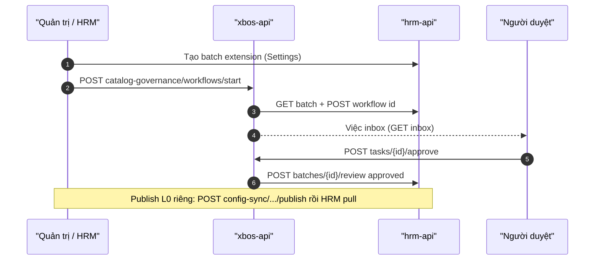

# API_DESIGN — XBOS Catalog governance (publish / pull / approve)

| Field | Value |
|-------|--------|
| **work_item_id** | `SA-U71-XBOS-CATALOG-GOV-DESIGN-01` |
| **change_mode** | ADD · preserve_default |
| **ref_srs** | Khách `SRS_XBOS_KHACH.md` **§3.11 FR-XBOS-CAT-02** Diễn biến #1–7 · **§3.12 FR-XBOS-CAT-05** Diễn biến #1–8 · UC-XBOS-02..05 · UC-XBOS-CAT-01..05 · **UF-XBOS-09** · **UF-XBOS-15** |
| **ref_techspec** | `docs/xbos/TECHSPEC.md` **§14.11** · **§14.12** · OpenAPI M01-Catalog |
| **ref_db** | `docs/xbos/DB_DESIGN_XBOS_CATALOG_GOV.md` |
| **ref_consumer** | `docs/hrm/API_DESIGN_HRM_SETTINGS_CATALOG.md` Endpoints F/G/H (**must_keep**) |
| **Template** | `_vibe-team-os/templates/TECHSPEC_API_CONTRACT.md` (Mục đích · Nghiệp vụ · Bước SRS) |
| **U71** | F.1-complete before Dev claim on catalog-gov / publish deepen |
| **Date** | 2026-07-27 |
| **Runtime** | `ConfigSyncController` · `CatalogGovernanceController` · `CatalogGovernanceService` · `ConfigSyncService` |
| **OpenAPI** | `docs/api/openapi/xbos-api.yaml` → `configSync*` · `catalogGovernance*` |
| **Base paths** | `/api/xbos/config-sync` · `/api/xbos/catalog-governance` |

> **Envelope:** Nest `ok(data, code, message)`.  
> **must_keep:** Settings HRM pull/extension pair · UF-XBOS-09/15 🟢 · U65 zero-seed (empty inbox OK).  
> **Rule:** Publish/pull = L0 SoT; start/approve = WF over HRM extension **batch** — không thay Settings CRUD.

---

## 0. Common contract

| Item | Value |
|------|--------|
| Auth | Bearer JWT and/or `x-internal-api-key` |
| Headers | `authorization` · optional `x-user-id` (reviewer / assignee) |
| Scope read (group CEO) | `resolveXbosGroupLegalReadScopeContext` — JWT `main` → `holding` |
| Scope write (publish / start member) | `resolveScopeContext` — JWT∩body/query; mismatch → **409** |
| Catalog key | Path/query normalized lowercase |
| Targets | `hrm` \| `xbos` \| `web-portal` |

### Locale / FE

| Concern | Rule |
|---------|------|
| Labels | VI from `items[].label` (U72); miss → «—» |
| Empty inbox | Valid — **không** seed task để nghiệm thu |
| After approve 2xx | Badge/count giảm; F5 còn; HRM effective label persists (UF-15) |

---

## 1. Endpoint A — Publish catalog (L0 SoT)

### Identity

| Item | Value |
|------|--------|
| Method / path | `POST /api/xbos/config-sync/catalog/{catalogKey}/publish` |
| OpenAPI | `configSyncPublishCatalog` |
| Success | HTTP 200 · **`XBOS-CFG-203`** · data = catalog projection for target `xbos` |
| Alias | `POST /api/xbos/catalog-governance/publish?catalogKey=` → same service · **`XBOS-CFG-203`** |
| Auth | Internal/Bearer + **write** scope on body `tenantId`/`companyId` |
| Body | `PublishCatalogDto` |

### Mục đích

Cho phép quản trị **phát hành phiên bản danh mục dùng chung** (header + items) làm **SoT L0** trên XBOS — để HRM và phân hệ đích kéo về qua pull; phục vụ UC-XBOS-02/05 và khóa master trước Settings sync.

### Nghiệp vụ xử lý

1. Assert auth; `resolveScopeContext(authorization, { tenantId, companyId })` from body — mismatch → **409**.
2. Normalize `catalogKey`; validate `name`, `domain`, `assignedTo[]` (≥1; typically includes `hrm`), `items[]` (≥1) with `code`/`label`/`status∈{active,draft}`.
3. Compute deterministic checksum of items; bump `version` only when checksum changes.
4. Upsert `config_catalogs`; replace-set `config_catalog_items` for scope×key.
5. Insert `catalog_audit_logs` action `publish_upsert`; emit platform audit.
6. Return `getCatalogForTarget(…, 'xbos', …)`.
7. **Does not** push HTTP into HRM — consumer must **pull** (Settings Endpoints F/G).

### Bước SRS

| UC / FR | Diễn biến # / bước | API role |
|---------|-------------------|----------|
| **UC-XBOS-02** | Khởi tạo/cập nhật danh mục dùng chung | **This endpoint** |
| **UC-XBOS-05** | Publish version | **This endpoint** |
| **FR-XBOS-CAT-05** | #6 Hoàn tất chuỗi → danh mục sẵn sàng (sau pull/materialize) | Enables L0 readiness |
| ADR S1 | XBOS SoT | Write L0 only |
| DANH_MUC | leave/dept/pos keys | Path `catalogKey` |

### DTO ↔ DB

| Request (camel) | DB |
|-----------------|-----|
| path `catalogKey` | `config_catalogs.catalog_key` / items |
| `tenantId` / `companyId` | `tenant_id` / `company_id` |
| `name` / `domain` | columns |
| `assignedTo[]` | `assigned_systems` JSONB |
| `items[].code/label/unit/status` | `config_catalog_items.*` |
| `actor` | `catalog_audit_logs.actor` |

### Errors

| Condition | Code | HTTP | FE |
|-----------|------|------|----|
| Unauthorized | `XBOS-AUTH-001` | 401 | Banner |
| Scope mismatch | `SCOPE_CONTEXT_MISMATCH` | 409 | Toast; no silent write |
| Validation (items/key) | Nest 400 / VAL family | 400 | Field errors |
| Success | `XBOS-CFG-203` | 200 | Show version; offer sync HRM |

### FE after 2xx (U65)

Version/checksum cập nhật trên màn catalog; **F5** còn; HRM Settings chỉ đổi sau **sync-from-xbos / pull** — không giả đã sync.

---

## 2. Endpoint B — Get catalog for target (pull upstream)

### Identity

| Item | Value |
|------|--------|
| Method / path | `GET /api/xbos/config-sync/catalog/{catalogKey}?target=&tenantId=&companyId=` |
| OpenAPI | `configSyncGetCatalog` |
| Success | **`XBOS-CFG-201`** |
| Auth | Internal/Bearer + **group read** scope |
| Primary consumer | HRM `POST /api/hrm/catalog-sync/pull/{catalogKey}` |

### Mục đích

Cấp **snapshot L0 một khóa** đã gán cho phân hệ đích (thường `target=hrm`) theo đúng partition — nguồn duy nhất để HRM upsert `synced_catalogs` (UC-XBOS-03 / UC-HRM-06).

### Nghiệp vụ xử lý

1. Assert auth; validate `target ∈ {hrm,xbos,web-portal}` — else **`XBOS-VAL-001`**.
2. `resolveXbosGroupLegalReadScopeContext` on query tenant/company (`main`→`holding`).
3. Load header+items where `assigned_systems` includes target; missing → not-found family (`XBOS-CFG-001` / empty per runtime).
4. Return projection `{ key, name, domain, assignedTo, version, checksum, items[] }` — **read-only**.

### Bước SRS

| UC / FR | Diễn biến | API role |
|---------|-----------|----------|
| **UC-XBOS-03** | Lấy danh mục theo khóa và phân hệ đích | **This endpoint** |
| **UC-HRM-06** / Settings G | Pull one key upstream | **Called by HRM** |
| **FR-HRM-SC-*** | Sync trước picker | Enables L1 |

### Response ↔ DB

| Wire | DB |
|------|-----|
| `key` | `catalog_key` |
| `version` / `checksum` / `updatedAt` | header columns |
| `items[]` | `config_catalog_items` rows |
| `assignedTo` | `assigned_systems` |

### Errors

| Condition | Code | FE / consumer |
|-----------|------|---------------|
| Invalid target | `XBOS-VAL-001` | 400 |
| Unauthorized | `XBOS-AUTH-001` | 401 |
| Scope mismatch | 409 family | HRM keep prior snapshot |
| Missing catalog | `XBOS-CFG-001` / 404 family | `HRM-SYNC-002` |

---

## 3. Endpoint C — List catalogs for target

### Identity

| Item | Value |
|------|--------|
| Method / path | `GET /api/xbos/config-sync/catalogs?target=&tenantId=&companyId=` |
| OpenAPI | `configSyncListCatalogs` |
| Success | **`XBOS-CFG-202`** |

### Mục đích

Liệt kê **các danh mục L0 đã gán** cho phân hệ đích trong partition — phục vụ UC-XBOS-04 và đối soát trước bulk sync HRM.

### Nghiệp vụ xử lý

1. Same auth/target/scope as Endpoint B.
2. List headers (+ items projection) filtered by `assigned_systems` ∋ target.
3. Empty list = valid (chưa publish).

### Bước SRS

| UC / FR | Diễn biến | API role |
|---------|-----------|----------|
| **UC-XBOS-04** | Liệt kê danh mục theo phân hệ đích | **This endpoint** |
| **UC-HRM-06** bulk | Discover keys to pull | Upstream for Settings F |

### Errors

Same family as Endpoint B (`XBOS-VAL-001`, auth, 409).

---

## 4. Endpoint D — Start catalog approval workflow

### Identity

| Item | Value |
|------|--------|
| Method / path | `POST /api/xbos/catalog-governance/workflows/start` |
| OpenAPI | `catalogGovernanceStartWorkflow` |
| Success | **`XBOS-CAT-211`** · data `{ workflowInstanceId, definitionId, batchId }` |
| Body | `StartCatalogWorkflowDto` — `batchId`, `memberTenantId`, `memberCompanyId`, optional `requesterUserId` |

### Mục đích

Khởi chạy **phiên duyệt mở rộng danh mục Nhân sự** từ batch HRM đã tạo — tạo việc trên hộp thư duyệt tập đoàn; đóng FR-XBOS-CAT-02 / UC-XBOS-CAT-02 / chuỗi UF-XBOS-15 (sau khi HRM tạo extension batch).

### Nghiệp vụ xử lý

1. Assert auth; resolve **member** scope from body via `resolveScopeContext`.
2. Ensure active catalog-approval workflow definition on holding (step `group_catalog_approval`) — missing/misconfigured → fail FR-CAT-02 #4.
3. GET HRM `/api/hrm/settings-catalogs/batches/{batchId}` with member headers — load items; invalid/empty label rules enforced upstream (FR #2/#3).
4. `startInstance` on holding: `business_type=HRM_CATALOG`, `business_id=batchId`, context includes member scope + items; create pending step_task for group approver.
5. POST HRM `…/batches/{batchId}/workflow` with `{ workflowInstanceId }`.
6. Return keys for FE «chờ duyệt».

### Bước SRS

| UC / FR | Diễn biến # | API role |
|---------|-------------|----------|
| **FR-XBOS-CAT-02** | **#1** Auth/phạm vi sai | Scope / auth |
| **FR-XBOS-CAT-02** | **#2** Thiếu nhãn/loại | Upstream batch / validation |
| **FR-XBOS-CAT-02** | **#3** Trùng giá trị cấm | Upstream / policy |
| **FR-XBOS-CAT-02** | **#4** Thiếu quy trình duyệt | ensure definition |
| **FR-XBOS-CAT-02** | **#5** Khởi chạy OK | **This endpoint** |
| **FR-XBOS-CAT-02** | **#6** Hộp thư thấy việc | Enables inbox |
| **FR-XBOS-CAT-02** | **#7** Thành công — khóa phiên | Return `workflowInstanceId` |
| sequenceDiagram | «Tạo mở rộng… khởi chạy duyệt» | Same |
| **UF-XBOS-15** | After HRM-SET create → start path | Same chain |
| **UC-XBOS-CAT-02** | Start approval | Same |

### DTO ↔ DB

| Request | DB / store |
|---------|------------|
| `batchId` | `xbos_workflow_instance.business_id` + HRM batch |
| `memberTenantId` / `memberCompanyId` | `context.member*` |
| (generated) `workflowInstanceId` | `xbos_workflow_instance.id` |
| step assignee | `xbos_workflow_step_task.assignee_user_id` |

### Errors

| Condition | Code | FE |
|-----------|------|-----|
| Unauthorized | `XBOS-AUTH-001` | — |
| Scope mismatch | 409 | Toast |
| HRM upstream fail | `XBOS-CAT-502` | Banner; retry |
| Missing WF config | service 4xx | «chưa cấu hình quy trình duyệt» (#4) |

### FE after 2xx

Yêu cầu = **chờ duyệt**; inbox người duyệt có việc (hoặc poll inbox); **không** seed.

---

## 5. Endpoint E — Catalog approval inbox

### Identity

| Item | Value |
|------|--------|
| Method / path | `GET /api/xbos/catalog-governance/inbox?assigneeUserId=&tenantId=&companyId=` |
| OpenAPI | `catalogGovernanceInbox` |
| Success | **`XBOS-CAT-212`** · `{ items: stepTask[] }` |
| Auth | Group **read** scope |

### Mục đích

Cấp **hộp thư việc duyệt danh mục** đang chờ của người được gán — bước mở trước phê duyệt (FR-CAT-05 #2 · P-CC-09 · UF-XBOS-09).

### Nghiệp vụ xử lý

1. Assert auth + group read scope (`main`→`holding`).
2. Resolve assignee = query `assigneeUserId` \|\| header `x-user-id` \|\| default pilot (runtime).
3. `listStepTasks` pending + `businessType=HRM_CATALOG` + tenant holding.
4. Return `{ items }` — **empty array is PASS** (no fake tasks).

### Bước SRS

| UC / FR | Diễn biến # | API role |
|---------|-------------|----------|
| **FR-XBOS-CAT-05** | **#2** Mở hộp thư — việc chờ hoặc empty | **This endpoint** |
| **FR-XBOS-CAT-02** | **#6** Người duyệt thấy việc | Same |
| **UC-XBOS-CAT-03** | Xem hộp thư duyệt danh mục | Same |
| **UF-XBOS-09** | Pre-approve list | Same |
| P-CC-09 | L2 load inbox 200 | Same |

### Response ↔ DB

| Wire | DB |
|------|-----|
| `items[].id` | `xbos_workflow_step_task.id` (`taskId`) |
| `items[].instance_id` | `instance_id` |
| `items[].status` | `pending` |
| `items[].assignee_user_id` | column |
| business via join | instance `business_id` / type |

### Errors

| Condition | Code | FE |
|-----------|------|-----|
| Unauthorized | `XBOS-AUTH-001` | — |
| Scope 409 (legacy main/holding) | 409 | Must not recur — group read resolver |
| Empty | `XBOS-CAT-212` + `[]` | Empty state OK |

---

## 6. Endpoint F — Approve catalog task

### Identity

| Item | Value |
|------|--------|
| Method / path | `POST /api/xbos/catalog-governance/tasks/{taskId}/approve` |
| OpenAPI | `catalogGovernanceApproveTask` |
| Success | **`XBOS-CAT-201`** · `{ decision:'approved', batchId, taskId, … }` |
| Body | optional `{ review_note }` |
| Auth | Group read scope + reviewer `x-user-id` |

### Mục đích

Cho phép người duyệt **phê duyệt bước duyệt danh mục** đang chờ — khi chuỗi hoàn tất, giá trị mở rộng hiệu lực trên Nhân sự (extension items); đóng FR-XBOS-CAT-05 / UF-XBOS-09 / UF-XBOS-15.

### Nghiệp vụ xử lý

1. Assert auth + group read scope.
2. Load task by `taskId` — not pending / wrong assignee → reject (#3/#4).
3. `completeStepTask` with reviewer + hat; if **instanceCompleted**:
   - POST HRM `…/batches/{batchId}/review` `{ decision:'approved', review_note }` → upsert `hrm_catalog_extension_items`.
4. Return decision payload; task leaves pending inbox.
5. **Does not** call L0 `publishCatalog` unless product bridge explicitly requires (current runtime: HRM extension materialize).

### Bước SRS

| UC / FR | Diễn biến # | API role |
|---------|-------------|----------|
| **FR-XBOS-CAT-05** | **#1** Auth | Auth |
| **FR-XBOS-CAT-05** | **#3** Việc đã xong | Reject |
| **FR-XBOS-CAT-05** | **#4** Sai người gán | Reject |
| **FR-XBOS-CAT-05** | **#5** Duyệt hợp lệ | **This endpoint** |
| **FR-XBOS-CAT-05** | **#6** Hoàn tất chuỗi → DM sẵn sàng HRM | HRM review on complete |
| **FR-XBOS-CAT-05** | **#7** Tải lại còn | Enables F5 |
| **FR-XBOS-CAT-05** | **#8** Thành công cuối — khóa giá trị | Return + extension codes |
| sequenceDiagram | «Phê duyệt bước danh mục» | Same |
| **UC-XBOS-CAT-05** | Approve step | Same |
| **UF-XBOS-09** | POST approve → count−1 · F5 | Same |
| **UF-XBOS-15** | After create → approve → label F5 | Same |

### DTO ↔ DB

| Wire | DB / HRM |
|------|----------|
| path `taskId` | `xbos_workflow_step_task.id` |
| `review_note` | task `payload` / HRM review |
| on complete | instance `status=completed` · HRM extension items |

### Errors

| Condition | Code | FE |
|-----------|------|-----|
| Unauthorized | `XBOS-AUTH-001` | — |
| Task not pending / wrong user | WF/CAT 4xx | Toast «không còn chờ» |
| HRM review fail | `XBOS-CAT-502` | Banner; do not claim FE success |
| Success | `XBOS-CAT-201` | Item leaves inbox; HRM label OK |

### FE after 2xx (U65)

Inbox count giảm; detail không còn chờ; HRM Settings/picker thấy mã đã duyệt; **F5** còn — **cấm** seed.

---

## 7. Endpoint G — List pending extension requests (cite)

### Identity

| Item | Value |
|------|--------|
| Method / path | `GET /api/xbos/catalog-governance/extension-requests?tenantId=` |
| OpenAPI | `catalogGovernanceListPending` |
| Success | **`XBOS-CAT-200`** |
| Upstream | Proxies HRM `GET …/settings-catalogs/extension-requests?status=pending` |

### Mục đích

Cho phép XBOS/CC xem **yêu cầu mở rộng đang chờ** phía HRM trước/ khi start WF — UC-XBOS-CAT-01 · TechSpec §14.11 Related.

### Nghiệp vụ xử lý

1. Auth + tenant-only context.
2. Proxy list pending from HRM — no local invent.
3. Empty pending = valid.

### Bước SRS

| UC / FR | Diễn biến | API role |
|---------|-----------|----------|
| **UC-XBOS-CAT-01** | Xem yêu cầu mở rộng đang chờ | **This endpoint** |
| **FR-XBOS-CAT-02** | Related list pending | Same |

---

## 8. Related endpoints (F.1-lite cite — not full spine)

| Method / path | Code | Mục đích ngắn | Bước SRS / note |
|---------------|------|---------------|-----------------|
| `GET …/catalog-governance/instances/{instanceId}` | `XBOS-CAT-213` | Chi tiết phiên + batchDetail | UC-XBOS-CAT-04 |
| `POST …/catalog-governance/tasks/{taskId}/reject` | `XBOS-CAT-202` | Từ chối bước | FR leftover **G-W2-CAT-REJ** (P3) · runtime exists |
| `POST …/config-sync/catalog/{key}/apply-to-members` | `XBOS-CFG-204` | Fan-out L0 sang ĐVTV | G-BM-REC-01 · **F.1 full:** [`API_DESIGN_XBOS_APPLY_TO_MEMBERS_EXPAND.md`](./API_DESIGN_XBOS_APPLY_TO_MEMBERS_EXPAND.md) (`SA-ERP-XBOS-CTRL-SPEC-01`) |
| `POST …/config-sync/bootstrap-xevn` | `XBOS-CFG-200` | Bootstrap catalogs | **Dev bootstrap only** — cấm U65 |
| `POST …/catalog-governance/workflows/seed-xe-du-lich-catalog` | `XBOS-CAT-210` | Seed WF definition | **Dev only** — cấm U65 |

HRM consumer pull/sync F.1 remains in `API_DESIGN_HRM_SETTINGS_CATALOG.md` Endpoints F/G — **must_keep**.

---

## 9. End-to-end sequence (governance → HRM)



---

## 10. Error taxonomy (summary)

| Code | Meaning |
|------|---------|
| `XBOS-CFG-201` / `202` / `203` / `204` | Get / list / publish / apply OK |
| `XBOS-CFG-001` | Source catalog missing |
| `XBOS-CFG-005` | apply key not allowed |
| `XBOS-VAL-001` | Invalid target |
| `XBOS-CAT-200` / `211` / `212` / `213` / `201` / `202` | Pending list / start / inbox / detail / approve / reject |
| `XBOS-CAT-502` | HRM upstream failure |
| `XBOS-AUTH-001` | Unauthorized |
| `SCOPE_CONTEXT_MISMATCH` | 409 JWT∩scope |

---

## 11. FE bind contract (CC catalog gov)

```text
MUST:
  Inbox ← GET catalog-governance/inbox (empty OK)
  Approve ← POST tasks/{taskId}/approve → observe XBOS-CAT-201 + FE count/label
  Publish L0 ← POST config-sync/catalog/{key}/publish → version; then HRM sync
  Pull consumer ← HRM catalog-sync (Settings pair) — not invent codes on XBOS approve alone without review bridge

MUST NOT:
  Seed inbox / seed WF for U65 evidence
  Treat HRM extension create as L0 publish
  Bind LE UUID as companyId for catalog partition
  Overwrite Settings HRM API_DESIGN contracts
```

---

## 12. F.1 completeness checklist

| Endpoint | Mục đích | Nghiệp vụ | Bước SRS | DTO↔DB | Errors |
|----------|----------|-----------|----------|--------|--------|
| A Publish | ✅ | ✅ | UC-XBOS-02/05 · ADR S1 | ✅ | ✅ |
| B Get (pull) | ✅ | ✅ | UC-XBOS-03 · UC-HRM-06 | ✅ | ✅ |
| C List | ✅ | ✅ | UC-XBOS-04 | ✅ | ✅ |
| D Start WF | ✅ | ✅ | FR-CAT-02 #1–7 · UF-15 | ✅ | ✅ |
| E Inbox | ✅ | ✅ | FR-CAT-05 #2 · UF-09 | ✅ | ✅ |
| F Approve | ✅ | ✅ | FR-CAT-05 #1–8 · UF-09/15 | ✅ | ✅ |
| G Pending list | ✅ | ✅ | UC-CAT-01 | proxy | ✅ |

---

## 13. Out of scope / residual

| Item | Owner |
|------|-------|
| OpenAPI deepen reject/instance/publish alias schemas | `dev-be` execution |
| Full WF engine API_DESIGN | `SA-U71-XBOS-WORKFLOW-DESIGN-01` |
| G-W2-CAT-REJ client FR reject depth | BA W3 |
| apply-to-members G-BM-REC-02 | BM lane |
| Settings pair changes | **Forbidden** this WI (must_keep) |

---

## 14. DOC-DELTA — `SA-ERP-XBOS-CTRL-SPEC-01` (2026-07-28)

| Item | Lock |
|------|------|
| Apply F.1 | Moved to `API_DESIGN_XBOS_APPLY_TO_MEMBERS_EXPAND.md` (BA P0/P1) |
| AS-IS keys | `job_titles`, `recruitment_channels`, `job_grades` |
| P0 expand | + `departments`, `leave_types` |
| P1 expand | + `contract_types`, `employment_types`, `pay_types`, `shifts`, `decision_types` |
| DEC | Path canonical `decision_types`; write key = source L0 (may be `hr_decision_types`) |
| Dev | **HOLD** until sponsor chốt `E-XBOS-CTRL-SPEC` |
| Evidence | `docs/qa/evidence/sa-erp-xbos-ctrl-spec-01-20260728.md` |
