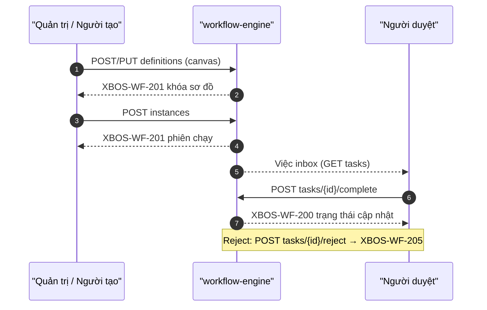

# API_DESIGN — XBOS Workflow engine (def / instance / tasks)

| Field | Value |
|-------|--------|
| **work_item_id** | `SA-U71-XBOS-WORKFLOW-DESIGN-01` |
| **change_mode** | ADD · preserve_default |
| **ref_srs** | Khách `SRS_XBOS_KHACH.md` **§3.8 FR-XBOS-WF-01** Diễn biến #1–7 · **§3.9 FR-XBOS-WF-03** Diễn biến #1–6 · **§3.10 FR-XBOS-WF-04** Diễn biến #1–7 · UC-XBOS-WF-01/03/04 · **UF-XBOS-08** |
| **ref_techspec** | `docs/xbos/TECHSPEC.md` **§12.3** · **§14.8–14.10** · OpenAPI M01-WF |
| **ref_db** | `docs/xbos/DB_DESIGN_XBOS_WORKFLOW.md` |
| **ref_bridge** | `docs/xbos/API_DESIGN_XBOS_CATALOG_GOV.md` (facade CAT — **must_keep**) · Leave API WF terminal cite |
| **Template** | `_vibe-team-os/templates/TECHSPEC_API_CONTRACT.md` (Mục đích · Nghiệp vụ · Bước SRS) |
| **U71** | F.1-complete before Dev claim on workflow-engine deepen |
| **Date** | 2026-07-27 |
| **Runtime** | `WorkflowEngineController` · `WorkflowEngineService` |
| **OpenAPI** | `docs/api/openapi/xbos-api.yaml` → `wfCreateDefinition` · `wfUpsertDefinition` · `wfStartInstance` · `wfListTasks` · `wfCompleteTask` · `wfRejectTask` |
| **Base path** | `/api/xbos/workflow-engine` |

> **Envelope:** Nest `ok(data, code, message)`.  
> **must_keep:** Catalog-gov facade endpoints · Settings HRM · UF-XBOS-08/09/15 🟢 · U65 zero-seed.  
> **Rule:** Generic engine APIs own def/instance/task; CAT start/approve may call the same tables via catalog-governance facade — **không** thay contract CAT đã 🟢.

---

## 0. Common contract

| Item | Value |
|------|--------|
| Auth | Bearer JWT and/or `x-internal-api-key` |
| Headers | `authorization` · optional `x-tenant-id` / `x-company-id` · optional `x-user-id` |
| Scope write (def / start / list instances) | `resolveScopeContext` — JWT∩headers; mismatch → **409** `SCOPE_CONTEXT_MISMATCH` |
| Scope list tasks | Query `tenantId` + filters (runtime listStepTasks) |
| Graph wire | `graph` \| `payload.graph` \| `steps` \| `payload.steps` → DB column **`graph`** |
| Catalog `businessType` wire | **`hrm_catalog_extension`** (docs alias HRM_CATALOG in catalog-gov §6) |

### Locale / FE

| Concern | Rule |
|---------|------|
| Canvas after save | Load API graph — **không** ghi đè mock khi load 2xx (§12.3) |
| Empty inbox (steady) | Valid U65 — **không** seed |
| After complete/reject 2xx | Task rời chờ; F5 còn; count cập nhật (UF-08) |
| Reject UI | Runtime `XBOS-WF-205` — FR khách reject = **G-W2-REJ-01** P3 leftover |

---

## 1. Endpoint A — Create / save workflow definition (canvas)

### Identity

| Item | Value |
|------|--------|
| Method / path | `POST /api/xbos/workflow-engine/definitions` |
| Alias update | `PUT /api/xbos/workflow-engine/definitions/{definitionId}` |
| OpenAPI | `wfCreateDefinition` · `wfUpsertDefinition` |
| Success | HTTP 200 · **`XBOS-WF-201`** · data = saved definition |
| Auth | Internal/Bearer + **write** scope |
| Body | name, workflowCode/definitionKey, category, status, graph/steps/payload, conditions, version? |

### Mục đích

Cho phép quản trị **lưu sơ đồ quy trình trên canvas** (bước, nối, viewport, hat/assignee) thành định nghĩa phiên bản dùng được để khởi tạo phiên — đóng FR-XBOS-WF-01 / UC-XBOS-WF-01 / nền UF-XBOS-08.

### Nghiệp vụ xử lý

1. Assert auth; `resolveScopeContext` from headers — mismatch → **409**.
2. Validate name non-empty (FR-WF-01 #3); for approval-capable graphs require ≥1 approval step / hat (FR #4 / BR-WF-01) — else **400**.
3. Normalize graph from `body.graph` ‖ `body.payload` ‖ `body.steps` → JSONB.
4. `upsertDefinition`: INSERT new `(tenant_id, workflow_code, version)` or UPDATE by `definitionId`; persist `graph`, `conditions`, `status`, optional `company_id` (Option B).
5. Return definition incl. `id` / `version` — khóa mang sang FR-WF-03.
6. **Does not** start an instance.

### Bước SRS

| UC / FR | Diễn biến # / bước | API role |
|---------|-------------------|----------|
| **FR-XBOS-WF-01** | **#1** Auth hết phiên | Auth |
| **FR-XBOS-WF-01** | **#2** Mở canvas | FE + list (Endpoint related) |
| **FR-XBOS-WF-01** | **#3** Thiếu tên | Validation |
| **FR-XBOS-WF-01** | **#4** Thiếu bước duyệt | Validation BR-WF-01 |
| **FR-XBOS-WF-01** | **#5** Lưu hợp lệ | **This endpoint** |
| **FR-XBOS-WF-01** | **#6** Mở lại danh sách | Enables GET definitions |
| **FR-XBOS-WF-01** | **#7** Thành công — khóa sơ đồ | Return `id`/`version` |
| sequenceDiagram | «Thiết kế canvas và Lưu» | Same |
| **UC-XBOS-WF-01** | Persist definition | Same |
| TechSpec §14.8 | `POST/PUT …/definitions*` | Same |

### DTO ↔ DB

| Request (camel) | DB |
|-----------------|-----|
| path `definitionId` (PUT) | `xbos_workflow_definition.id` |
| `workflowCode` / `definitionKey` | `workflow_code` |
| `name` / `category` / `status` / `scopeLevel` | columns |
| `companyId` | `company_id` |
| `version` | `version` (or MAX+1) |
| `graph` / `payload` / `steps` | **`graph` JSONB** |
| `conditions` | `conditions` |

### Errors

| Condition | Code | HTTP | FE |
|-----------|------|------|----|
| Unauthorized | `XBOS-AUTH-001` | 401 | — |
| Scope mismatch | `SCOPE_CONTEXT_MISMATCH` | 409 | Toast |
| Missing steps/hat | BR-WF-01 family | 400 | «hoàn thiện sơ đồ» |
| Success | `XBOS-WF-201` | 200 | Canvas/list reflects; F5 còn |

### FE after 2xx (U65)

Sơ đồ trên canvas/danh sách; **không** seed; sẵn sàng start instance.

---

## 2. Endpoint B — Start workflow instance

### Identity

| Item | Value |
|------|--------|
| Method / path | `POST /api/xbos/workflow-engine/instances` |
| Alias | `POST …/instances/start` |
| OpenAPI | `wfStartInstance` |
| Success | **`XBOS-WF-201`** · data includes instance id + spawned tasks |
| Body | `workflowCode` **or** `definitionId` + `businessType` + `businessId` + optional `context` / `submitter` |

### Mục đích

Cho phép người có quyền **khởi tạo phiên chạy** từ sơ đồ hiệu lực — sinh bước chờ trên hộp thư người được gán; đóng FR-XBOS-WF-03 / UC-XBOS-WF-03 / chuỗi UF-XBOS-08 (sau khi có def).

### Nghiệp vụ xử lý

1. Assert auth + `resolveScopeContext`.
2. Resolve active definition: by `definitionId` or `workflowCode` (+ Option B member keys in `context` / headers) — inactive/missing → fail FR-WF-03 #2.
3. Validate `businessType` / `businessId` when required by type; idempotent active `(tenant, businessType, businessId)` → return existing instance.
4. INSERT `xbos_workflow_instance`; spawn first-wave `xbos_workflow_step_task` pending from graph (assignee/hat resolve; REC soft fallback per ADR).
5. If graph has approval steps and zero pending spawned → **business FAIL** (FR-WF-03 #5) — không PASS UAT.
6. Return instance + task keys for FE «đang chạy / chờ duyệt».
7. Catalog product path may instead call catalog-governance `/workflows/start` (must_keep facade) which uses same tables with `businessType=hrm_catalog_extension`.

### Bước SRS

| UC / FR | Diễn biến # | API role |
|---------|-------------|----------|
| **FR-XBOS-WF-03** | **#1** Auth/phạm vi | Auth / 409 |
| **FR-XBOS-WF-03** | **#2** Sơ đồ hết hiệu lực | Resolve def fail |
| **FR-XBOS-WF-03** | **#3** Khởi tạo hợp lệ | **This endpoint** |
| **FR-XBOS-WF-03** | **#4** Hộp thư người duyệt | Enables list tasks |
| **FR-XBOS-WF-03** | **#5** Trống sau tạo (lỗi gán) | Fail closed |
| **FR-XBOS-WF-03** | **#6** Thành công — khóa phiên/bước | Return ids |
| sequenceDiagram | «Khởi tạo phiên từ sơ đồ» | Same |
| **UC-XBOS-WF-03** | Start instance | Same |
| **UF-XBOS-08** | Spawn → inbox | Same chain |
| TechSpec §14.9 | `POST …/instances` | Same |

### DTO ↔ DB

| Request | DB |
|---------|-----|
| `workflowCode` | Resolve → `definition_id` via `workflow_code` |
| `definitionId` | `definition_id` |
| `businessType` | `business_type` (e.g. `hrm_leave`, `hrm_catalog_extension`, …) |
| `businessId` | `business_id` |
| `context.*` / `submitter.*` | `context` JSONB |
| (generated) instance id | `xbos_workflow_instance.id` |
| spawned tasks | `xbos_workflow_step_task` rows |

### Errors

| Condition | Code | FE |
|-----------|------|-----|
| Unauthorized | `XBOS-AUTH-001` | — |
| Scope mismatch | 409 | Toast |
| Def inactive / missing | 4xx service | «sơ đồ không hiệu lực» |
| Success | `XBOS-WF-201` | Phiên chạy; inbox có việc (khi có bước duyệt) |

### FE after 2xx

Phiên đang chạy; người duyệt thấy việc (poll GET tasks) — **không** seed.

---

## 3. Endpoint C — List step tasks (inbox)

### Identity

| Item | Value |
|------|--------|
| Method / path | `GET /api/xbos/workflow-engine/tasks` |
| OpenAPI | `wfListTasks` |
| Success | **`XBOS-WF-203`** · `{ items: stepTask[] }` |
| Query | `assigneeUserId` · `tenantId` · `status` · `businessType` |

### Mục đích

Cấp **hộp thư việc quy trình** (bước chờ / theo filter) cho người được gán — bước mở trước duyệt (FR-WF-04 #2 · UF-XBOS-08 · P-CC workflow inbox). Catalog UI may use catalog-governance inbox filtered to `hrm_catalog_extension` (must_keep).

### Nghiệp vụ xử lý

1. Assert auth.
2. `listStepTasks` join instance — filter assignee / tenant / status / businessType.
3. Return `{ items }` — **empty array valid** in steady state (U65); immediately after start with approval graph, empty = FAIL FR-WF-03 #5.

### Bước SRS

| UC / FR | Diễn biến # | API role |
|---------|-------------|----------|
| **FR-XBOS-WF-04** | **#2** Mở hộp thư — việc chờ hoặc empty | **This endpoint** |
| **FR-XBOS-WF-03** | **#4** Người duyệt thấy việc | Same |
| **UC-XBOS-WF-04** / UC-CC-P0-06 | Inbox | Same |
| **UF-XBOS-08** | Pre-approve list | Same |

### Response ↔ DB

| Wire | DB |
|------|-----|
| `items[].id` | `xbos_workflow_step_task.id` (`taskId`) |
| `items[].instance_id` | `instance_id` |
| `items[].step_key` / `hat_key` / `status` | columns |
| `items[].assignee_user_id` | column |
| `items[].business_type` / `business_id` | join instance |
| `items[].instance_status` | instance.status |

### Errors

| Condition | Code | FE |
|-----------|------|-----|
| Unauthorized | `XBOS-AUTH-001` | — |
| Empty | `XBOS-WF-203` + `[]` | Empty state OK (steady) |

---

## 4. Endpoint D — Complete / approve step task

### Identity

| Item | Value |
|------|--------|
| Method / path | `POST /api/xbos/workflow-engine/tasks/{taskId}/complete` |
| OpenAPI | `wfCompleteTask` |
| Success | **`XBOS-WF-200`** |
| Body | optional `{ decision:'approve', comment }` / reviewer fields |

### Mục đích

Cho phép người được gán **hoàn thành bước phê duyệt** đang chờ — cập nhật task/instance, spawn bước kế hoặc terminal + side-effect consumer; đóng FR-XBOS-WF-04 / UC-XBOS-WF-04 / UF-XBOS-08.

### Nghiệp vụ xử lý

1. Assert auth; load task+instance — not pending → reject (#3); wrong assignee/hat → **403** BR-WF-02 (#4).
2. `completeStepTask`: set task `completed` + `completed_at` + merge `payload` (comment).
3. parallel_any / same-hat first-wins → skip siblings per runtime.
4. If more graph steps → spawn next pending tasks; else mark instance `completed` and notify consumer:
   - Leave → HRM leave terminal
   - REC → HRM recruitment step/terminal
   - Catalog product prefer catalog-gov approve facade (must_keep) which also completes engine task + HRM batch review
5. Return completion payload; task leaves pending inbox.

### Bước SRS

| UC / FR | Diễn biến # | API role |
|---------|-------------|----------|
| **FR-XBOS-WF-04** | **#1** Auth | Auth |
| **FR-XBOS-WF-04** | **#2** Mở hộp thư | Endpoint C |
| **FR-XBOS-WF-04** | **#3** Việc đã xử lý | Reject |
| **FR-XBOS-WF-04** | **#4** Sai người gán | 403 / reject |
| **FR-XBOS-WF-04** | **#5** Duyệt hợp lệ | **This endpoint** |
| **FR-XBOS-WF-04** | **#6** Tải lại còn đúng | Enables F5 |
| **FR-XBOS-WF-04** | **#7** Thành công cuối | Return + instance progress |
| sequenceDiagram | «Hoàn thành bước» | Same |
| **UC-XBOS-WF-04** | Complete task | Same |
| **UF-XBOS-08** | POST complete → inbox−1 · F5 | Same |
| TechSpec §14.10 | `POST …/complete` | Same |

### DTO ↔ DB

| Wire | DB / side-effect |
|------|------------------|
| path `taskId` | `xbos_workflow_step_task.id` |
| `comment` / decision | task `payload` |
| on complete | task.status=`completed` · maybe instance + next tasks |
| consumer | HRM leave/REC/CAT review (by `business_type`) |

### Errors

| Condition | Code | FE |
|-----------|------|-----|
| Unauthorized | `XBOS-AUTH-001` | — |
| Wrong hat / actor | BR-WF-02 | 403 toast |
| Not pending | 4xx | «không còn chờ» |
| Success | `XBOS-WF-200` | Item leaves inbox; F5 OK |

### FE after 2xx (U65)

Inbox giảm; trạng thái phiên cập nhật; **cấm** seed.

---

## 5. Endpoint E — Reject step task

### Identity

| Item | Value |
|------|--------|
| Method / path | `POST /api/xbos/workflow-engine/tasks/{taskId}/reject` |
| OpenAPI | `wfRejectTask` |
| Success | **`XBOS-WF-205`** |
| Body | optional `{ comment }` |
| Spec note | FR khách reject = **G-W2-REJ-01** P3 leftover — runtime **exists**; F.1 documents runtime for Dev/QA |

### Mục đích

Cho phép người được gán **từ chối bước** đang chờ — đóng task/instance nhánh reject và thông báo consumer (leave/REC/CAT) khi áp dụng; phục vụ UF reject paths và catalog-gov reject cite.

### Nghiệp vụ xử lý

1. Assert auth; load pending task — same assignee/hat guards as complete.
2. `rejectStepTask`: task `rejected` + `completed_at` + payload comment; instance → `rejected`.
3. Notify consumer terminal (REC/leave) per `business_type`; CAT may use catalog-gov `/tasks/{id}/reject` facade (`XBOS-CAT-202`).
4. Return reject payload; task leaves pending inbox.

### Bước SRS

| UC / FR | Diễn biến / note | API role |
|---------|------------------|----------|
| **FR-XBOS-WF-04** | Alternate path «nhánh từ chối: đợt sau» (SRS input) | **This endpoint** (runtime) |
| TechSpec §14.10 gap | **G-W2-REJ-01** FR khách W2 | Documented; BA W2 |
| Catalog-gov §8 | `POST …/catalog-governance/tasks/{id}/reject` | Facade cite |
| sequenceDiagram WF-04 | Fail «không xử lý» vs success reject | Reject success = this |

### DTO ↔ DB

| Wire | DB |
|------|-----|
| path `taskId` | step_task.id |
| `comment` | payload |
| result | task+instance `rejected` |

### Errors

| Condition | Code | FE |
|-----------|------|-----|
| Unauthorized | `XBOS-AUTH-001` | — |
| Not pending / wrong user | 4xx | Toast |
| Success | `XBOS-WF-205` | Leaves inbox; dashed reject UX on canvas consumers |

### FE after 2xx

Việc rời chờ; trạng thái từ chối; F5 còn — **không** seed.

---

## 6. Related endpoints (F.1-lite cite)

| Method / path | Code | Mục đích ngắn | Bước SRS / note |
|---------------|------|---------------|-----------------|
| `GET …/workflow-engine/definitions` | `XBOS-WF-200` | List defs for canvas | FR-WF-01 #6 |
| `GET …/workflow-engine/instances` | `XBOS-WF-200` | List instances by status | UC-XBOS-14 |
| `GET …/workflow-engine/instances/{id}/detail` | `XBOS-WF-204` | Instance + tasks | UC-XBOS-WF-05 |
| `GET/POST …/reporting-routes` | `XBOS-WF-200/201` | Rollup routes (out of WF spine) | UC-XBOS-15 |
| `POST …/catalog-governance/workflows/start` | `XBOS-CAT-211` | CAT facade start | **must_keep** catalog-gov |
| `GET …/catalog-governance/inbox` | `XBOS-CAT-212` | CAT facade inbox | UF-09 |
| `POST …/catalog-governance/tasks/{id}/approve` | `XBOS-CAT-201` | CAT facade approve | UF-09/15 🟢 |

---

## 7. End-to-end sequence (generic engine)



---

## 8. Error taxonomy (summary)

| Code | Meaning |
|------|---------|
| `XBOS-WF-200` | Complete OK / list definitions·instances·routes OK |
| `XBOS-WF-201` | Definition saved / instance started / route saved |
| `XBOS-WF-203` | Tasks list OK |
| `XBOS-WF-204` | Instance detail OK |
| `XBOS-WF-205` | Reject OK |
| `XBOS-AUTH-001` | Unauthorized |
| `SCOPE_CONTEXT_MISMATCH` | 409 JWT∩scope |
| BR-WF-01 | Definition validation (steps/hat) |
| BR-WF-02 | Actor lacks hat for step (403) |

---

## 9. FE bind contract

```text
MUST:
  Save canvas ← POST/PUT …/definitions → XBOS-WF-201; reload graph from API
  Start ← POST …/instances → XBOS-WF-201; then GET …/tasks shows pending (when approval steps)
  Approve ← POST …/tasks/{taskId}/complete → XBOS-WF-200; inbox−1; F5
  Reject ← POST …/tasks/{taskId}/reject → XBOS-WF-205 (runtime)
  Catalog approve 🟢 ← keep catalog-governance approve path (do not force generic complete for UF-09/15)

MUST NOT:
  Seed definitions/inbox for U65 evidence
  Bind LE UUID as companyId
  Overwrite catalog-gov / Settings API_DESIGN
  Persist business_type literal HRM_CATALOG (use hrm_catalog_extension)
```

---

## 10. F.1 completeness checklist

| Endpoint | Mục đích | Nghiệp vụ | Bước SRS | DTO↔DB | Errors |
|----------|----------|-----------|----------|--------|--------|
| A Create/upsert def | ✅ | ✅ | FR-WF-01 #1–7 | ✅ | WF-201 / 400 / 409 |
| B Start instance | ✅ | ✅ | FR-WF-03 #1–6 · UF-08 | ✅ | WF-201 / 409 |
| C List tasks | ✅ | ✅ | FR-WF-04 #2 · FR-WF-03 #4 | ✅ | WF-203 empty OK |
| D Complete | ✅ | ✅ | FR-WF-04 #1–7 · UF-08 | ✅ | WF-200 / 403 |
| E Reject | ✅ | ✅ | WF-04 alt · G-W2-REJ-01 note | ✅ | WF-205 |

---

## 11. Out of scope / residual

| Item | Owner |
|------|-------|
| OpenAPI deepen full graph JSON schema | `dev-be` execution |
| FR khách reject depth (G-W2-REJ-01) | BA W2 P3 |
| RACI / position-rbac pair | `SA-U71-XBOS-RACI-RBAC-CAT-DESIGN-01` |
| Catalog-gov / Settings changes | **Forbidden** (must_keep) |
| TechSpec §12.3 rename payload→graph prose | Optional SA delta |
