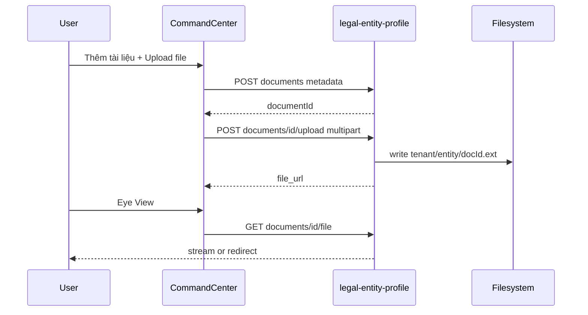

# SRS — Command Center P0 (Thiết lập công ty — API thật)

> Phiên bản: 2026-05-18  
> Traceability: [`COMMAND_CENTER_P0_TECHSPEC.md`](./COMMAND_CENTER_P0_TECHSPEC.md), [`WBS_COMMAND_CENTER_P0.md`](../program/WBS_COMMAND_CENTER_P0.md), [`FE_MOCK_TO_API_AUDIT.md`](../ecosystem/FE_MOCK_TO_API_AUDIT.md)

## 1. Mục đích

Loại bỏ hành vi “lưu tạm trên giao diện” (`publishVersionChange` → `/version/publish` không có persistence) trên **Command Center → Thiết lập công ty**, thay bằng API XBOS có đọc lại DB và file storage cho tài liệu pháp lý.

**Phạm vi:** web-portal [`CommandCenterPage.tsx`](../../apps/web/web-portal/src/pages/command-center/CommandCenterPage.tsx).

**Ngoài phạm vi P0:** HRM embed mock KPI; x-bos-core; `POST /version/publish` làm audit trail (P0.5).

## 2. Actors

| Actor | Mô tả |
|-------|--------|
| Quản trị tập đoàn | Sửa cổ đông, tài liệu, phòng ban, phân quyền, catalog |
| Hệ thống XBOS API | Persist + file storage |
| QA/QC | Xác minh evidence theo [`ECOSYSTEM_CAPABILITY_GATE.md`](../ecosystem/ECOSYSTEM_CAPABILITY_GATE.md) |

## 3. Danh mục use case

| Mã | Tên | API chính |
|----|-----|-----------|
| UC-CC-P0-01 | CRUD cổ đông theo pháp nhân | `.../legal-entities/:id/shareholders` |
| UC-CC-P0-02 | CRUD tài liệu pháp lý + upload/view file | `.../documents`, `.../documents/:id/upload`, `.../file` |
| UC-CC-P0-03 | Lưu/xóa phòng ban (org-units) | `POST/PUT/DELETE /org-foundation/org-units` |
| UC-CC-P0-04 | Ma trận phân quyền theo vai trò | `GET/PUT /position-rbac/matrix` |
| UC-CC-P0-05 | Catalog văn bản / đo lường / giá | `business-master` domain `command_center_catalogs` |
| UC-CC-P0-06 | Inbox — mở chi tiết task workflow | `GET /workflow-engine/instances/:id/detail` |
| UC-CC-P0-07 | Xem trước biểu mẫu metadata nhân sự | Client preview (P0) |
| UC-CC-P0-08 | Dashboard workspace meta | `GET /command-center/workspace-meta` |
| UC-CC-P0-09 | Chính sách mock inbox/alerts | `VITE_ALLOW_MOCK_FALLBACK` + banner |

---

## UC-CC-P0-01 — CRUD cổ đông

### Purpose
Quản lý danh sách cổ đông gắn pháp nhân trong form Thiết lập công ty.

### Happy path
1. User mở chi tiết pháp nhân → tab Cổ đông.
2. FE `GET .../shareholders` → hiển thị bảng.
3. User nhập dòng mới → Submit (✓) → `POST .../shareholders`.
4. Reload list; dòng có `id` từ DB.

### Alternate
- Sửa dòng đã lưu → `PUT .../shareholders/:id`.

### Exception
- Thiếu `holderName` → `XBOS-SHR-400`.
- `ratioPercent` ∉ [0,100] → `XBOS-SHR-400`.
- API lỗi → toast lỗi; **không** đánh dấu submitted local.

### Business logic

| Rule | Condition → Action → Outcome |
|------|---------------------------|
| BL-01-01 | `legal_entity_id` không thuộc tenant → 404 |
| BL-01-02 | Save OK → `status=active`; không gọi `publishVersionChange` làm SoT |

### Data interaction

| Field | Validation | Owner |
|-------|------------|-------|
| holder_name | 1–200 chars | XBOS |
| identity_code | 0–50 | XBOS |
| ratio_percent | 0–100 numeric | XBOS |
| contributed_value | >= 0 | XBOS |

### Acceptance
- [ ] PASS: POST → GET trả cùng `holder_name`.
- [ ] FAIL: API down → không hiện “đã lưu” giả.

---

## UC-CC-P0-02 — Tài liệu pháp lý + file

### Purpose
Lưu metadata tài liệu và upload file PDF/DOC/DOCX/XLS/XLSX lên filesystem; View qua URL công khai API.

### Happy path

### Business logic

| Rule | Condition → Action → Outcome |
|------|---------------------------|
| BL-02-01 | File > 25MB → `XBOS-DOC-413` |
| BL-02-02 | Extension not in pdf,doc,docx,xls,xlsx → `XBOS-DOC-415` |
| BL-02-03 | Upload success → `file_url`, `storage_path`, `mime_type` set |
| BL-02-04 | Eye without file → disable hoặc message “Chưa upload” |

### Acceptance
- [ ] PASS: upload docx → DB có `file_url` → View tải được.
- [ ] PASS: PDF mở tab/`iframe` preview.

---

## UC-CC-P0-03 — Phòng ban (org-units)

### Purpose
Persist phòng/ban thuộc pháp nhân qua org-foundation thay vì version publish.

### Happy path
- Submit hàng phòng ban → `POST` hoặc `PUT /org-foundation/org-units`.
- Xóa → `DELETE` (soft) nếu có `unitId`.

### Acceptance
- [ ] PASS: Reload trang → cây phòng ban khớp DB.

---

## UC-CC-P0-04 — Ma trận phân quyền

### Purpose
Lưu checkbox view/write/delete/approve + dataScope theo `roleId` UI.

### Happy path
1. `GET /position-rbac/matrix?roleId=ceo`
2. User đổi checkbox → debounce `PUT /position-rbac/matrix` bulk.
3. Reload khớp.

### Acceptance
- [ ] PASS: Đổi 1 ô → refresh → giữ nguyên.

---

## UC-CC-P0-05 — Catalog CC

### Purpose
Autosave document/measurement/pricing chỉ qua `saveCcCatalogRows`; không `publishVersionChange` song song.

### Acceptance
- [ ] PASS: Sửa ô catalog → reload → giữ; Network chỉ business-master.

---

## UC-CC-P0-06 — Inbox chi tiết

### Purpose
Nút **Mở chi tiết** mở drawer task + bước workflow từ instance.

### Happy path
1. `GET /workflow-engine/instances/:instanceId/detail`
2. Drawer hiển thị steps, assignee, trạng thái.
3. Optional: Complete từ drawer.

### Acceptance
- [ ] PASS: Inbox API task → drawer có `instance_id` khớp `task.sourceId`.

---

## UC-CC-P0-07 — Preview metadata nhân sự

### Purpose
Nút **Xem trước biểu mẫu** mở modal với field defs hiện tại (client-only P0).

### Acceptance
- [ ] PASS: Click nút → modal hiển thị; đóng được.

---

## UC-CC-P0-08 — Workspace meta

### Purpose
Header dashboard hiển thị `asOf` từ API, không hardcode mock.

### Happy path
- `GET /command-center/workspace-meta` → `asOf` ISO, `dataSyncNote` optional.

### Acceptance
- [ ] PASS: Sau seed workflow → `asOf` đổi theo MAX(updated_at).

---

## UC-CC-P0-09 — Mock policy

### Purpose
Khi `VITE_ALLOW_MOCK_FALLBACK=false`, inbox/alerts không hiện mock khi API trả empty/error; hiện banner.

### Acceptance
- [ ] PASS: API tắt → banner; không mock rows.

---

## 4. Deprecation `publishVersionChange`

| Trước | Sau P0 |
|-------|--------|
| SoT persistence | Domain API ở trên |
| publish chỉ audit (optional P0.5) | `POST /api/xbos/version/publish` + bảng audit |

Không được hiển thị success khi chỉ catch publish failed.
