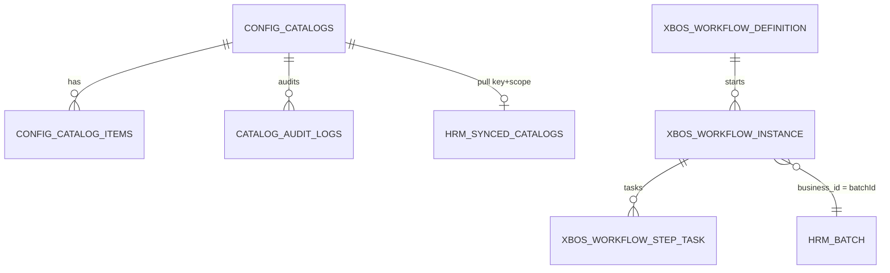

# DB_DESIGN — XBOS Catalog governance (L0 SoT + WF bridge)

| Field | Value |
|-------|--------|
| **work_item_id** | `SA-U71-XBOS-CATALOG-GOV-DESIGN-01` |
| **change_mode** | ADD · preserve_default |
| **ref_srs** | Khách `docs/client-delivery/xbos/SRS_XBOS_KHACH.md` **§3.11 FR-XBOS-CAT-02** Diễn biến #1–7 · **§3.12 FR-XBOS-CAT-05** Diễn biến #1–8 · team UC-XBOS-02..05 · UC-XBOS-CAT-01..05 · **UF-XBOS-09** · **UF-XBOS-15** |
| **ref_techspec** | `docs/xbos/TECHSPEC.md` **§14.11** · **§14.12** · §5 M01-Catalog |
| **ref_consumer** | `docs/hrm/DB_DESIGN_HRM_SETTINGS_CATALOG.md` (L1 pull + L2a extension — **must_keep**) · ADR-HRM-SETTINGS-SOT **S1/S3** |
| **ref_api** | `docs/xbos/API_DESIGN_XBOS_CATALOG_GOV.md` |
| **ref_danh_muc** | `docs/xbos/DANH_MUC_XBOS_CHO_HRM.md` §1–§5 (keys leave/dept/pos) |
| **Template** | `_vibe-team-os/templates/TECHSPEC_PHYSICAL_DB_TABLE.md` |
| **U71** | Physical DB slice before Dev claim on catalog publish / governance deepen |
| **Date** | 2026-07-27 |
| **Owner service** | XBOS (`xbos-api` · `ConfigSyncService` · `CatalogGovernanceService` · `WorkflowEngineService`) |
| **Runtime DDL** | `ConfigSyncService.ensureSchema` · `FoundationSchemaService` workflow tables |

> **Scope:** XBOS **L0** group catalog SoT (`config_catalogs` / items / audit) + **catalog-governance** WF bridge tables (definition / instance / step_task) used by FR-CAT-02/05.  
> **Out of scope:** HRM `synced_catalogs` / extension CRUD physical depth (already in Settings pair) · full generic WF engine design (`SA-U71-XBOS-WORKFLOW-DESIGN-01`) · RACI.  
> **must_keep:** Settings HRM pair · UF-XBOS-09/15 🟢 approve paths · U65 zero-seed (no seed routes as UAT evidence).

---

## 1. Ownership & plane (normative)

```text
XBOS FE / CC catalog admin
        │
        │ POST …/config-sync/catalog/{key}/publish   (L0 write)
        │ POST …/catalog-governance/workflows/start  (WF on HRM batch)
        ▼
L0 XBOS SoT ── config_catalogs + config_catalog_items (+ catalog_audit_logs)
        │
        │ GET …/config-sync/catalog/{key}?target=hrm   (pull upstream)
        ▼
L1 HRM snapshot ── synced_catalogs   ← docs/hrm/DB_DESIGN_HRM_SETTINGS_CATALOG.md
        │
HRM extension request (batch) ──► XBOS catalog-governance WF
        │                              xbos_workflow_instance.business_id = batchId
        │                              business_type = HRM_CATALOG
        ▼
Approve last step ──► HRM batches/{id}/review approved
        │                 → hrm_catalog_extension_items (L2a)
        ▼
effectiveItems (Settings + pickers)
```

| Layer | Owner | Tables (this file) | Mutate group master? |
|-------|-------|--------------------|----------------------|
| **L0 SoT** | `xbos-api` config-sync | `config_catalogs`, `config_catalog_items`, `catalog_audit_logs` | **Yes** (publish) |
| **Gov WF** | `xbos-api` catalog-governance + workflow-engine | `xbos_workflow_definition`, `xbos_workflow_instance`, `xbos_workflow_step_task` | N/A — orchestrates approve |
| **L1/L2a** | `hrm-api` | **Cite only** — Settings pair SoT | No invent master |

**Reject:** HRM inventing group master codes without XBOS publish / governance (ADR Option S2).

---

## 2. Canonical `catalog_key` (publish / pull)

Same contract as Settings consumer pair — **TEXT**, normalize `trim().toLowerCase()`, pattern `^[a-z0-9_][a-z0-9_-]{1,62}$`.

| Business catalog | Canonical key | Pull target | `ref_srs` |
|------------------|---------------|-------------|-----------|
| Loại nghỉ | `leave_types` | `hrm` | FR-HRM-SC-LEAVE-01 · DANH_MUC §5 STT 30 |
| Phòng ban | `departments` | `hrm` | FR-HRM-SC-POS-01 |
| Chức danh | `job_titles` | `hrm` | FR-HRM-SC-POS-01 · UF-XBOS-09/15 |

Aliases (`positions`, `department_catalog`, …) accepted at HRM merge; **new XBOS publish SHOULD use canonical keys**.

Partition identity: **`(tenant_id, company_id, catalog_key)`** — holding default `holding`; JWT `main` maps to legal partition `holding` on **group read** paths (ADR C2).

---

## 3. Table — `public.config_catalogs` (L0 header)

| Item | Value |
|------|--------|
| Schema | `public` |
| Owner | XBOS `ConfigSyncService` |
| Role | Versioned header for one catalog_key in tenant×company |

| Column | Type | Null | Meaning (VI) | `ref_srs` |
|--------|------|------|--------------|-----------|
| `id` | BIGSERIAL | NO | Surrogate PK | — |
| `tenant_id` | TEXT | NO | Partition tenant | UC-XBOS-02 · FR-XBOS-CAT-* |
| `company_id` | TEXT | NO | Holding / member partition (`holding` / slug) | Scope ladder |
| `catalog_key` | TEXT | NO | Publish key | UC-XBOS-03 |
| `name` | TEXT | NO | Tên danh mục HIỂN THỊ | UC-XBOS-02 |
| `domain` | TEXT | NO | Nhóm domain (HR / org / …) | DANH_MUC |
| `assigned_systems` | JSONB | NO | Systems nhận catalog — must include `hrm` for HRM pull | UC-XBOS-03/04 |
| `version` | INT | NO | Bump when checksum changes on publish | UC-XBOS-02/05 |
| `checksum` | TEXT | NO | Deterministic items integrity | UC-XBOS-02 |
| `updated_at` | TIMESTAMPTZ | NO | Last publish | F5 / sync stamp |

**Constraints / indexes**

| Constraint | Purpose |
|------------|---------|
| `UNIQUE (tenant_id, company_id, catalog_key)` (`uq_config_catalogs_scope_key`) | One header per scope×key |
| GIN `assigned_systems` | Filter by target system |

**Semantic lock:** `company_id` is **operating partition** (slug/`holding`) — **not** Plane A LE UUID.

---

## 4. Table — `public.config_catalog_items` (L0 items)

| Column | Type | Null | Meaning (VI) | Consumer bind |
|--------|------|------|--------------|---------------|
| `id` | BIGSERIAL | NO | Surrogate PK | — |
| `tenant_id` | TEXT | NO | Same as header | Partition |
| `company_id` | TEXT | NO | Same as header | Partition |
| `catalog_key` | TEXT | NO | Logical FK → header | Join |
| `code` | TEXT | NO | **Mã nghiệp vụ ổn định** | HRM picker persist key |
| `label` | TEXT | NO | **Nhãn tiếng Việt** | UI / U72 |
| `unit` | TEXT | YES | Metadata | Optional |
| `status` | TEXT | NO | `active` \| `draft` | Picker filter |

**Constraints**

| Constraint | Purpose |
|------------|---------|
| `UNIQUE (tenant_id, company_id, catalog_key, code)` | No duplicate codes in scope |
| FK `(tenant_id, company_id, catalog_key)` → `config_catalogs` | Header before items |

**Publish semantics:** replace-set per scope×key (DELETE items then INSERT/upsert) inside `publishCatalog` transaction path — version/checksum on header.

---

## 5. Table — `public.catalog_audit_logs` (L0 audit)

| Column | Type | Null | Meaning |
|--------|------|------|---------|
| `id` | BIGSERIAL | NO | PK |
| `catalog_key` | TEXT | NO | Key published / applied |
| `action` | TEXT | NO | e.g. `publish_upsert`, apply fan-out |
| `actor` | TEXT | NO | Actor id / `system` |
| `before_payload` | JSONB | YES | Optional prior |
| `after_payload` | JSONB | YES | Published snapshot projection |
| `created_at` | TIMESTAMPTZ | NO | Audit time |

**Index:** `(catalog_key, created_at DESC)`.

---

## 6. WF bridge tables (catalog-governance)

> Full generic WF physical design → `SA-U71-XBOS-WORKFLOW-DESIGN-01`.  
> This slice locks **columns used by FR-CAT-02/05** only.

### 6.1 `public.xbos_workflow_definition`

| Column | Type | Null | Catalog-gov use |
|--------|------|------|-----------------|
| `id` | UUID PK | NO | Definition id returned on start |
| `tenant_id` | TEXT | NO | Holding tenant (`xevn`) |
| `workflow_code` | TEXT | NO | Catalog approval workflow code |
| `name` | TEXT | NO | Display |
| `company_id` | TEXT | YES | Holding partition |
| `version` | INT | NO | Definition version |
| `graph` | JSONB | NO | Steps incl. `group_catalog_approval` + assignee |
| `status` | TEXT | NO | Active definition for start |
| `created_at` / `updated_at` | TIMESTAMPTZ | NO | Audit |

**Unique:** `(tenant_id, workflow_code, version)`.

**Catalog invariant:** Active definition must expose step `stepKey = group_catalog_approval` with group approver assignee (runtime `GROUP_APPROVER_USER`).

### 6.2 `public.xbos_workflow_instance`

| Column | Type | Null | Catalog-gov use | `ref_srs` |
|--------|------|------|-----------------|-----------|
| `id` | UUID PK | NO | `workflowInstanceId` (khóa mang FR-CAT-02 #7) | FR-XBOS-CAT-02 |
| `tenant_id` / `company_id` | TEXT | NO | Holding scope for group approval | ADR C2 |
| `definition_id` | UUID FK | NO | → definition | FR-CAT-02 #4 |
| `business_type` | TEXT | NO | `HRM_CATALOG` (constant) | FR-CAT-02 |
| `business_id` | TEXT | NO | **HRM `batchId`** | FR-CAT-02 #5 |
| `status` | TEXT | NO | `pending` → `completed` / `rejected` | FR-CAT-05 |
| `context` | JSONB | NO | `{ memberTenantId, memberCompanyId, batchId, items[], … }` | Bridge scope |
| `created_at` / `updated_at` | TIMESTAMPTZ | NO | — | — |

### 6.3 `public.xbos_workflow_step_task`

| Column | Type | Null | Catalog-gov use | `ref_srs` |
|--------|------|------|-----------------|-----------|
| `id` | UUID PK | NO | Path `{taskId}` approve/reject | FR-XBOS-CAT-05 |
| `instance_id` | UUID FK | NO | → instance | — |
| `step_key` | TEXT | NO | `group_catalog_approval` | FR-CAT-05 |
| `hat_key` | TEXT | NO | e.g. `group_ceo` | — |
| `assignee_user_id` | TEXT | YES | Inbox filter | FR-CAT-05 #2/#4 |
| `status` | TEXT | NO | `pending` → `completed` / skipped | #3/#5 |
| `payload` | JSONB | NO | Review note / decision meta | #5 |
| `completed_at` | TIMESTAMPTZ | YES | When approved | #5 |
| `created_at` / `updated_at` | TIMESTAMPTZ | NO | — | — |

**Inbox query:** pending tasks where `business_type = HRM_CATALOG` + assignee — empty inbox = **valid** (U65 / FR-CAT-05 #2).

---

## 7. Cross-plane data (HRM — cite, not redefine)

| HRM artifact | Role after XBOS approve / publish | Physical SoT |
|--------------|-----------------------------------|--------------|
| `hrm_catalog_extension_requests` / batches | Source of `batchId` for start WF | Settings DB_DESIGN §8 |
| `hrm_catalog_extension_items` | Materialized on final approve | Settings DB_DESIGN §7 |
| `synced_catalogs` | Snapshot after pull from L0 GET | Settings DB_DESIGN §5 |

**Bridge direction:**

| Event | XBOS write | HRM write |
|-------|------------|-----------|
| Start WF | INSERT instance + step_task | PATCH batch `workflow_instance_id` |
| Approve (last) | complete task + instance | POST batches/{id}/review `approved` → extension items |
| Reject | reject task + instance | POST review `rejected` |
| Publish L0 | upsert config_* | (later) HRM pull → synced_catalogs |

---

## 8. ERD (logical)



(`HRM_BATCH` / `HRM_SYNCED_CATALOGS` = HRM plane — Settings pair.)

---

## 9. Scope / dual-plane rules

| Rule | Verdict |
|------|---------|
| L0 partition key | `(tenant_id, company_id)` TEXT slug / `holding` |
| JWT `main` on group **read** (inbox, get catalog, apply) | Map → `holding` via `resolveXbosGroupLegalReadScopeContext` |
| Publish write scope | `resolveScopeContext` JWT∩body — mismatch → **409** `SCOPE_CONTEXT_MISMATCH` |
| Start WF member scope | Body `memberTenantId` / `memberCompanyId` via `resolveScopeContext` |
| Instance holding scope | Start always on holding tenant/company for group approval |
| LE UUID as `company_id` on catalog | **Forbidden** |
| Seed workflow / bootstrap | Bootstrap/dev only — **cấm** U65 evidence |

---

## 10. Acceptance (DB plane)

| Check | PASS |
|-------|------|
| Unique scope×key on `config_catalogs` | `\d` / information_schema |
| Unique scope×key×code on items | same |
| Publish bumps `version` when checksum changes | SQL before/after |
| Audit row `publish_upsert` after publish | `catalog_audit_logs` |
| Instance `business_type` + `business_id=batchId` after start | SQL |
| Pending inbox tasks filterable by assignee | SQL / API empty OK |
| HRM Settings pair unchanged (must_keep) | no wipe Settings files |

---

## 11. Out of scope / residual

| Item | Owner |
|------|-------|
| Full WF engine API_DESIGN (def CRUD, generic complete) | `SA-U71-XBOS-WORKFLOW-DESIGN-01` |
| OpenAPI deepen for reject / instance detail (runtime exists) | `dev-be` when execution opens |
| `apply-to-members` BM residual G-BM-REC-02 (WF bind) | BM lane |
| Reject FR leftover G-W2-CAT-REJ | BA W3 / P3 |
| Apply allow-list expand (no DDL) | `DB_DESIGN_XBOS_APPLY_TO_MEMBERS_EXPAND.md` · `SA-ERP-XBOS-CTRL-SPEC-01` — **Dev HOLD** |

---

## 12. must_keep / forbidden

| must_keep | forbidden |
|-----------|-----------|
| Settings HRM L1/L2a pair as consumer SoT | Treat TechSpec §14.11–14.12 matrices as U71 substitute |
| UF-XBOS-09 / UF-XBOS-15 🟢 approve click paths | Seed inbox to force approve for UAT (U65) |
| L0 XBOS = group master SoT | HRM invent group master without publish/gov |
| Empty inbox = valid state | Fake pending tasks |
| Plane B slug/`holding` partition | LE UUID as catalog `company_id` |
