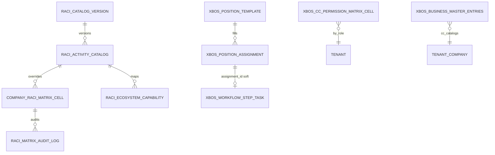

# DB_DESIGN — XBOS RACI · Position RBAC · CC catalogs

| Field | Value |
|-------|--------|
| **work_item_id** | `SA-U71-XBOS-RACI-RBAC-CAT-DESIGN-01` |
| **change_mode** | ADD · preserve_default |
| **ref_srs** | Khách `docs/client-delivery/xbos/SRS_XBOS_KHACH.md` **§3.13 FR-XBOS-RACI-02** Diễn biến #1–8 · **§3.14 FR-CC-P0-04** Diễn biến #1–7 · **§3.15 FR-CC-P0-05** Diễn biến #1–7 · team UC-RACI-02 · UC-CC-P0-04 · UC-CC-P0-05 · **UF-XBOS-07** · **UF-XBOS-13** · **UF-XBOS-14** |
| **ref_techspec** | `docs/xbos/TECHSPEC.md` **§14.14** · **§14.15** · **§14.16** · `docs/xbos/RACI_GOVERNANCE_TECHSPEC.md` (schema baseline) · `docs/xbos/COMMAND_CENTER_P0_TECHSPEC.md` §2 / §4 |
| **ref_workflow** | `docs/xbos/DB_DESIGN_XBOS_WORKFLOW.md` — `xbos_workflow_step_task.assignment_id` soft cite (**must_keep**) |
| **ref_catalog_gov** | `docs/xbos/DB_DESIGN_XBOS_CATALOG_GOV.md` — L0 `config_*` SoT (**must_keep**; **not** CC autosave) |
| **ref_api** | `docs/xbos/API_DESIGN_XBOS_RACI_RBAC.md` |
| **Template** | `_vibe-team-os/templates/TECHSPEC_PHYSICAL_DB_TABLE.md` |
| **U71** | Physical DB slice for RACI + position-rbac matrix + CC business-master catalogs before Dev OpenAPI deepen |
| **Date** | 2026-07-27 |
| **Owner service** | XBOS (`xbos-api` · `RaciGovernanceService` · `PositionRbacService` · `BusinessMasterService` · `FoundationSchemaService`) |
| **Runtime DDL** | `FoundationSchemaService.ensureRaciGovernanceTables` · `ensureSchema` position tables · `BusinessMasterService.ensureSchema` |

> **Scope:** One paired pack — (A) RACI catalog + company matrix cells + audit/bindings, (B) CC permission matrix + position assignment (WF soft FK), (C) business-master `command_center_catalogs` partitions.  
> **Out of scope:** Catalog-gov L0 publish/pull (`config_*`) · generic WF engine redefine · KPI rollup · shareholders/org-legal.  
> **must_keep:** Workflow `assignment_id` soft → `xbos_position_assignment` · Catalog-gov / Settings pairs · UF-XBOS-07/13/14 🟢 · U65 zero-seed.

---

## 1. Ownership & plane (normative)

```text
CC / Legal detail FE
        │
        │ GET/PUT …/raci-governance/*          → company_raci_matrix_cell (+ catalog)
        │ GET/PUT …/position-rbac/matrix       → xbos_cc_permission_matrix_cell
        │ GET/PUT …/business-master/command_center_catalogs/items*
        ▼                                      → xbos_business_master_entries
xbos-api (tenant_id TEXT · company_id TEXT slug / holding)
        │
        └── WF step_task.assignment_id ──soft──► xbos_position_assignment
```

| Subsystem | Owner | Tables (this file) | Plane key |
|-----------|-------|--------------------|-----------|
| **RACI** | `raci-governance` | `raci_catalog_version` · `raci_activity_catalog` · `raci_ecosystem_capability` · `company_raci_matrix_cell` · `company_raci_column_binding` · `raci_matrix_audit_log` | `(tenant_id, company_id)` TEXT — **cấm** invent LE UUID as matrix partition |
| **Position RBAC (CC Settings matrix)** | `position-rbac` | `xbos_cc_permission_matrix_cell` (+ cite templates/assignments) | `(tenant_id, role_id, row_id)` |
| **Position assignment** | `position-rbac` | `xbos_position_assignment` (+ template cite) | Soft target of WF `assignment_id` |
| **CC catalogs** | `business-master` | `xbos_business_master_entries` domain=`command_center_catalogs` | `(tenant_id, company_id, domain, item_id)` |

**Reject:** Using catalog-governance **publish** as substitute for CC autosave (FR-CC-P0-05).  
**Reject:** Writing RACI cell of company A into company B partition.

---

## 2. Subsystem A — RACI governance

### 2.1 `public.raci_catalog_version`

| Column | Type | Null | Meaning (VI) | `ref_srs` |
|--------|------|------|--------------|-----------|
| `id` | UUID PK | NO | Phiên bản catalog hoạt động | FR-XBOS-RACI-02 |
| `tenant_id` | TEXT | NO | Partition tenant | Scope |
| `version_label` | TEXT | NO | Nhãn phiên bản (vd. `2026-05-xevn`) | Catalog |
| `source_ref` | TEXT | YES | Path tài liệu gốc | Trace |
| `status` | TEXT | NO | `active` \| `archived` | FR #2 |
| `created_at` | TIMESTAMPTZ | NO | Audit | — |

**Constraint:** `UNIQUE (tenant_id, version_label)`.

### 2.2 `public.raci_activity_catalog`

| Column | Type | Null | Meaning (VI) | `ref_srs` |
|--------|------|------|--------------|-----------|
| `id` | UUID PK | NO | `activity_id` trên wire | FR #2/#5 |
| `tenant_id` | TEXT | NO | Partition | — |
| `catalog_version_id` | UUID FK | NO | → `raci_catalog_version` ON DELETE CASCADE | Catalog hiệu lực |
| `activity_code` | TEXT | NO | Mã hoạt động (vd. `HCNS-020`) | Input SRS |
| `domain_code` / `domain_label` | TEXT | NO | Nhóm domain HIỂN THỊ | Filter matrix |
| `seq_no` | INT | NO | Thứ tự lưới | FE grid |
| `name` | TEXT | NO | Tên hoạt động | FR #2 |
| `default_matrix` | JSONB | NO | Mẫu tập đoàn theo cột | FR #2/#6 (template) |
| `created_at` / `updated_at` | TIMESTAMPTZ | NO | — | — |

**Constraint:** `UNIQUE (tenant_id, catalog_version_id, activity_code)`.  
**Index:** `(tenant_id, domain_code)`.

### 2.3 `public.raci_ecosystem_capability`

| Column | Type | Null | Meaning (VI) | `ref_srs` |
|--------|------|------|--------------|-----------|
| `id` | UUID PK | NO | Capability row | Coverage tab |
| `tenant_id` | TEXT | NO | — | — |
| `activity_id` | UUID FK | NO | → activity | FR coverage |
| `module_code` / `feature_code` | TEXT | NO | Map module/feature | P2 evolution |
| `permission_code` | TEXT | YES | Optional grant code | — |
| `workflow_id` / `api_route` | TEXT | YES | Soft links | — |
| `raci_letter_required` | TEXT | NO | `R` \| `A` \| `*` | — |
| `status` | TEXT | NO | `active` \| `planned` | — |
| `metadata` | JSONB | NO | Ext | — |

**Constraint:** `UNIQUE (tenant_id, activity_id, module_code, feature_code)`.

### 2.4 `public.company_raci_matrix_cell` (mutate SoT)

| Column | Type | Null | Meaning (VI) | `ref_srs` |
|--------|------|------|--------------|-----------|
| `id` | UUID PK | NO | Surrogate | — |
| `tenant_id` | TEXT | NO | Partition | Scope |
| `company_id` | TEXT | NO | Slug / holding (**không** LE UUID làm khóa partition) | FR #3/#5/#8 |
| `activity_id` | UUID FK | NO | → activity | FR #5 |
| `org_column_id` | TEXT | NO | Cột vai trò chuẩn (`RaciOrgColumnId`) | FR #5 |
| `raci_letters` | TEXT | NO | `^[RACI]*$`; **empty** = clear override | FR #4/#6 |
| `source` | TEXT | NO | `group_template` \| `company_override` | Merge rule |
| `updated_by` | TEXT | YES | Actor | Audit |
| `created_at` / `updated_at` | TIMESTAMPTZ | NO | — | F5 |

**Constraint:** `UNIQUE (tenant_id, company_id, activity_id, org_column_id)`.  
**Index:** `(tenant_id, company_id)`.

**Merge rule (read):** FE/API trả mẫu `default_matrix` ⊕ cell override theo `company_id`; empty letters → drop override (template wins).

### 2.5 `public.company_raci_column_binding`

| Column | Type | Null | Meaning (VI) | `ref_srs` |
|--------|------|------|--------------|-----------|
| `id` | UUID PK | NO | Binding row | Bindings tab |
| `tenant_id` / `company_id` | TEXT | NO | Partition | — |
| `org_column_id` | TEXT | NO | Cột RACI | — |
| `position_template_id` | UUID | YES | Soft → `xbos_position_template` | Cross-cite |
| `org_unit_id` | UUID | YES | Soft → org unit | — |
| `notes` | TEXT | YES | — | — |

**Constraint:** `UNIQUE (tenant_id, company_id, org_column_id)`.

### 2.6 `public.raci_matrix_audit_log` (append-only)

| Column | Type | Null | Meaning (VI) | `ref_srs` |
|--------|------|------|--------------|-----------|
| `id` | UUID PK | NO | Event | FR #5/#6 |
| `tenant_id` / `company_id` | TEXT | NO | Scope of change | Isolation A≠B |
| `activity_id` | UUID | NO | Cell key | — |
| `org_column_id` | TEXT | NO | Cell key | — |
| `old_letters` / `new_letters` | TEXT | YES | Diff | — |
| `actor_id` | TEXT | YES | Who | — |
| `created_at` | TIMESTAMPTZ | NO | Immutable | — |

---

## 3. Subsystem B — Position RBAC + assignment (WF soft)

### 3.1 `public.xbos_cc_permission_matrix_cell` (FR-CC-P0-04)

| Column | Type | Null | Meaning (VI) | `ref_srs` |
|--------|------|------|--------------|-----------|
| `tenant_id` | TEXT | NO | PK part | FR-CC-P0-04 |
| `role_id` | TEXT | NO | PK — chức danh / role đang cấu hình | Diễn biến #4–5 |
| `row_id` | TEXT | NO | PK — hàng chức năng ổn định (`pm-org-1`…) | CC P0 §5 |
| `view` / `write` / `delete` / `approve` | BOOLEAN | NO | Checkbox ma trận | FR #5/#6 |
| `data_scope` | TEXT | NO | Phạm vi dữ liệu (default `personal`) | Input SRS optional |
| `updated_at` | TIMESTAMPTZ | NO | F5 | FR #6 |

**PK:** `(tenant_id, role_id, row_id)`.  
**Upsert:** `ON CONFLICT DO UPDATE` all flag columns + `updated_at`.

### 3.2 `public.xbos_position_template` (cite — supporting)

| Column | Type | Null | Meaning (VI) | `ref` |
|--------|------|------|--------------|-------|
| `id` | UUID PK | NO | Template id | Org / binding |
| `tenant_id` | TEXT | NO | — | — |
| `code` / `name` | TEXT | NO | Chức danh mẫu | Position-rbac templates API |
| `level_scope` | TEXT | NO | `group` / … | — |
| `status` | TEXT | NO | Soft-delete ≠ `deleted` | — |
| `payload` | JSONB | NO | Ext | — |

**Constraint:** `UNIQUE (tenant_id, code)`.

### 3.3 `public.xbos_position_assignment` (**must_keep** WF soft target)

| Column | Type | Null | Meaning (VI) | `ref` |
|--------|------|------|--------------|-------|
| `id` | UUID PK | NO | **Soft cite** từ `xbos_workflow_step_task.assignment_id` | `DB_DESIGN_XBOS_WORKFLOW` §5 |
| `tenant_id` / `company_id` | TEXT | NO | Partition | ADR C2 |
| `position_template_id` | UUID FK | NO | → template | Assignments API |
| `org_unit_id` | UUID | YES | Soft org | — |
| `user_id` / `employee_id` | TEXT | YES | Người giữ vị trí | Resolver inbox |
| `valid_from` / `valid_to` | DATE | YES | Hiệu lực | — |
| `status` | TEXT | NO | `active` / … | List filter |

**Invariant:** Workflow pair **must_keep** soft FK semantics — do not harden to CASCADE-delete tasks when assignment removed without product CR.  
**Cite only (not redefine):** `xbos_permission_definition` · `xbos_permission_grant` · `xbos_job_description` — present in foundation DDL; deepen when OpenAPI/execution wave requires.

---

## 4. Subsystem C — CC catalogs (`command_center_catalogs`)

### 4.1 `public.xbos_business_master_entries`

| Column | Type | Null | Meaning (VI) | `ref_srs` |
|--------|------|------|--------------|-----------|
| `tenant_id` | TEXT | NO | PK | Scope |
| `company_id` | TEXT | NO | PK — JWT `main` → `holding` on group read | D-W8-CAT-SCOPE |
| `domain` | TEXT | NO | PK — **`command_center_catalogs`** for this FR | FR-CC-P0-05 |
| `item_id` | TEXT | NO | PK — partition kind **`regulations` \| `measurements` \| `pricing`** **or** flat row `code` | Diễn biến #5 |
| `payload` | JSONB | NO | Partition `{ rows: […] }` **or** flat row fields | FR DTO |
| `status` | TEXT | NO | Default `active` | — |
| `created_at` / `updated_at` | TIMESTAMPTZ | NO | Autosave stamp | FR #6 |

**PK:** `(tenant_id, company_id, domain, item_id)`.  
**Index:** `(tenant_id, company_id, domain, updated_at DESC)`.

### 4.2 Partition kinds (normative — not separate tables)

| `item_id` (partition mode) | Payload shape | Row fields (VI) |
|----------------------------|---------------|-----------------|
| `regulations` | `{ rows: [{ code, title, category, version?, active? }] }` | Văn bản |
| `measurements` | `{ rows: [{ key, unit, currency, precision, category }] }` | Đo lường |
| `pricing` | `{ rows: [{ priceCode, label, amount, category }] }` | Giá — `amount` **số thuần** (FE nhóm nghìn) |

**Flat-row mode:** `itemId=code` + body `category ∈ {regulations,measurements,pricing}` merges into the partition payload (runtime UF-XBOS-14).

**Empty list:** Valid — **không** seed rows for UAT (U65).

---

## 5. Dual-plane / scope notes

| Concern | Rule |
|---------|------|
| RACI `company_id` | Operating slug / `holding` — path may accept LE UUID for **read assert** then resolve to partition; **persist** company key = scope resolver output (TechSpec §14.14) |
| CC catalogs | Group CEO JWT `main` lists/upserts under **`holding`** |
| Position matrix | Tenant-scoped by `role_id`; do not cross-tenant upsert |
| Catalog-gov | Separate L0 SoT — **must_keep**; CC catalogs ≠ `config_catalogs` |

---

## 6. ER (logical)



---

## 7. Cross-slice cite (must_keep — do not wipe)

| Artifact | Relationship |
|----------|--------------|
| `DB_DESIGN_XBOS_WORKFLOW.md` | `assignment_id` soft → **this** `xbos_position_assignment.id` |
| `DB_DESIGN_XBOS_CATALOG_GOV.md` | L0 publish/pull SoT — **not** replaced by CC autosave |
| `DB_DESIGN_HRM_SETTINGS_CATALOG.md` | Consumer of catalog-gov — untouched |
| UF-XBOS-07 / 13 / 14 🟢 | Behavior lock — design documents runtime, does not invent new BR |

---

## 8. Residual (not this file)

| Item | Owner | Note |
|------|-------|------|
| OpenAPI `raci-governance/*` F.1 | `BE-XBOS-OA-RACI-CC-01` | **CLOSED** G-OA-W2-RACI-01 |
| OpenAPI CC kinds semantics | `BE-XBOS-OA-RACI-CC-01` | **CLOSED** G-OA-W2-CC-CAT-01 |
| class-validator RACI cell DTO | `BE-XBOS-OA-DTO-P2-01` | **CLOSED** G-DTO-W2-RACI-01 |
| PermissionMatrixRow OpenAPI + Nest DTO | `BE-XBOS-OA-DTO-P2-01` | **CLOSED** G-DTO-W2-POS-01 |
| P2 sync matrix → `xbos_permission_grant` | Evolution | RACI_GOVERNANCE_TECHSPEC §5 |
