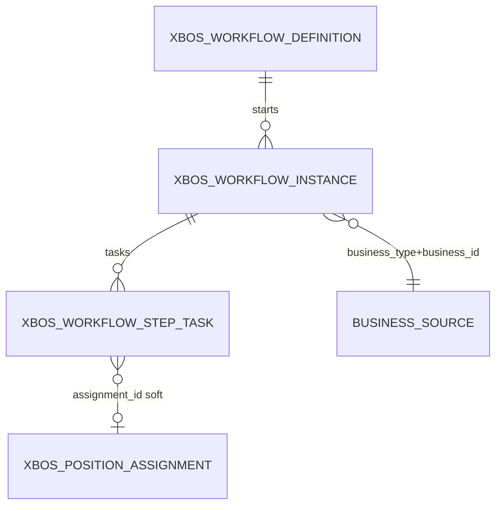

# DB_DESIGN — XBOS Workflow engine (definition / instance / step_task)

| Field | Value |
|-------|--------|
| **work_item_id** | `SA-U71-XBOS-WORKFLOW-DESIGN-01` |
| **change_mode** | ADD · preserve_default |
| **ref_srs** | Khách `docs/client-delivery/xbos/SRS_XBOS_KHACH.md` **§3.8 FR-XBOS-WF-01** Diễn biến #1–7 · **§3.9 FR-XBOS-WF-03** Diễn biến #1–6 · **§3.10 FR-XBOS-WF-04** Diễn biến #1–7 · team UC-XBOS-WF-01/03/04 · **UF-XBOS-08** |
| **ref_techspec** | `docs/xbos/TECHSPEC.md` **§12.3** · **§14.8** · **§14.9** · **§14.10** |
| **ref_bridge** | `docs/xbos/DB_DESIGN_XBOS_CATALOG_GOV.md` **§6** (catalog columns — **must_keep**) · Leave/REC consumers cite same tables |
| **ref_api** | `docs/xbos/API_DESIGN_XBOS_WORKFLOW.md` |
| **Template** | `_vibe-team-os/templates/TECHSPEC_PHYSICAL_DB_TABLE.md` |
| **U71** | Physical DB slice for generic workflow-engine before Dev claim deepen |
| **Date** | 2026-07-27 |
| **Owner service** | XBOS (`xbos-api` · `WorkflowEngineService` · `FoundationSchemaService`) |
| **Runtime DDL** | `FoundationSchemaService.ensureSchema` → `xbos_workflow_*` |

> **Scope:** Generic **workflow-engine** physical tables — definition (canvas graph), instance, step_task (+ indexes + catalog/leave/REC bridge keys).  
> **Out of scope:** Catalog-gov L0 publish/pull (catalog-gov pair) · RACI · reporting-routes depth (cite only) · HRM leave/recruitment request tables.  
> **must_keep:** `DB_DESIGN_XBOS_CATALOG_GOV` §6 column semantics · Settings HRM pair · UF-XBOS-08/09/15 🟢 · U65 zero-seed.

---

## 1. Ownership & plane (normative)

```text
CC / XBOS FE (canvas + inbox)
        │
        │ POST/PUT …/workflow-engine/definitions*
        │ POST …/workflow-engine/instances
        │ GET  …/workflow-engine/tasks
        │ POST …/tasks/{taskId}/complete|reject
        ▼
xbos_workflow_definition  (graph JSONB = canvas SoT)
        │
        ▼
xbos_workflow_instance  (business_type + business_id bridge)
        │
        ▼
xbos_workflow_step_task  (inbox rows · assignee filter)
        │
        ├── catalog-gov approve path (must_keep facade) ──► HRM batches/review
        ├── leave terminal notify ──► HRM leave
        └── recruitment step/terminal ──► HRM recruitment
```

| Layer | Owner | Tables (this file) |
|-------|-------|--------------------|
| **WF engine** | `xbos-api` workflow-engine | `xbos_workflow_definition` · `xbos_workflow_instance` · `xbos_workflow_step_task` |
| **Catalog facade** | catalog-governance | **Cite** same tables — do not redefine (catalog-gov §6) |
| **Consumers** | hrm-api | Leave / REC / extension batch — **cite only** |

**Physical column lock:** canvas SoT column is **`graph` JSONB** (runtime). TechSpec §12.3 / §14.8 text «payload» = **wire alias** (`body.payload` / `body.steps` / `body.graph`) merged into `graph` on upsert — **not** a separate DB column.

---

## 2. Catalog & consumer bridge keys (normative)

| Wire / constant | Value | Used by | `ref` |
|-----------------|-------|---------|-------|
| `workflow_code` (catalog) | `wf_hrm_catalog_extension_xe_du_lich` | Active def for CAT start | `workflow-catalog.constants` · catalog-gov |
| `business_type` (catalog) | **`hrm_catalog_extension`** | Instance filter + inbox | Runtime `WF_BUSINESS_TYPE_HRM_CATALOG` |
| Catalog-gov §6 shorthand | `HRM_CATALOG` | **Docs alias only** — persist/filter **`hrm_catalog_extension`** | must_keep §6 meaning |
| `step_key` (catalog) | `group_catalog_approval` | Pending approval step | FR-CAT-05 · catalog-gov §6.3 |
| `business_id` (catalog) | HRM **`batchId`** TEXT | Instance bridge | FR-CAT-02 #5/#7 |
| `business_type` (leave) | `hrm_leave` | Leave WF | Leave pair / OpenAPI |
| `workflow_code` (leave) | `hrm_leave_approval` | Leave start | OpenAPI enum |
| `business_type` (REC) | `hrm_recruitment_plan` · `hrm_requisition` · `hrm_candidate` | REC bridge ADR | OpenAPI · ADR REC |
| `business_type` (def review) | `workflow_definition_review` | Canvas self-review spawn | UF-XBOS-08 path |
| Partition | `(tenant_id, company_id)` TEXT slug / `holding` | All three tables | ADR C2 — **cấm LE UUID** |

**Inbox query bridge:** `listStepTasks` joins instance → filter `business_type` + `assignee_user_id` + `status`. Empty pending = **valid** (U65) except FR-WF-03 #5 right after start when graph has approval steps (must spawn ≥1 pending).

---

## 3. Table — `public.xbos_workflow_definition`

| Item | Value |
|------|--------|
| Schema | `public` |
| Owner | XBOS `WorkflowEngineService.upsertDefinition` |
| Role | Versioned canvas / graph SoT for one `workflow_code` (+ optional company partition Override — Option B) |

| Column | Type | Null | Meaning (VI) | `ref_srs` |
|--------|------|------|--------------|-----------|
| `id` | UUID PK | NO | Định danh sơ đồ (khóa mang FR-WF-01 #7) | FR-XBOS-WF-01 |
| `tenant_id` | TEXT | NO | Partition tenant | Scope |
| `workflow_code` | TEXT | NO | Mã loại quy trình ổn định | FR-WF-01 · FR-WF-03 |
| `name` | TEXT | NO | Tên HIỂN THỊ | FR-WF-01 #3 |
| `category` | TEXT | NO | Nhóm (general / hrm_catalog / …) | Catalog |
| `scope_level` | TEXT | NO | `group` \| member hint | Option B |
| `company_id` | TEXT | YES | Partition override member / holding | ADR Option B |
| `version` | INT | NO | Phiên bản định nghĩa | UNIQUE triple |
| `graph` | JSONB | NO | **Canvas SoT:** `steps[]`, transitions, viewport, assignees | FR-WF-01 #5 · §12.3 |
| `conditions` | JSONB | NO | Match `businessType` / rules | Start resolve |
| `status` | TEXT | NO | `draft` \| `active` \| … — start cần hiệu lực | FR-WF-03 #2 |
| `created_at` / `updated_at` | TIMESTAMPTZ | NO | Audit | — |

**Constraints / indexes**

| Constraint | Purpose |
|------------|---------|
| `UNIQUE (tenant_id, workflow_code, version)` | No duplicate version per code |
| Index recommend `(tenant_id, workflow_code, status)` | Resolve active def |
| Index recommend `(tenant_id, company_id, workflow_code)` | Option B member override |

**Graph invariants (runtime-aligned)**

| Rule | Detail |
|------|--------|
| Approval-capable def | ≥1 step with approval hat / assignee when used for real approve flows (FR-WF-01 #4) |
| Catalog def | Must expose `stepKey = group_catalog_approval` (catalog-gov must_keep) |
| Wire → DB | `body.graph` \|\| `body.payload.graph` \|\| `body.steps` \|\| `body.payload.steps` → column `graph` |

---

## 4. Table — `public.xbos_workflow_instance`

| Column | Type | Null | Meaning (VI) | `ref_srs` |
|--------|------|------|--------------|-----------|
| `id` | UUID PK | NO | `workflowInstanceId` (khóa mang FR-WF-03 #6) | FR-XBOS-WF-03 |
| `tenant_id` | TEXT | NO | Scope tenant (holding for group approve) | ADR C2 |
| `company_id` | TEXT | NO | Scope company slug / `holding` | ADR C2 |
| `definition_id` | UUID FK | NO | → `xbos_workflow_definition.id` | FR-WF-03 #3 |
| `business_type` | TEXT | NO | Bridge type (§2) | FR-WF-03 · CAT/Leave/REC |
| `business_id` | TEXT | NO | Khóa nghiệp vụ nguồn (batchId / leaveId / …) | FR-WF-03 |
| `status` | TEXT | NO | `pending` → `completed` / `rejected` | FR-WF-04 |
| `context` | JSONB | NO | Member scope, submitter, items[], Option B keys | Start body |
| `created_at` / `updated_at` | TIMESTAMPTZ | NO | — | — |

**Constraints / indexes**

| Constraint | Purpose |
|------------|---------|
| FK `definition_id` → definition | Def before instance |
| `idx_xbos_wf_instance_biz` `(tenant_id, company_id, business_type, business_id)` | Idempotent / lookup bridge (**runtime**) |
| Recommend `(status, tenant_id)` | List instances |

**Idempotency (runtime OpenAPI):** same `(tenant, businessType, businessId)` while active → return same instance id (200) — do not invent duplicate pending chains for UAT.

---

## 5. Table — `public.xbos_workflow_step_task`

| Column | Type | Null | Meaning (VI) | `ref_srs` |
|--------|------|------|--------------|-----------|
| `id` | UUID PK | NO | Path `{taskId}` complete/reject | FR-XBOS-WF-04 |
| `instance_id` | UUID FK | NO | → instance ON DELETE CASCADE | — |
| `step_key` | TEXT | NO | Key trong graph (vd. `group_catalog_approval`) | FR-WF-04 · CAT |
| `hat_key` | TEXT | NO | Vai / hat duyệt | BR-WF-02 |
| `assignee_user_id` | TEXT | YES | Inbox filter | FR-WF-03 #4 · FR-WF-04 #2/#4 |
| `assignment_id` | UUID | YES | Soft → `xbos_position_assignment` | Position-rbac |
| `status` | TEXT | NO | `pending` \| `completed` \| `rejected` (+ skip) | FR-WF-04 |
| `due_at` | TIMESTAMPTZ | YES | Optional SLA | — |
| `completed_at` | TIMESTAMPTZ | YES | When complete/reject | FR-WF-04 #5 |
| `payload` | JSONB | NO | Comment / decision / parallel meta | FR-WF-04 |
| `created_at` / `updated_at` | TIMESTAMPTZ | NO | — | — |

**Indexes (required for inbox)**

| Index | Purpose |
|-------|---------|
| `(instance_id)` | Detail join |
| Recommend `(assignee_user_id, status)` | Inbox by assignee |
| Join path via instance `business_type` | Catalog inbox filter `hrm_catalog_extension` |

**Lifecycle**

| Event | Task | Instance |
|-------|------|----------|
| Start | INSERT pending first-wave steps | `pending` |
| Complete (non-terminal) | `completed` + spawn next | still `pending` |
| Complete (terminal) | `completed` | `completed` + consumer notify |
| Reject | `rejected` | `rejected` + consumer notify |
| parallel_any first-wins | siblings skipped in payload | — |

---

## 6. Cross-slice cite (must_keep — do not wipe)

| Artifact | Relationship |
|----------|--------------|
| `DB_DESIGN_XBOS_CATALOG_GOV.md` §6 | Same three tables; CAT columns + `group_catalog_approval` — **must_keep** |
| `API_DESIGN_XBOS_CATALOG_GOV.md` | Facade start/inbox/approve over engine tables |
| `DB_DESIGN_HRM_LEAVE.md` / Leave API | `business_type=hrm_leave` terminal notify |
| Settings HRM pair | Extension batch = `business_id` for CAT — **must_keep** |
| `xbos_reporting_route` | Separate rollup table — out of spine F.1 |

**Direction**

| Event | WF engine write | Consumer |
|-------|-----------------|----------|
| Create/upsert def | UPSERT definition.graph | Canvas list |
| Start instance | INSERT instance + step_tasks | Optional HRM patch workflow id (CAT) |
| Complete | UPDATE task + maybe next tasks / instance | Leave/REC/CAT review side-effects |
| Reject | UPDATE task + instance rejected | Same consumers |

---

## 7. ERD (logical)



(`BUSINESS_SOURCE` = HRM batch / leave / REC / def-review — not owned by this file.)

---

## 8. Scope / dual-plane rules

| Rule | Verdict |
|------|---------|
| Write scope (def / start) | `resolveScopeContext` JWT∩headers — mismatch → **409** |
| `company_id` | TEXT slug / `holding` — **cấm** Plane A LE UUID |
| Catalog group approve instance | Holding tenant/company (catalog-gov) |
| Option B def resolve | Prefer member `(tenant, workflow_code, company)` override → fallback group |
| Seed WF / inbox | Bootstrap/dev only — **cấm** U65 evidence |
| Empty inbox (steady state) | Valid U65 — except immediate post-start with approval graph (FR-WF-03 #5) |

---

## 9. Acceptance (DB plane)

| Check | PASS |
|-------|------|
| Unique `(tenant_id, workflow_code, version)` | `\d` / information_schema |
| Column `graph` JSONB exists (not separate `payload` column) | DDL |
| `idx_xbos_wf_instance_biz` present | DDL |
| Start creates instance + ≥1 pending task when graph has approval | SQL after POST instances |
| Complete sets task `completed` + `completed_at` | SQL |
| Reject sets task/instance rejected | SQL |
| Catalog bridge: `business_type='hrm_catalog_extension'` + `business_id=batchId` | SQL / CAT start |
| Catalog-gov + Settings files unchanged | git / path check |

---

## 10. Out of scope / residual

| Item | Owner |
|------|-------|
| OpenAPI deepen graph schema / reject FR khách | `dev-be` / BA W2 **G-W2-REJ-01** P3 |
| RACI + position-rbac physical pair | `SA-U71-XBOS-RACI-RBAC-CAT-DESIGN-01` |
| Soft GROUP_APPROVER REC gap | REC ADR R2 |
| Rewrite TechSpec §12.3 «payload» wording | Optional SA delta (non-blocking — documented here) |

---

## 11. must_keep / forbidden

| must_keep | forbidden |
|-----------|-----------|
| Catalog-gov DB/API pairs + §6 bridge meaning | Wipe / redefine catalog-gov tables differently |
| Settings HRM consumer pair | Treat TechSpec matrix alone as U71 substitute |
| UF-XBOS-08 🟢 generic inbox approve · UF-09/15 🟢 CAT | Seed inbox/tasks for UAT (U65) |
| Physical column `graph` | Invent LE UUID as WF `company_id` |
| Wire value `hrm_catalog_extension` | Persist literal `HRM_CATALOG` as business_type |
