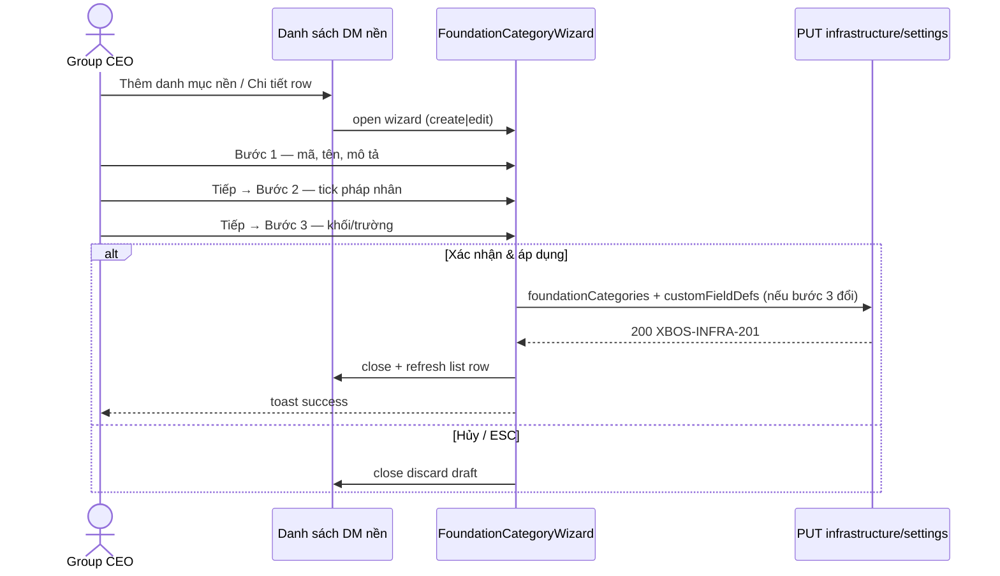

# Danh mục nền Hạ tầng — Foundation Category Wizard UX

| Field | Value |
|-------|-------|
| **work_item_id** | `P1-INFRA-FCAT-WIZARD-BA-01` |
| **from_role** | ba-process |
| **lane** | governance |
| **program** | [`P1-INFRA-FOUNDATION-CATEGORY-UX-PROGRAM.md`](../program/P1-INFRA-FOUNDATION-CATEGORY-UX-PROGRAM.md) |
| **spec_ref** | UC-XBOS-INF-01 · UC-XBOS-CC-07 · `COMMAND_CENTER_P0_SRS.md` · `METADATA_APPLY_PROPAGATION_MATRIX.md` row FND |
| **trigger** | Sponsor UX 2026-06-20: danh mục nền khó hiểu; list hiện `—` / `0 pháp nhân`; cần **một popup full-screen** gom Thêm + Phạm vi + Cấu hình khối/trường |
| **generated** | 2026-06-21 |
| **ack_status** | **PASS_TO_PM** |

---

## 1. Purpose & phạm vi

**Mục tiêu:** Thay luồng rời (list → detail inline → modal khối/trường riêng) bằng **FoundationCategoryWizard** — overlay full-viewport, 3 bước tuần tự, Apple luxury (`.cursorrules` §2).

**Actors:** Group CEO / Admin tập đoàn (`ceo@xe.vn`, scope `main`).

**In scope**

- Tạo mới danh mục nền (CRUD Create).
- Sửa danh mục đã lưu (CRUD Update — mở wizard từ list).
- Gán phạm vi pháp nhân + cấu hình khối/trường trong cùng wizard (bước 3 embed panel hiện có).
- List chỉ hiển thị row **đã persist** (`PUT …/infrastructure/settings` **200**).

**Out of scope (wave này)**

- Xóa danh mục nền (confirm dialog — backlog nếu sponsor yêu cầu).
- Điểm hạ tầng tab 2 (consumer — giữ nguyên, chỉ phụ thuộc output wizard).
- Bind `customFieldDefs` vào form pháp nhân ĐVTV (GAP LE-01 — program metadata riêng).

---

## 2. As-is vs To-be

| Khía cạnh | As-is (code hiện tại) | To-be (wizard) |
|-----------|----------------------|----------------|
| Entry | **Thêm danh mục nền** → push row rỗng vào `foundationCategories` + mở detail inline | Mở **FoundationCategoryWizard**; **không** thêm row list cho đến khi Lưu thành công |
| Layout | Detail inline trong workspace + sticky footer «Lưu danh mục nền» | Modal `fixed inset-0 z-[100]`, glass header sticky, body scroll, footer actions |
| Phạm vi | Checkbox trong detail; «Quay lại» **không** sync `foundationForm` → list bug `—` / `0 pháp nhân` | State wizard isolated; commit atomically khi **Xác nhận & áp dụng** |
| Khối/trường | Nút riêng → modal `infrastructureFieldsConfigOpen` (z thấp hơn) | **Bước 3** embed cùng panel; preview entity = pháp nhân đầu tiên đã tick |
| List cột Phạm vi | `{appliesToCompanyIds.length} pháp nhân` — sai khi draft chưa lưu | Chỉ row persisted; hiển thị **mã — tên chip** (≤3) + «+N» hoặc «Chưa gán» |
| Hủy draft | Row rỗng vẫn trong table | Hủy → discard wizard state; list không đổi |

**Root cause bug P0 (program):** `openNewFoundationCategory()` gọi `setFoundationCategories(prev => [...prev, row])` trước save; `closeFoundationCategoryDetail()` chỉ clear form, **không** rollback row rỗng; list render `code \|\| '—'` và `length` từ state stale.

---

## 3. FoundationCategoryWizard — thiết kế UI (Apple luxury)

### 3.1 Shell

| Thuộc tính | Giá trị |
|------------|---------|
| Container | `fixed inset-0 z-[100] flex flex-col bg-surface/95 backdrop-blur-md` |
| Safe area | `.xevn-safe-inline` cho header + footer |
| Header | `h-10` flex items-center: nút đóng (X) · tiêu đề wizard · step indicator |
| Step indicator | 3 pill: **1 Thông tin** · **2 Phạm vi** · **3 Khối & trường** — active = `bg-xevn-primary text-white`; done = emerald dot; pending = slate border |
| Body | `flex-1 overflow-y-auto` · grid 12 cột · `col-span-4` cho field đơn |
| Footer | Sticky glass `bg-white/80 backdrop-blur-md border-t shadow-soft` |
| Primary | `#1E40AF` · `rounded-card` 12px · `rounded-input` 8px · `shadow-soft` |

### 3.2 Stepper & điều hướng

| Nút footer | Hành vi |
|------------|---------|
| **Hủy** | Confirm nếu dirty → đóng wizard; **không** mutate list |
| **Lưu nháp** | Chỉ bước 1–2 bắt buộc mã+tên; PUT partial OK; đóng wizard; list refresh 1 row |
| **Quay lại** | Lùi step; giữ draft wizard |
| **Tiếp theo** | Validate step hiện tại → step+1 |
| **Xác nhận & áp dụng** | Chỉ bước 3 (hoặc step cuối): validate full → PUT → toast → đóng → list refresh |

---

## 4. Chi tiết từng bước

### Bước 1 — Thông tin danh mục

| Field | Bắt buộc | Validation | Error copy |
|-------|----------|------------|------------|
| Mã danh mục nền (`code`) | Có | Trim non-empty; pattern `[A-Z0-9-_.]{2,32}` khuyến nghị | «Vui lòng nhập mã danh mục nền (Origin).» |
| Tên danh mục (`nameVi`) | Có | Trim non-empty; max 120 | «Vui lòng nhập tên danh mục nền.» |
| Mô tả (`description`) | Không | max 2000 | — |

**AC bước 1 — AC-FCAT-S1-01..04**

| ID | Given | When | Then (PASS) | FAIL |
|----|-------|------|-------------|------|
| AC-FCAT-S1-01 | Wizard mở (create) | Nhập mã + tên hợp lệ → **Tiếp theo** | Chuyển bước 2; indicator step 2 active | Ở lại bước 1 |
| AC-FCAT-S1-02 | Bước 1 | Bỏ trống mã → **Tiếp theo** | Inline error dưới field mã; không chuyển step | Im lặng / chuyển step |
| AC-FCAT-S1-03 | Bước 1 | Bỏ trống tên → **Tiếp theo** | Inline error tên | Im lặng |
| AC-FCAT-S1-04 | Edit mode | Mở từ list row đã lưu | Field pre-fill đúng GET/ state | Trống / sai mã |

**Empty state bước 1:** Subtitle helper: «Mã danh mục dùng làm khóa nghiệp vụ — ví dụ HT-LOG-CS cho logistics cơ sở.»

---

### Bước 2 — Phạm vi pháp nhân

| UI | Mô tả |
|----|-------|
| Chip grid | Mỗi pháp nhân = checkbox chip (`legalEntityList`); alias holding hiển thị 1 lần |
| Counter | «Đã chọn: N pháp nhân» |
| Select all | Optional: «Chọn tất cả» / «Bỏ chọn» (group CEO) |

**Business rules**

| BR-ID | Condition | Action | Outcome |
|-------|-----------|--------|---------|
| BR-FCAT-SCOPE-01 | Bước 3 mở khối/trường | `previewEntityId = appliesToCompanyIds[0]` | Nếu rỗng → chặn vào bước 3 |
| BR-FCAT-SCOPE-02 | `appliesToCompanyIds` đổi sau bước 3 config | Giữ defs the entity keys đã lưu; warn nếu bỏ entity đã có field | Không silent delete |
| BR-FCAT-SCOPE-03 | Holding alias (`main`, `xbos-group-holding-root`) | Tick một → resolver coi match alias (`infraEntityIdsMatch`) | AC-META-PROP-FND-01 không regression |
| BR-FCAT-SCOPE-04 | Key plane `appliesToCompanyIds` | **Plane A** LE UUID (member) + holding aliases; cấm B′ / slug `trsport|logistics|finance|services` | ADR `ADR-XBOS-INF-APPLIES-TO-COMPANY-IDS-KEY-PLANE-20260727` · `API_DESIGN_XBOS_INFRASTRUCTURE` |

**AC bước 2 — AC-FCAT-S2-01..05**

| ID | Given | When | Then (PASS) | FAIL |
|----|-------|------|-------------|------|
| AC-FCAT-S2-01 | Bước 2 | Tick ≥1 pháp nhân → **Tiếp theo** | Vào bước 3; preview entity = pháp nhân đầu | Step 3 blocked không message |
| AC-FCAT-S2-02 | Bước 2 | 0 tick → **Tiếp theo** | Banner amber: «Chọn ít nhất một pháp nhân…»; không chuyển step | Vào bước 3 |
| AC-FCAT-S2-03 | Đã tick A,B | **Quay lại** bước 1 → **Tiếp** | Tick A,B vẫn còn | Mất selection |
| AC-FCAT-S2-04 | Sau **Xác nhận & áp dụng** | List refresh | Cột phạm vi ≥1; không `0 pháp nhân` khi đã tick | `—` / 0 |
| AC-FCAT-S2-05 | F5 sau save | Mở lại wizard edit | Checkbox khớp GET `appliesToCompanyIds` | Lệch scope |

**Empty state bước 2:** «Chưa có pháp nhân trong tập đoàn» — banner đỏ + link Cài đặt → Đơn vị thành viên (nếu `legalEntityList.length === 0`).

---

### Bước 3 — Cấu hình khối & trường

Embed panel **reuse** logic `openInfrastructureFieldsConfigModal` / `applyInfrastructureFieldsConfig`:

- Chọn pháp nhân preview (dropdown chỉ các id đã tick bước 2).
- Khối preset: general · location · capacity + custom blocks.
- Thêm field custom → lưu vào `customFieldDefsByEntity.{entityId}`.
- **Xác nhận & áp dụng** (wizard primary): gọi `applyInfrastructureFieldsConfig` **và** persist `foundationCategories` row trong **một** PUT (hoặc 2 PUT tuần tự với busy state — FE quyết định; QA assert kết quả cuối).

**AC bước 3 — AC-FCAT-S3-01..06**

| ID | Given | When | Then (PASS) | FAIL |
|----|-------|------|-------------|------|
| AC-FCAT-S3-01 | Bước 3 · entity preview X | Thêm field visible → **Xác nhận & áp dụng** | PUT **200** `XBOS-INFRA-201`; toast; wizard đóng; list 1 row mới/cập nhật | 4xx; wizard treo |
| AC-FCAT-S3-02 | Tiếp S3-01 | Tab **Điểm hạ tầng** → Thêm/Sửa entity X | Field custom hiển thị (AC-META-PROP-INF-01) | Field missing |
| AC-FCAT-S3-03 | Tiếp S3-01 | **F5** | List + GET defs còn | Mất data |
| AC-FCAT-S3-04 | Apply lỗi network | **Xác nhận & áp dụng** fail | Error banner trong wizard; **không** đóng; list không row rỗng | Đóng wizard; row `—` |
| AC-FCAT-S3-05 | **Lưu nháp** từ bước 2 (skip bước 3) | PUT chỉ foundationCategories | List có row; bước 3 có thể mở lại edit | Bắt buộc bước 3 |
| AC-FCAT-S3-06 | Busy applying | Double-click primary | Nút disabled + Loader2; 1 request | Duplicate PUT |

**Empty state bước 3:** «Chưa thêm trường tùy chỉnh — biểu mẫu điểm hạ tầng vẫn dùng khối mặc định.» CTA «Thêm field» highlighted.

---

## 5. List screen (sau wizard)

| Cột | Render rule |
|-----|-------------|
| Mã | `row.code` monospace |
| Tên | `row.nameVi` |
| Phạm vi | 0 → badge amber «Chưa gán»; ≥1 → chip `code — shortName` max 3 + «+N» |
| Thao tác | «Sửa» → mở wizard edit (không inline detail) |

**List empty state:** Illustration nhẹ + «Chưa có danh mục nền» + primary «Thêm danh mục nền».

**AC list — AC-FCAT-LIST-01..03**

| ID | Given | When | Then | FAIL |
|----|-------|------|------|------|
| AC-FCAT-LIST-01 | User bấm Thêm → Hủy chưa save | Quay list | Không row mới / không row `—` | Row rỗng trong table |
| AC-FCAT-LIST-02 | Save thành công | List | Row đúng mã/tên/scope | Stale `0 pháp nhân` |
| AC-FCAT-LIST-03 | Click **Sửa** | Wizard edit | Pre-fill 3 bước | Inline detail cũ |

---

## 6. Error & exception paths (global)

| Code / class | Trigger | UI response |
|--------------|---------|-------------|
| `XBOS-VAL-001` | DTO validation (array/object) | Toast đỏ + giữ wizard mở |
| `XBOS-INFRA-201` | Success | Toast emerald «Đã lưu danh mục nền và phạm vi áp dụng.» (hoặc copy wizard unified) |
| 409 scope | JWT `companyId` mismatch | Banner scope; disable save |
| 5xx / network | API down | Retry CTA trong wizard error region |
| Dirty close | Hủy / ESC khi đã sửa | Confirm «Bỏ thay đổi chưa lưu?» |
| API load fail list | GET settings fail | `ApiLoadBanner` — không mở wizard create until retry OK (hoặc allow offline draft — **FAIL** nghiệm thu) |

---

## 7. UF acceptance — QA browser (AC-UF-INF-FCAT-01..03)

**Persona:** `ceo@xe.vn` / `Xevn@2026` · URL `:8088/command-center` → Cài đặt → **Hạ tầng cơ sở** → tab **1. Danh mục nền & phạm vi** · U65 zero-seed.

### AC-UF-INF-FCAT-01 — Tạo mới full wizard (happy path)

| # | Step | Expected |
|---|------|----------|
| 1 | **Thêm danh mục nền** | Full-screen wizard mở bước 1; list **không** thêm row |
| 2 | Mã `QA-FCAT-{ts}` · Tên `QA Wizard DM` → **Tiếp** | Bước 2 |
| 3 | Tick pháp nhân holding (`main` / XEVN) → **Tiếp** | Bước 3; preview entity = holding |
| 4 | Thêm field `QA-FCAT-FLD-{ts}` visible → **Xác nhận & áp dụng** | Network PUT **200** `XBOS-INFRA-201`; toast; wizard đóng |
| 5 | Quan sát list | 1 row: mã, tên, phạm vi ≥1 pháp nhân (không `—` / `0`) |
| 6 | Tab **Điểm hạ tầng** → Thêm/Sửa · entity đã tick | Field bước 4 hiển thị |
| 7 | **F5** | Row + field consumer còn |

**Verdict template:** 🟢 khi 1–7 PASS · spec_ref: this doc §7 · journey: **J-XBOS-05** step 1 (foundation create).

### AC-UF-INF-FCAT-02 — Hủy draft & validation

| # | Step | Expected |
|---|------|----------|
| 1 | **Thêm danh mục nền** → nhập tên chưa save → **Hủy** → confirm | Wizard đóng; list row count unchanged |
| 2 | Mở wizard → bước 1 bỏ mã → **Tiếp** | Inline error; không sang bước 2 |
| 3 | Bước 2 zero tick → **Tiếp** | Amber banner; không sang bước 3 |

**Verdict:** 🟢 khi list không polluted; 🟡 nếu confirm dialog thiếu (document gap).

### AC-UF-INF-FCAT-03 — Sửa phạm vi & propagation

| # | Step | Expected |
|---|------|----------|
| 1 | List → **Sửa** row AC-UF-INF-FCAT-01 | Wizard edit; bước 2 pre-fill |
| 2 | Thêm tick pháp nhân member (nếu có) → **Xác nhận & áp dụng** | PUT **200**; list chip scope cập nhật |
| 3 | **Điểm hạ tầng** · entity member vừa thêm | Không còn banner «ngoài phạm vi»; fields category merge |
| 4 | Bỏ tick entity → save | Banner cảnh báo lại trên form điểm entity đó (**AC-META-PROP-FND-01** #2) |
| 5 | **F5** | `appliesToCompanyIds` persist |

**Verdict:** 🟢 · cross-ref **AC-META-PROP-FND-01**.

---

## 8. Handoff Dev / QA

| Role | Deliverable |
|------|-------------|
| **dev-fe** (`P1-INFRA-FCAT-WIZARD-FE-01`) | Component `FoundationCategoryWizard`; remove inline detail + `openNewFoundationCategory` list pollution; wire PUT atomic; Apple tokens |
| **qa** (`P1-INFRA-FCAT-WIZARD-QA`) | Execute AC-UF-INF-FCAT-01..03 + regression J-XBOS-05 / AC-META-PROP-INF-01 / FND-01 |
| **dev-be** | No change expected (DTO array đã fix); regression `infrastructure.controller.spec.ts` |

**Regression guard 🟢:** UF-XBOS infra point CRUD; metadata apply Path A; không đổi resolver alias.

---

## 9. Residual & open items

| ID | Mô tả | Owner |
|----|-------|-------|
| R-FCAT-01 | Delete category UX chưa spec | backlog |
| R-FCAT-02 | `ACT-CC-INF-FOUNDATION-WIZARD` chưa registry `capabilityActionRegistry.ts` | dev-fe |
| R-FCAT-03 | SRS `UC-XBOS-CC-07` body vẫn ngắn — merge § wizard vào SRS delta sprint kế | ba-process |

---

## 10. Handoff packet

| Field | Value |
|-------|-------|
| **completion_report** | Published wizard UX spec: 3 steps + 18 step-AC + 3 list-AC + 3 UF QA AC + error/empty tables; as-is bug root cause documented; BR-FCAT-SCOPE-01..03. |
| **residual** | R-FCAT-01..03; SRS merge deferred; delete flow out of scope. |
| **next_owner** | **pm** → dispatch **dev-fe** |
| **next_dispatch_prompt** | `work_item_id: P1-INFRA-FCAT-WIZARD-FE-01 — entry: docs/xbos/INFRA_FOUNDATION_CATEGORY_WIZARD_UX.md + docs/program/P1-INFRA-FOUNDATION-CATEGORY-UX-PROGRAM.md. Implement FoundationCategoryWizard full-viewport z-[100] 3-step (Thông tin → Phạm vi chip → embed khối/trường). Fix: không push draft row vào foundationCategories until PUT 200; list scope column chips not 0/—; replace inline detail. Style: .cursorrules Apple luxury (.xevn-safe-inline, h-10 header, primary #1E40AF). exit_criteria: AC-FCAT-S1..S3 + AC-FCAT-LIST-01..03 code-complete; deploy :8088; ack READY_FOR_QA. evidence: docs/qa/evidence/p1-infra-fcat-wizard-fe-20260621.md. Không regression AC-META-PROP-INF-01 / FND-01.` |
| **evidence_path** | `docs/xbos/INFRA_FOUNDATION_CATEGORY_WIZARD_UX.md` |
| **ack_status** | **PASS_TO_PM** |
