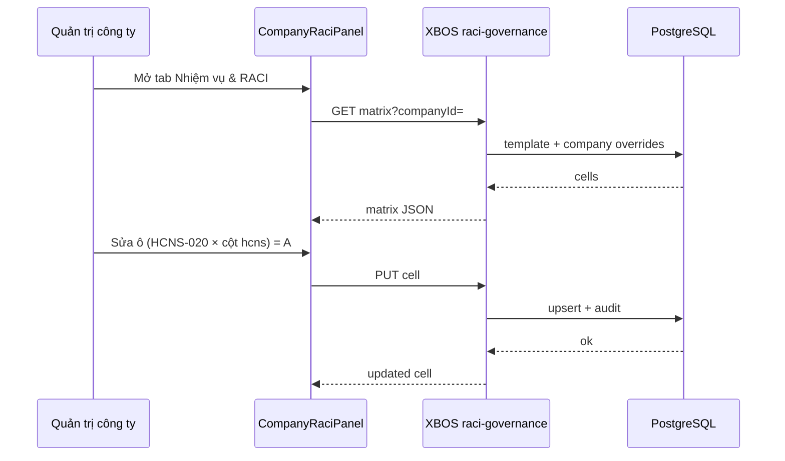

# SRS — Quản trị RACI & số hóa nhiệm vụ (X-BOS)

## 1. Mục đích

Đặc tả phần mềm cho tab **Nhiệm vụ & RACI** trong chi tiết pháp nhân và API/DB hỗ trợ số hóa quản trị tập đoàn.

**Traceability:** BR-RACI-01 … BR-RACI-07 → UC-RACI-* → API → `company_raci_*` tables.

## 2. Actors

| Actor | Mô tả |
|-------|--------|
| Quản trị tập đoàn | Sửa template group, xem coverage toàn tập đoàn |
| Quản trị công ty | Override ma trận theo `company_id` |
| Hệ thống (XBOS API) | Enforce scope, audit, đọc catalog |
| Phân hệ downstream | Tiêu thụ `permission_code` / workflow (P2) |

## 3. Danh mục use case

| Mã | Tên | BR |
|----|-----|-----|
| UC-RACI-01 | Xem catalog hoạt động RACI theo khối nghiệp vụ | BR-RACI-01 |
| UC-RACI-02 | Xem & chỉnh ma trận RACI tại chi tiết pháp nhân | BR-RACI-02, BR-RACI-07 |
| UC-RACI-03 | Xem ánh xạ capability phân hệ cho hoạt động | BR-RACI-03, BR-RACI-04 |
| UC-RACI-04 | Gán cột RACI ↔ chức danh / position template | BR-RACI-05 |
| UC-RACI-05 | Import / nâng version catalog từ file khách hàng | BR-RACI-01 |
| UC-RACI-06 | Báo cáo độ phủ số hóa theo công ty | BR-RACI-04 |

---

## UC-RACI-01 — Xem catalog hoạt động

### Purpose
Người dùng tra cứu danh sách hoạt động RACI chuẩn tập đoàn (266 dòng) theo khối (HĐQT, HCNS, …).

### Use cases

**Happy path**
1. User mở tab Nhiệm vụ & RACI → sub-view Ma trận.
2. Hệ thống tải `GET /raci-governance/activities?domain=phong_hcns`.
3. Hiển thị bảng STT, mã hoạt động, tên, khối.

**Alternate**
- Lọc theo từ khóa tên hoạt động.
- Chọn「Tất cả khối」.

**Exception**
- Không có catalog → hiển thị empty + hướng dẫn chạy `pnpm seed:raci:catalog`.

### Business logic

| Rule ID | Condition → Action → Outcome |
|---------|------------------------------|
| BL-RACI-01-01 | `tenant_id` thiếu → 400 `SCOPE_TENANT_REQUIRED` |
| BL-RACI-01-02 | `catalog_version` không tồn tại → trả `active_version` mới nhất |

### Data interaction

| Field | Validation | Owner | Source |
|-------|------------|-------|--------|
| `activity_code` | Unique per tenant+version | XBOS | Generated `BQT-001`, `HCNS-020` |
| `domain_code` | Enum khối | XBOS | Parser import |
| `name` | 3–500 chars | XBOS | Markdown khách hàng |

### Acceptance criteria

- [ ] PASS: API trả ≥ 240 activities sau seed.
- [ ] PASS: Filter `domain_code=phong_hcns` chỉ trả khối HCNS.

---

## UC-RACI-02 — Ma trận RACI tại chi tiết pháp nhân

### Purpose
Cấu hình R/A/C/I cho từng hoạt động × 18 cột vai trò **theo công ty** (có kế thừa group template).

### Activity diagram (tóm tắt)

### Business logic

| Rule ID | Condition → Action → Outcome |
|---------|------------------------------|
| BL-RACI-02-01 | `raci_letters` chỉ ∈ {R,A,C,I,AR,A/R,…} chuẩn hóa | Lưu chuỗi gốc + `letters[]` parsed |
| BL-RACI-02-02 | `company_id` ≠ scope user | 403 |
| BL-RACI-02-03 | Ô trống | Xóa override → fallback template group |

### Data interaction

| Field | Validation | Owner |
|-------|------------|-------|
| `company_id` | Required, UUID/text scope | Request header |
| `activity_id` | FK catalog | DB |
| `org_column_id` | FK `RaciOrgColumnId` | DB |
| `raci_letters` | Max 8 chars | DB |

### Acceptance criteria

- [ ] PASS: Sửa ô → reload giữ giá trị.
- [ ] PASS: Công ty B override không đổi công ty A.

---

## UC-RACI-03 — Ánh xạ capability phân hệ

### Purpose
Mỗi hoạt động hiển thị phân hệ/chức năng hệ thống đảm nhiệm (HRM payroll, CRM quote, …).

### Business logic

| Rule ID | Condition → Action → Outcome |
|---------|------------------------------|
| BL-RACI-03-01 | Activity có R/A và 0 capability active | Flag `digitization_status=gap` |
| BL-RACI-03-02 | `module_code=hrm` | `feature_code` phải thuộc registry HRM |

### Data interaction — `ecosystem_capability`

| Field | Semantics |
|-------|-----------|
| `module_code` | `hrm`, `xbos`, `crm`, `fleet`, `lgts` |
| `feature_code` | `payroll.run`, `employees.list`, … |
| `permission_code` | Liên kết `xbos_permission_definition` (P2) |
| `workflow_id` | Optional WF step |
| `raci_letter_required` | R hoặc A khi enforce |

### Acceptance criteria

- [ ] PASS: Sub-view hiển thị heatmap module × count activities.
- [ ] PASS: Drill-down 1 activity → list capabilities.

---

## UC-RACI-04 — Gán cột RACI ↔ chức danh

### Purpose
Liên kết cột `hcns` với `position_template` code CHRO tại công ty.

### Acceptance criteria

- [ ] PASS: Dropdown 18 cột → chọn position template.
- [ ] PASS: Lưu `company_raci_column_binding`.

---

## UC-RACI-05 — Import catalog

### Purpose
Ops chạy script import từ `docs/ma trận chức năng RACI.md`.

### Acceptance criteria

- [ ] PASS: `pnpm seed:raci:catalog` idempotent.
- [ ] PASS: Log số dòng import + domain breakdown.

---

## UC-RACI-06 — Báo cáo độ phủ

### Purpose
Dashboard nhỏ trong tab: % hoạt động có R/A đã có capability.

### Acceptance criteria

- [ ] PASS: `coverage_pct` khớp công thức: `mapped_ra / total_ra`.

---

## 4. Ma trận validation lỗi

| Mã | HTTP | Khi |
|----|------|-----|
| `RACI-400-01` | 400 | Thiếu companyId |
| `RACI-403-01` | 403 | Ngoài scope |
| `RACI-404-01` | 404 | activity_id không tồn tại |
| `RACI-409-01` | 409 | Version catalog conflict |

## 5. NFR

- Load ma trận 266×18 < 2s (p95) với pagination/virtual scroll UI.
- Audit log retention ≥ 24 tháng (policy tập đoàn).

## 6. Tham chiếu implementation

| Artifact | Path |
|----------|------|
| UI Panel | `apps/web/web-portal/src/pages/command-center/CompanyRaciPanel.tsx` |
| API | `apps/api/xbos-api/src/raci-governance/` |
| Migration | `apps/api/xbos-api/migrations/20260516_raci_governance.sql` |
| Seed | `scripts/seed-raci-activity-catalog.mjs` |
