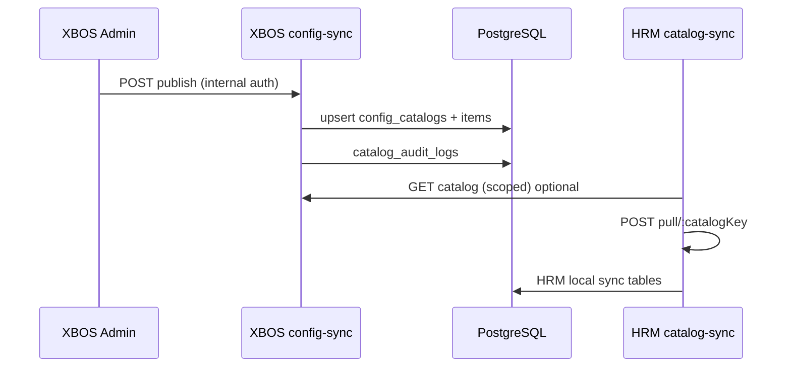

# Sprint S1 — BA-Process acceptance package (UC-XBOS-03..07, SYNC, MET)

| Field | Value |
|-------|--------|
| **work_item_id** | `P1-S1-BA-P-01` |
| **Sprint** | S1 (M01 hub — catalog / sync / audit / metrics) |
| **Author** | BA-Process |
| **Date** | 2026-05-23 |
| **Consumers** | Dev-BE (`P1-S1-BE-01`…`BE-04`), QA (`P1-S1-QA-01`), SA (OpenAPI drift guard) |

## References (source of truth)

| Artifact | Role |
|----------|------|
| `docs/program/sprints/S1_SPRINT_BACKLOG.md` | Sprint ordering; item 4 = this pack |
| `docs/decisions/ADR-XBOS-M01-OPENAPI-BOUNDARIES.md` | Planes, scope invariants, S1 deferrals |
| `docs/api/openapi/xbos-api.yaml` | `operationId` + HTTP codes for QA traceability |
| `docs/xbos/SRS.md` §2–7 | BRD-aligned UC narrative (legacy `XBOS-ERR-*` names) |
| `docs/xbos/BRD.md` §7–9 | BR-XBOS-01..05 |
| `apps/api/xbos-api/src/config-sync/*` | **Runtime truth** for catalog codes (`XBOS-CFG-*`) |
| `apps/api/hrm-api/src/catalog-sync/*` | HRM spoke pull (no catalog write) |
| `docs/ecosystem/SRS.md` | `UC-ECO-SCOPE-01/02` cross-cutting scope |

## Scope

### In scope (S1)

- `UC-XBOS-03` — get catalog by key + target
- `UC-XBOS-04` — list catalogs by target
- `UC-XBOS-05` — publish catalog version (implementation path below)
- `UC-XBOS-06` — audit **emit** on publish (REST query deferred S1 per ADR)
- `UC-XBOS-07` — satellite alert ingest (**BE-04**; not in repo at pack time)
- `UC-XBOS-SYNC-01` — bootstrap group catalogs (`bootstrap-xevn`)
- `UC-XBOS-MET-01` — service metrics (`GET /metrics`)
- Cross-cutting: `SCOPE_CONTEXT_MISMATCH` (409) prevention on scoped catalog reads

### Out of scope (S1)

- SRS legacy `POST /api/xbos/version/publish` — superseded by `config-sync/catalog/{catalogKey}/publish`
- `GET /api/xbos/audit` REST (ADR: `platform_audit_events` emit only in S1)
- `catalog-governance` approval workflow as **gate** for publish (S1 publish is internal-auth; governance inbox is parallel CC lane)
- KPI math (`kpi-engine`) — separate BE-02; only referenced for scope-409 pilot alignment

### API path mapping (SRS → S1 implementation)

| UC | SRS (legacy) | S1 canonical (`xbos-api.yaml` / code) |
|----|--------------|----------------------------------------|
| UC-XBOS-03 | `GET .../catalog/:catalogKey?target=` | `configSyncGetCatalog` → `GET /config-sync/catalog/{catalogKey}` |
| UC-XBOS-04 | `GET .../catalogs?target=` | `configSyncListCatalogs` → `GET /config-sync/catalogs` |
| UC-XBOS-05 | `POST .../version/publish` | `configSyncPublishCatalog` → `POST /config-sync/catalog/{catalogKey}/publish` |
| UC-XBOS-SYNC-01 | (bootstrap) | `configSyncBootstrapXevn` → `POST /config-sync/bootstrap-xevn` |
| UC-XBOS-MET-01 | metrics | `xbosMetrics` → `GET /metrics?format=prometheus` |
| UC-XBOS-06 | `GET /audit` | `catalog_audit_logs` row on publish + `PlatformAuditService.emit` (BE-04) |
| UC-XBOS-07 | `POST /alerts/violation-ingest` | **Not implemented** — target `P1-S1-BE-04` |

---

## 1. Business rule matrix

### 1.1 Catalog publish (`UC-XBOS-05` / `configSyncPublishCatalog`)

| ID | Condition | Action | Outcome | HTTP | Code (runtime) |
|----|-----------|--------|---------|------|----------------|
| BR-CAT-PUB-01 | Caller lacks `Authorization` and valid `x-internal-api-key` | Reject before service | No DB write | 401 | `XBOS-AUTH-001` |
| BR-CAT-PUB-02 | `catalogKey` fails normalize regex | Reject | No DB write | 400 | `XBOS-VAL-002` |
| BR-CAT-PUB-03 | Payload missing `tenantId`, `companyId`, `name`, `domain`, `assignedTo`, or `items[]` | Reject | No DB write | 400 | `XBOS-VAL-003` (service validation) |
| BR-CAT-PUB-04 | No row for `(tenantId, companyId, catalogKey)` | Insert catalog + items | `version = 1` | 200 | `XBOS-CFG-203` |
| BR-CAT-PUB-05 | Row exists; item checksum **unchanged** | Upsert metadata; keep version | Idempotent publish | 200 | `XBOS-CFG-203`; `version` unchanged |
| BR-CAT-PUB-06 | Row exists; checksum **changed** | Replace items; bump version | `version = previous + 1` | 200 | `XBOS-CFG-203` |
| BR-CAT-PUB-07 | Publish succeeds | Insert `catalog_audit_logs` (`publish_upsert`, actor, after_payload) | Audit trail for UC-06 partial | — | DB row |
| BR-CAT-PUB-08 | Publish succeeds (BE-04) | `PlatformAuditService.emit` with `entityType=config_catalog` | Platform audit event | — | `platform_audit_events` row |
| BR-CAT-GOV-01 | Extension change pending in `catalog-governance` | **S1:** does not block internal publish | Document for CC UX only | — | N/A until product binds gate |

### 1.2 Catalog read / list (`UC-XBOS-03`, `UC-XBOS-04`)

| ID | Condition | Action | Outcome | HTTP | Code |
|----|-----------|--------|---------|------|------|
| BR-CAT-GET-01 | Same as BR-CAT-PUB-01 | Reject | No read | 401 | `XBOS-AUTH-001` |
| BR-CAT-GET-02 | `target` ∉ `{hrm, xbos, web-portal}` | Reject at controller | No service call | 400 | `XBOS-VAL-001` |
| BR-CAT-GET-03 | JWT `tenantId`/`companyId` present and query param **differs** | Reject at `resolveScopeContext` | No service call | 409 | `SCOPE_CONTEXT_MISMATCH` |
| BR-CAT-GET-04 | Missing `tenantId` or `companyId` (no claim fallback) | Reject | No service call | 400 | `SCOPE_TENANT_REQUIRED` / `SCOPE_COMPANY_REQUIRED` |
| BR-CAT-GET-05 | Catalog row missing for scope | Reject | No partial data | 404 | `XBOS-CFG-001` |
| BR-CAT-GET-06 | Catalog exists; `target` ∉ `assigned_systems` | Reject (BR-XBOS-03) | No data leak | 403 | `XBOS-CFG-002` |
| BR-CAT-GET-07 | Stored checksum ≠ deterministic checksum of items | Reject | Data integrity guard | 409 | `XBOS-CFG-004` |
| BR-CAT-GET-08 | All checks pass | Return contract envelope + items | Consumer may cache by `version`+`checksum` | 200 | `XBOS-CFG-201` (get) / `XBOS-CFG-202` (list) |

### 1.3 Scope 409 prevention (portal + spokes)

| ID | Condition | Action | Outcome | Evidence |
|----|-----------|--------|---------|----------|
| BR-SCOPE-01 | Portal CEO session JWT `companyId=holding` | All scoped XBOS/HRM calls use `holding` (not `main`) | No `SCOPE_CONTEXT_MISMATCH` on load | `docs/qa/PILOT_BUSINESS_FLOW_MATRIX.md` P-CC-04; `scope-context.spec.ts` |
| BR-SCOPE-02 | `GlobalFilter` / `xbosHttp` sends query `companyId` | Must equal JWT claim when both sent | 409 prevented | `apps/web/web-portal/src/integrations/xbosHttp.ts` (FE S1-FE-01) |
| BR-SCOPE-03 | KPI rollup (`kpi-engine/rollup`) | Same `resolveScopeContext` as catalog | 409 on drift | OpenAPI `kpiEngineRollup` 409 |
| BR-SCOPE-04 | Tenant-only endpoints (`portal-alerts`, position templates) | Use `resolveTenantOnlyContext` | No false `SCOPE_COMPANY_REQUIRED` | ADR § Scope rules |
| BR-SCOPE-05 | HRM `catalog-sync` pull | Scope via headers + JWT; **no** catalog definition write in HRM | Pull-only spoke | `catalog-sync.controller.ts` |

### 1.4 Sync paths (XBOS ↔ HRM)

| ID | Step | Actor | API | Outcome |
|----|------|-------|-----|---------|
| BR-SYNC-01 | Seed group catalogs | Ops / bootstrap job | `POST /api/xbos/config-sync/bootstrap-xevn` | `XBOS-CFG-200`; seeds holding/VTC catalogs |
| BR-SYNC-02 | Publish new version | XBOS admin / CI | `POST /api/xbos/config-sync/catalog/{key}/publish` | Version bump when checksum changes |
| BR-SYNC-03 | HRM pull after publish | HRM job or manual | `POST /api/hrm/catalog-sync/pull/{catalogKey}` | `HRM-SYNC-200`; local replica updated |
| BR-SYNC-04 | HRM read local | HRM API consumers | `GET /api/hrm/catalog-sync/{catalogKey}` | `HRM-SYNC-201` |
| BR-SYNC-05 | HRM list local | HRM API | `GET /api/hrm/catalog-sync` | `HRM-SYNC-202` |
| BR-SYNC-06 | Direct read (no pull) | Internal service | `GET /api/xbos/config-sync/catalog/{key}?target=hrm` | Source of truth from XBOS DB |

---

## 2. Use-case flows (happy / alternate / exception)

### UC-XBOS-03 — Lấy danh mục theo khóa và phân hệ đích

| Path | Steps | Result |
|------|-------|--------|
| **Happy** | Auth OK → scope resolved → catalog exists → target assigned → checksum OK | 200 `XBOS-CFG-201` + `data` contract |
| **Alt-A** | JWT omits query params; claims supply `tenantId`/`companyId` | 200 (claim-only scope) |
| **Alt-B** | `target=xbos` for ops introspection | 200 if assigned includes `xbos` |
| **Exc-1** | Invalid `target` | 400 `XBOS-VAL-001` |
| **Exc-2** | `companyId` query ≠ JWT | 409 `SCOPE_CONTEXT_MISMATCH` |
| **Exc-3** | Unknown `catalogKey` | 404 `XBOS-CFG-001` |
| **Exc-4** | Target not in `assignedTo` | 403 `XBOS-CFG-002` |
| **Exc-5** | Checksum drift | 409 `XBOS-CFG-004` |
| **Exc-6** | No auth | 401 `XBOS-AUTH-001` |

### UC-XBOS-04 — Liệt kê danh mục theo phân hệ đích

| Path | Steps | Result |
|------|-------|--------|
| **Happy** | Auth OK → scope OK → filter `assigned_systems @> [target]` → all rows checksum OK | 200 `XBOS-CFG-202`; `data.total` ≥ 0 |
| **Alt-A** | Empty assignment set for scope | 200; `total: 0`; `data: []` |
| **Exc-1..6** | Same scope/auth/target rules as UC-03 | Per-row failure: first checksum mismatch fails entire list with `XBOS-CFG-004` |

### UC-XBOS-05 — Phát hành phiên bản hợp đồng dữ liệu (catalog publish)

| Path | Steps | Result |
|------|-------|--------|
| **Happy** | Auth OK → valid payload → checksum delta → version++ → audit log | 200 `XBOS-CFG-203` |
| **Alt-A** | Idempotent republish (same items) | 200; version unchanged (BR-CAT-PUB-05) |
| **Alt-B** | First-time catalog | version = 1 |
| **Exc-1** | No auth | 401 `XBOS-AUTH-001` |
| **Exc-2** | Invalid key / payload | 400 `XBOS-VAL-002` / `XBOS-VAL-003` |
| **Exc-3** | DB transaction failure | 5xx; no partial catalog (service uses sequential awaits; BE must wrap txn in hardening) |

*SRS exceptions `XBOS-ERR-WORKFLOW-NOT-APPROVED` / `XBOS-ERR-VERSION-CONFLICT` apply when governance gate or monotonic **artifact** versioning is product-bound; S1 uses **checksum-driven** version on `config_catalogs`.*

### UC-XBOS-06 — Truy vấn nhật ký kiểm toán

| Path | Steps | Result |
|------|-------|--------|
| **Happy (S1)** | After UC-05 publish | Row in `catalog_audit_logs`; optional `platform_audit_events` |
| **Alt-A** | Ops SQL / future REST | Query by `catalog_key`, time range |
| **Exc-1** | Publish failed | No audit row |
| **Defer** | `GET /api/xbos/audit` | S2 — ADR: no REST in S1 |

### UC-XBOS-07 — Tiếp nhận cảnh báo từ phân hệ vệ tinh

| Path | Steps | Result |
|------|-------|--------|
| **Happy (target)** | Valid `moduleCode`, `occurredAt`, payload | 202 `XBOS-OK-ALERT-INGEST` (SRS) |
| **Exc-1..3** | Per SRS §4 UC-07 | Validation / module / datetime errors |
| **S1 status** | Endpoint absent | **BE-04** implements; QA defers L1 until route exists |

### UC-XBOS-SYNC-01 — Bootstrap hệ sinh thái XEVN

| Path | Steps | Result |
|------|-------|--------|
| **Happy** | Internal auth → `bootstrapXevnGroupConfig()` | 200 `XBOS-CFG-200`; `seeded_catalogs` > 0 |
| **Alt-A** | Re-run bootstrap | Idempotent publish per catalog key |
| **Exc-1** | No auth | 401 `XBOS-AUTH-001` |

### UC-XBOS-MET-01 — Xem chỉ số vận hành API

| Path | Steps | Result |
|------|-------|--------|
| **Happy** | `GET /api/xbos/metrics?format=prometheus` | 200; body contains `http_requests_total` |
| **Alt-A** | JSON default (no format) | 200 metrics envelope |
| **Exc-1** | Service down | Non-200 / connection refused (L0 stack) |

---

## 3. Acceptance criteria (pass/fail + evidence hooks)

| AC-ID | UC | Criterion (pass when) | Fail when | Evidence hook |
|-------|-----|----------------------|-----------|----------------|
| AC-S1-03-01 | 03 | `GET .../catalog/job_titles?target=hrm` with aligned JWT + scope returns 200 and `code=XBOS-CFG-201` | 401/403/404/409 | `config-sync.controller.spec.ts` — "returns deterministic codes for get/list" |
| AC-S1-03-02 | 03 | Query `companyId` ≠ JWT → 409 before DB | Service invoked | Same file — "rejects scope mismatch before service read" |
| AC-S1-03-03 | 03 | `target=bad-target` → 400 `XBOS-VAL-001` | 200 | Same file — "rejects invalid target values" |
| AC-S1-04-01 | 04 | List returns `XBOS-CFG-202` and only catalogs with `hrm` in `assignedTo` | Wrong target rows returned | `config-sync.service.spec.ts` + manual SQL spot-check |
| AC-S1-05-01 | 05 | Publish with item change increments `version` | Version flat when checksum changes | `config-sync.service.spec.ts` — version bump case |
| AC-S1-05-02 | 05 | Idempotent publish keeps `version` | Version increments on identical payload | `config-sync.service.spec.ts` — "keeps version unchanged when checksum is unchanged" |
| AC-S1-05-03 | 05 | Publish without auth → 401 | 200 without credentials | `config-sync.controller.spec.ts` — publish auth tests |
| AC-S1-05-04 | 05 | `catalog_audit_logs` row after publish | Missing audit on success | DB assertion in BE integration test (BE-01 deliverable) |
| AC-S1-06-01 | 06 | Publish emits platform audit (BE-04) | No row in `platform_audit_events` | `platform-audit.service.ts` + BE-04 jest |
| AC-S1-06-02 | 06 | S1: no requirement for `GET /audit` | False PASS on non-existent route | ADR § Audit row |
| AC-S1-07-01 | 07 | **Deferred** until route exists | N/A | Track under `P1-S1-BE-04` |
| AC-S1-SYNC-01 | SYNC-01 | Bootstrap with internal key → `XBOS-CFG-200` | 401 | `config-sync.controller.spec.ts` — bootstrap tests |
| AC-S1-SYNC-02 | SYNC-01 | HRM pull after bootstrap → `HRM-SYNC-200` | HRM-AUTH / scope errors | `apps/api/hrm-api/src/catalog-sync/catalog-sync.controller.spec.ts` |
| AC-S1-MET-01 | MET-01 | Prometheus scrape contains `http_requests_total` | Missing counter | `pnpm verify:openapi-contract` (stack up); `docs/ecosystem/NFR_OBSERVABILITY_SECURITY_BASELINE.md` |
| AC-S1-SCOPE-01 | 03/04/KPI | `scope-context.spec.ts` PASS | Mismatch not 409 | `apps/api/xbos-api/src/common/scope-context.spec.ts` |
| AC-S1-SCOPE-02 | Portal | P-CC-04 load: no 409 on `settings-catalogs` / rollup | Console 409 | `docs/qa/PILOT_BUSINESS_FLOW_MATRIX.md` L2 QA (`P1-S1-QA-01`) |
| AC-S1-CONTRACT-01 | All M01 | `pnpm verify:openapi-m01` exit 0 | Missing paths in YAML | `scripts/verify-openapi-m01.mjs` |
| AC-S1-E2E-01 | Tenant | `xbos-api` `test:e2e:security` + `tenant-isolation.e2e-spec.ts` when DB env set | Unauthorized cross-tenant read | `pnpm test:e2e:security` |

### QA UAT extension (P1-S1-QA-01)

Add scenarios to `docs/qa/SYSTEM_INTEGRATION_UAT_SCENARIO.md` (or S1 annex):

| Scenario | Steps | Pass |
|----------|-------|------|
| UAT-XBOS-CAT-01 | Login CEO → internal/bootstrap already run → `GET catalog/job_titles?target=hrm&tenantId=xevn&companyId=holding` | 200 `XBOS-CFG-201` |
| UAT-XBOS-CAT-02 | Same token, `companyId=main` deliberate | 409 `SCOPE_CONTEXT_MISMATCH` |
| UAT-XBOS-CAT-03 | Publish `job_titles` patch → HRM `POST catalog-sync/pull/job_titles` | HRM-SYNC-200; version ≥ XBOS |
| UAT-XBOS-MET-01 | `GET /api/xbos/metrics?format=prometheus` | `http_requests_total` present |

Runner: `pnpm run test:system:uat` → `docs/qa/evidence/system-integration-uat-report.json` (`verdict: PASS`).

---

## 4. Handoff packet

| Field | Value |
|-------|--------|
| **from_role** | ba-process |
| **to_role** | pm → dev-be, qa |
| **entry_criteria** | `P1-S1-SA-01` ADR + `xbos-api.yaml` on bus; S1 backlog item 4 |
| **exit_criteria** | This document published; BR matrix + AC hooks traceable to OpenAPI `operationId`; `PASS_TO_PM` on bus |
| **evidence_path** | `docs/xbos/S1_BA_PROCESS_XBOS_UC03-07.md` |
| **needed_by** | `P1-S1-BE-01` (catalog), `P1-S1-BE-04` (audit/alert), `P1-S1-QA-01` |
| **ack_status** | `PASS_TO_PM` |

### Dev-BE expectations

1. Keep response codes aligned with §1 matrices (`XBOS-CFG-*`, not SRS `XBOS-OK-*` aliases unless mapped in OpenAPI).
2. Wire `PlatformAuditService.emit` on publish (`P1-S1-BE-04`).
3. Implement `UC-XBOS-07` ingest with SRS validation codes or document mapping table in BE evidence MD.
4. Any route change → update `xbos-api.yaml` + ADR in same PR.

### QA expectations

1. Run jest hooks in §3 before L2 portal sweep.
2. Extend system UAT with §3 UAT-XBOS-* scenarios.
3. L2: P-CC-04 + Command Center catalog panels — zero 409 scope per `business-flow-zero-defect-gate.mdc`.

### Open risks / clarifications

| ID | Risk | Owner | Trigger |
|----|------|-------|---------|
| R-S1-01 | SRS `XBOS-ERR-*` vs runtime `XBOS-CFG-*` naming drift | SA + BA-Data | Customer-facing SRS export |
| R-S1-02 | `catalog-governance` not gating publish | PM | If CC requires approval before prod publish |
| R-S1-03 | UC-07 not implemented | Dev-BE BE-04 | Before alerting integrations |
| R-S1-04 | UAT script lacks catalog scenarios today | QA | `P1-S1-QA-01` |

---

## 5. Traceability snapshot

| UC | operationId | Primary test / command |
|----|-------------|------------------------|
| UC-XBOS-03 | `configSyncGetCatalog` | `config-sync.controller.spec.ts` |
| UC-XBOS-04 | `configSyncListCatalogs` | `config-sync.controller.spec.ts` |
| UC-XBOS-05 | `configSyncPublishCatalog` | `config-sync.service.spec.ts`, controller auth |
| UC-XBOS-06 | (emit) | `catalog_audit_logs` + BE-04 platform audit |
| UC-XBOS-07 | TBD | `P1-S1-BE-04` |
| UC-XBOS-SYNC-01 | `configSyncBootstrapXevn` | controller bootstrap tests |
| UC-XBOS-MET-01 | `xbosMetrics` | `verify:openapi-contract`, NFR baseline |
