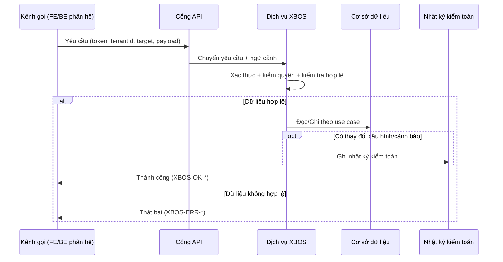

# SRS Phân Hệ XBOS

## 1. Mục Đích

Đặc tả yêu cầu phần mềm chi tiết cho XBOS, bảo đảm:

- đồng nhất với BRD XBOS 2.2,
- bám cấu trúc phân hệ trong hệ sinh thái,
- Việt hóa thuật ngữ đầy đủ (danh mục, hợp đồng dữ liệu, nhật ký kiểm toán),
- mô tả rõ nhánh điều kiện if/else, kiểm tra hợp lệ, thành công/thất bại, mã lỗi.

### 1.1 Tham chiếu bắt buộc — phạm vi dữ liệu toàn hệ

Mọi use case XBOS có truy cập dữ liệu theo tenant hoặc phát hành xuống phân hệ phải **bổ sung** hành vi từ `UC-ECO-SCOPE-01` và `UC-ECO-SCOPE-02` trong `docs/ecosystem/SRS.md` (và `BR-ECO-SCOPE-*` trong `docs/ecosystem/BRD.md`). Phân hệ mới trong hệ sinh thái chỉ cần trích dẫn bộ tài liệu `docs/ecosystem/*` thay vì sao chép.

## 2. Danh Sách Use Case Chuẩn

| Mã use case | Tên | Điểm vào API chính |
|---|---|---|
| UC-XBOS-01 | Kiểm tra trạng thái dịch vụ | `GET /api/xbos` |
| UC-XBOS-02 | Khởi tạo/cập nhật danh mục dùng chung | `POST /api/xbos/config-sync/bootstrap-xevn` |
| UC-XBOS-03 | Lấy danh mục theo khóa và phân hệ đích | `GET /api/xbos/config-sync/catalog/:catalogKey?target=...` |
| UC-XBOS-04 | Liệt kê danh mục theo phân hệ đích | `GET /api/xbos/config-sync/catalogs?target=...` |
| UC-XBOS-05 | Phát hành phiên bản hợp đồng dữ liệu | `POST /api/xbos/version/publish` |
| UC-XBOS-06 | Truy vấn nhật ký kiểm toán | `GET /api/xbos/audit?...` |
| UC-XBOS-07 | Tiếp nhận cảnh báo từ phân hệ vệ tinh | `POST /api/xbos/alerts/violation-ingest` |

## 3. Luồng Nghiệp Vụ Tổng Quát (Sequence)

## 4. Đặc Tả Use Case Chi Tiết

### UC-XBOS-01 - Kiểm tra trạng thái dịch vụ

- If dịch vụ hoạt động bình thường -> trả `XBOS-OK-HEALTH`.
- Else -> trả `XBOS-ERR-SERVICE-UNAVAILABLE`.

### UC-XBOS-02 - Khởi tạo/cập nhật danh mục dùng chung

- If payload thiếu trường bắt buộc -> `XBOS-ERR-VALIDATION`.
- Else if người gọi không có quyền quản trị -> `XBOS-ERR-FORBIDDEN`.
- Else if khóa danh mục chưa tồn tại -> tạo mới.
- Else -> cập nhật theo nguyên tắc idempotent.
- Success: trả số lượng bản ghi tạo mới/cập nhật/không đổi.
- Fail: không để lại ghi dở dang nếu giao dịch lỗi.

### UC-XBOS-03 - Lấy danh mục theo khóa và phân hệ đích

- If thiếu `catalogKey` hoặc `target` -> `XBOS-ERR-VALIDATION`.
- Else if `target` không hợp lệ -> `XBOS-ERR-TARGET-INVALID`.
- Else if không có quyền theo phạm vi -> `XBOS-ERR-FORBIDDEN`.
- Else if khóa danh mục không tồn tại -> `XBOS-ERR-CATALOG-NOT-FOUND`.
- Else if danh mục chưa gán cho phân hệ đích -> `XBOS-ERR-TARGET-NOT-ASSIGNED`.
- Else -> trả dữ liệu danh mục theo phiên bản lược đồ hiện hành.

### UC-XBOS-04 - Liệt kê danh mục theo phân hệ đích

- If `target` không hợp lệ -> `XBOS-ERR-TARGET-INVALID`.
- Else if không có quyền -> `XBOS-ERR-FORBIDDEN`.
- Else -> trả danh sách danh mục đã gán cho phân hệ đích.

### UC-XBOS-05 - Phát hành phiên bản hợp đồng dữ liệu

- If thiếu `artifactType`/`artifactKey`/`newVersion` -> `XBOS-ERR-VALIDATION`.
- Else if chưa duyệt quy trình -> `XBOS-ERR-WORKFLOW-NOT-APPROVED`.
- Else if phiên bản mới không hợp lệ (`newVersion <= currentVersion`) -> `XBOS-ERR-VERSION-CONFLICT`.
- Else -> phát hành thành công, ghi nhật ký kiểm toán trước/sau, gửi tín hiệu đồng bộ.

### UC-XBOS-06 - Truy vấn nhật ký kiểm toán

- If không đủ quyền -> `XBOS-ERR-FORBIDDEN`.
- Else if bộ lọc truy vấn không hợp lệ -> `XBOS-ERR-VALIDATION`.
- Else -> trả dữ liệu nhật ký theo phân trang.

### UC-XBOS-07 - Tiếp nhận cảnh báo từ phân hệ vệ tinh

- If payload thiếu trường bắt buộc -> `XBOS-ERR-VALIDATION`.
- Else if mã phân hệ nguồn không hợp lệ -> `XBOS-ERR-MODULE-INVALID`.
- Else if thời điểm xảy ra sai định dạng -> `XBOS-ERR-DATETIME-INVALID`.
- Else -> chuẩn hóa cảnh báo, loại trùng, lưu ảnh chụp cảnh báo.

## 5. Ma Trận Kiểm Tra Hợp Lệ Dữ Liệu

| Trường | Quy tắc | Mã lỗi |
|---|---|---|
| `tenantId` | bắt buộc cho API theo phạm vi | `XBOS-ERR-SCOPE-INVALID` |
| `target` | thuộc tập phân hệ đích hợp lệ | `XBOS-ERR-TARGET-INVALID` |
| `catalogKey` | không rỗng, phải tồn tại khi truy vấn | `XBOS-ERR-CATALOG-NOT-FOUND` |
| `schemaVersion` | số nguyên dương, tăng tuần tự | `XBOS-ERR-VERSION-CONFLICT` |
| `artifactType` | thuộc nhóm được phép | `XBOS-ERR-ARTIFACT-TYPE-INVALID` |
| `moduleCode` | thuộc danh sách phân hệ đã đăng ký | `XBOS-ERR-MODULE-INVALID` |
| `occurredAt` | định dạng ISO-8601 UTC | `XBOS-ERR-DATETIME-INVALID` |

## 6. Danh Mục Mã Lỗi Chuẩn

| Mã lỗi | HTTP | Ý nghĩa |
|---|---|---|
| `XBOS-ERR-AUTH-INVALID` | 401 | Token không hợp lệ/hết hạn |
| `XBOS-ERR-FORBIDDEN` | 403 | Không đủ quyền/phạm vi |
| `XBOS-ERR-VALIDATION` | 400 | Dữ liệu đầu vào không hợp lệ |
| `XBOS-ERR-TARGET-INVALID` | 400 | Phân hệ đích không hợp lệ |
| `XBOS-ERR-CATALOG-NOT-FOUND` | 404 | Không tìm thấy danh mục |
| `XBOS-ERR-TARGET-NOT-ASSIGNED` | 403 | Danh mục chưa gán cho phân hệ |
| `XBOS-ERR-WORKFLOW-NOT-APPROVED` | 409 | Chưa đủ điều kiện phát hành |
| `XBOS-ERR-VERSION-CONFLICT` | 409 | Xung đột phiên bản |
| `XBOS-ERR-MODULE-INVALID` | 400 | Mã phân hệ không hợp lệ |
| `XBOS-ERR-DATETIME-INVALID` | 400 | Thời gian không hợp lệ |
| `XBOS-ERR-SERVICE-UNAVAILABLE` | 503 | Dịch vụ tạm không sẵn sàng |

## 7. Danh Mục Mã Thành Công

| Mã thành công | HTTP | Use case |
|---|---|---|
| `XBOS-OK-HEALTH` | 200 | UC-XBOS-01 |
| `XBOS-OK-BOOTSTRAP` | 200/201 | UC-XBOS-02 |
| `XBOS-OK-CATALOG-GET` | 200 | UC-XBOS-03 |
| `XBOS-OK-CATALOG-LIST` | 200 | UC-XBOS-04 |
| `XBOS-OK-PUBLISH` | 200 | UC-XBOS-05 |
| `XBOS-OK-AUDIT-LIST` | 200 | UC-XBOS-06 |
| `XBOS-OK-ALERT-INGEST` | 202 | UC-XBOS-07 |

## 8. Yêu Cầu Phi Chức Năng

- Bảo mật: bắt buộc xác thực, phân quyền và kiểm tra phạm vi.
- Độ tin cậy: nhánh thất bại không tạo thay đổi dữ liệu ngoài ý muốn.
- Hiệu năng: truy vấn danh mục theo khóa/phân hệ đích phải ổn định.
- Khả năng vận hành: mọi thay đổi có nhật ký kiểm toán và mã tương quan giao dịch.

## 9. Tiêu Chí Chấp Nhận

- Use case UC-XBOS-01..07 có đủ kịch bản thành công/thất bại.
- Mã lỗi và HTTP status đúng bảng chuẩn.
- Nội dung use case đồng nhất với BRD XBOS 2.2.

## 10. Bổ sung use case Wave Full Ecosystem

| Mã use case | Tên | Điểm vào API chính |
|---|---|---|
| UC-XBOS-08 | CRUD Business Master theo domain | `GET/PUT/DELETE /api/xbos/business-master/:domain/items...` |
| UC-XBOS-09 | Tính KPI server-side | `POST /api/xbos/kpi-engine/evaluate`, `POST /api/xbos/kpi-engine/evaluate-batch` |

### UC-XBOS-08 - CRUD Business Master theo domain

- If domain không thuộc whitelist -> trả `XBOS-MASTER-400`.
- Else if thiếu scope tenant/company hợp lệ -> trả lỗi scope chuẩn (`SCOPE_TENANT_REQUIRED`, `SCOPE_COMPANY_REQUIRED`).
- Else if upsert hợp lệ -> ghi DB theo khóa `(tenant_id, company_id, domain, item_id)` và trả thành công.
- Else if delete -> cập nhật `status='deleted'` (soft-delete), không xóa cứng mặc định.

### UC-XBOS-09 - Tính KPI server-side

- If payload thiếu `target` hoặc `actual` -> lỗi validation.
- Else tính score/band/reward/penalty theo rule engine server-side, trả kết quả xác định.
- Batch mode xử lý nhiều dòng theo cùng nguyên tắc, trả kết quả theo index đầu vào.
