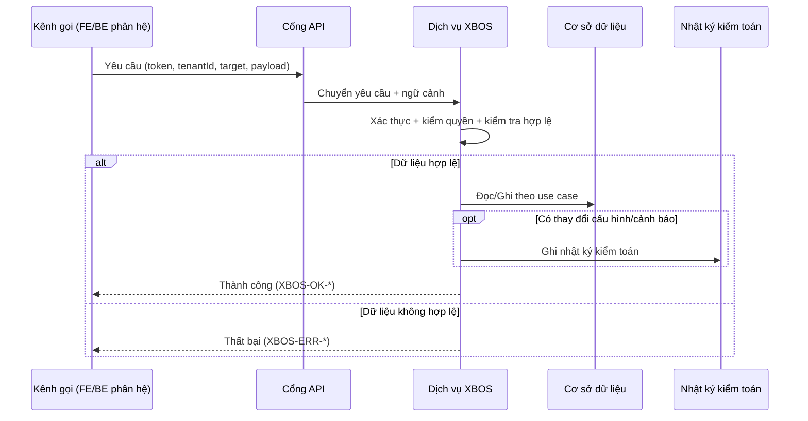
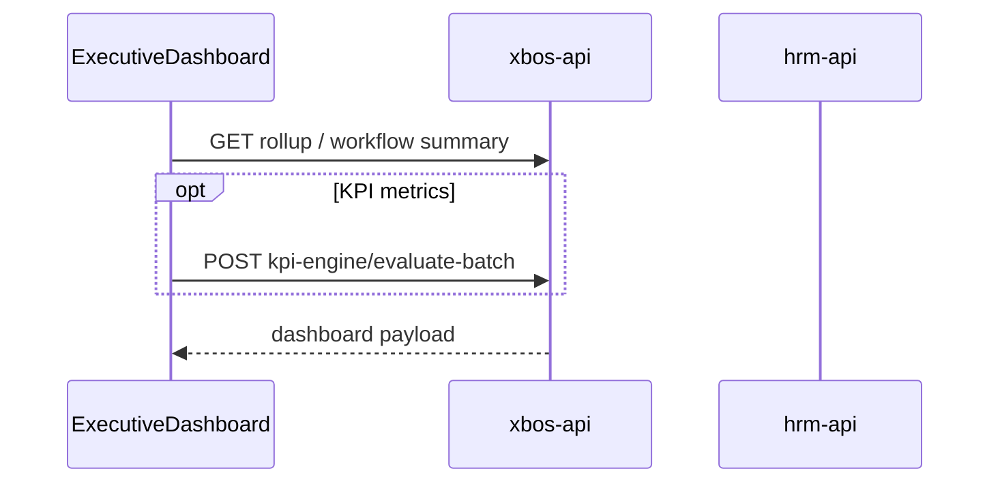
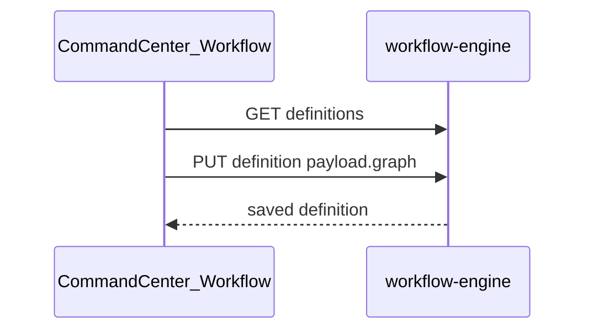

# SRS Phân Hệ XBOS

> **SoT khách (Bateco W1+W2 — 2026-07-22):** `docs/client-delivery/xbos/SRS_XBOS_KHACH.md` + `BRD_XBOS_KHACH.md` · inventory `docs/xbos/UC_INVENTORY_BRD_SRS.md` (**16 FR** = 12 W1 spine + RACI/RBAC/CAT-CC/KPI). File này giữ **annex kỹ thuật / API** đội ngũ — **không** đè FR khách; leftover CAT/WF/RACI sâu = đợt W3+.

## 1. Mục Đích

Đặc tả yêu cầu phần mềm chi tiết cho XBOS, bảo đảm:

- đồng nhất với BRD XBOS 2.2,
- bám cấu trúc phân hệ trong hệ sinh thái,
- Việt hóa thuật ngữ đầy đủ (danh mục, hợp đồng dữ liệu, nhật ký kiểm toán),
- mô tả rõ nhánh điều kiện if/else, kiểm tra hợp lệ, thành công/thất bại, mã lỗi.

### 1.1 Tham chiếu bắt buộc — phạm vi dữ liệu toàn hệ

Mọi use case XBOS có truy cập dữ liệu theo tenant hoặc phát hành xuống phân hệ phải **bổ sung** hành vi từ `UC-ECO-SCOPE-01` và `UC-ECO-SCOPE-02` trong `docs/ecosystem/SRS.md` (và `BR-ECO-SCOPE-*` trong `docs/ecosystem/BRD.md`). Phân hệ mới trong hệ sinh thái chỉ cần trích dẫn bộ tài liệu `docs/ecosystem/*` thay vì sao chép.

| Khái niệm | Quy tắc | Tài liệu |
|-----------|---------|----------|
| **Field display (U72 — toàn XBOS)** | Mọi enum/code/slug trên UI người dùng (CC, portal, x-bos-core) phải qua dictionary → nhãn VI; thiếu map → **«—»**; **cấm** fallback raw key; **cấm** bind `entity_type` làm ngành nghề | **FR-XBOS-U72-LABEL-01** · **BR-XBOS-LABEL-01..03** · slice `docs/xbos/SRS_FIELD_DISPLAY.md` · **AC-F-XBOS-*** / **AC-H-XBOS-*** |

## 2. Danh Sách Use Case Chuẩn

| Mã use case | Tên | Điểm vào API chính |
|---|---|---|
| UC-XBOS-01 | Kiểm tra trạng thái dịch vụ | `GET /api/xbos` |
| UC-XBOS-02 | Khởi tạo/cập nhật danh mục dùng chung | `POST /api/xbos/config-sync/bootstrap-xevn` |
| UC-XBOS-03 | Lấy danh mục theo khóa và phân hệ đích | `GET /api/xbos/config-sync/catalog/:catalogKey?target=...` |
| UC-XBOS-04 | Liệt kê danh mục theo phân hệ đích | `GET /api/xbos/config-sync/catalogs?target=...` |
| UC-XBOS-05 | Phát hành phiên bản hợp đồng dữ liệu | `POST /api/xbos/version/publish` |
| UC-XBOS-06 | Truy vấn nhật ký kiểm toán | `GET /api/xbos/audit?...` |
| UC-XBOS-07 | Tiếp nhận cảnh báo từ phân hệ vệ tinh | `POST /api/xbos/alerts/violation-ingest` |

## 3. Luồng Nghiệp Vụ Tổng Quát (Sequence)

## 4. Đặc Tả Use Case Chi Tiết

### UC-XBOS-01 - Kiểm tra trạng thái dịch vụ

- If dịch vụ hoạt động bình thường -> trả `XBOS-OK-HEALTH`.
- Else -> trả `XBOS-ERR-SERVICE-UNAVAILABLE`.

### UC-XBOS-02 - Khởi tạo/cập nhật danh mục dùng chung

- If payload thiếu trường bắt buộc -> `XBOS-ERR-VALIDATION`.
- Else if người gọi không có quyền quản trị -> `XBOS-ERR-FORBIDDEN`.
- Else if khóa danh mục chưa tồn tại -> tạo mới.
- Else -> cập nhật theo nguyên tắc idempotent.
- Success: trả số lượng bản ghi tạo mới/cập nhật/không đổi.
- Fail: không để lại ghi dở dang nếu giao dịch lỗi.

### UC-XBOS-03 - Lấy danh mục theo khóa và phân hệ đích

- If thiếu `catalogKey` hoặc `target` -> `XBOS-ERR-VALIDATION`.
- Else if `target` không hợp lệ -> `XBOS-ERR-TARGET-INVALID`.
- Else if không có quyền theo phạm vi -> `XBOS-ERR-FORBIDDEN`.
- Else if khóa danh mục không tồn tại -> `XBOS-ERR-CATALOG-NOT-FOUND`.
- Else if danh mục chưa gán cho phân hệ đích -> `XBOS-ERR-TARGET-NOT-ASSIGNED`.
- Else -> trả dữ liệu danh mục theo phiên bản lược đồ hiện hành.

### UC-XBOS-04 - Liệt kê danh mục theo phân hệ đích

- If `target` không hợp lệ -> `XBOS-ERR-TARGET-INVALID`.
- Else if không có quyền -> `XBOS-ERR-FORBIDDEN`.
- Else -> trả danh sách danh mục đã gán cho phân hệ đích.

### UC-XBOS-05 - Phát hành phiên bản hợp đồng dữ liệu

- If thiếu `artifactType`/`artifactKey`/`newVersion` -> `XBOS-ERR-VALIDATION`.
- Else if chưa duyệt quy trình -> `XBOS-ERR-WORKFLOW-NOT-APPROVED`.
- Else if phiên bản mới không hợp lệ (`newVersion <= currentVersion`) -> `XBOS-ERR-VERSION-CONFLICT`.
- Else -> phát hành thành công, ghi nhật ký kiểm toán trước/sau, gửi tín hiệu đồng bộ.

### UC-XBOS-06 - Truy vấn nhật ký kiểm toán

- If không đủ quyền -> `XBOS-ERR-FORBIDDEN`.
- Else if bộ lọc truy vấn không hợp lệ -> `XBOS-ERR-VALIDATION`.
- Else -> trả dữ liệu nhật ký theo phân trang.

### UC-XBOS-07 - Tiếp nhận cảnh báo từ phân hệ vệ tinh

- If payload thiếu trường bắt buộc -> `XBOS-ERR-VALIDATION`.
- Else if mã phân hệ nguồn không hợp lệ -> `XBOS-ERR-MODULE-INVALID`.
- Else if thời điểm xảy ra sai định dạng -> `XBOS-ERR-DATETIME-INVALID`.
- Else -> chuẩn hóa cảnh báo, loại trùng, lưu ảnh chụp cảnh báo.

## 5. Ma Trận Kiểm Tra Hợp Lệ Dữ Liệu

| Trường | Quy tắc | Mã lỗi |
|---|---|---|
| `tenantId` | bắt buộc cho API theo phạm vi | `XBOS-ERR-SCOPE-INVALID` |
| `target` | thuộc tập phân hệ đích hợp lệ | `XBOS-ERR-TARGET-INVALID` |
| `catalogKey` | không rỗng, phải tồn tại khi truy vấn | `XBOS-ERR-CATALOG-NOT-FOUND` |
| `schemaVersion` | số nguyên dương, tăng tuần tự | `XBOS-ERR-VERSION-CONFLICT` |
| `artifactType` | thuộc nhóm được phép | `XBOS-ERR-ARTIFACT-TYPE-INVALID` |
| `moduleCode` | thuộc danh sách phân hệ đã đăng ký | `XBOS-ERR-MODULE-INVALID` |
| `occurredAt` | định dạng ISO-8601 UTC | `XBOS-ERR-DATETIME-INVALID` |

## 6. Danh Mục Mã Lỗi Chuẩn

| Mã lỗi | HTTP | Ý nghĩa |
|---|---|---|
| `XBOS-ERR-AUTH-INVALID` | 401 | Token không hợp lệ/hết hạn |
| `XBOS-ERR-FORBIDDEN` | 403 | Không đủ quyền/phạm vi |
| `XBOS-ERR-VALIDATION` | 400 | Dữ liệu đầu vào không hợp lệ |
| `XBOS-ERR-TARGET-INVALID` | 400 | Phân hệ đích không hợp lệ |
| `XBOS-ERR-CATALOG-NOT-FOUND` | 404 | Không tìm thấy danh mục |
| `XBOS-ERR-TARGET-NOT-ASSIGNED` | 403 | Danh mục chưa gán cho phân hệ |
| `XBOS-ERR-WORKFLOW-NOT-APPROVED` | 409 | Chưa đủ điều kiện phát hành |
| `XBOS-ERR-VERSION-CONFLICT` | 409 | Xung đột phiên bản |
| `XBOS-ERR-MODULE-INVALID` | 400 | Mã phân hệ không hợp lệ |
| `XBOS-ERR-DATETIME-INVALID` | 400 | Thời gian không hợp lệ |
| `XBOS-ERR-SERVICE-UNAVAILABLE` | 503 | Dịch vụ tạm không sẵn sàng |

## 7. Danh Mục Mã Thành Công

| Mã thành công | HTTP | Use case |
|---|---|---|
| `XBOS-OK-HEALTH` | 200 | UC-XBOS-01 |
| `XBOS-OK-BOOTSTRAP` | 200/201 | UC-XBOS-02 |
| `XBOS-OK-CATALOG-GET` | 200 | UC-XBOS-03 |
| `XBOS-OK-CATALOG-LIST` | 200 | UC-XBOS-04 |
| `XBOS-OK-PUBLISH` | 200 | UC-XBOS-05 |
| `XBOS-OK-AUDIT-LIST` | 200 | UC-XBOS-06 |
| `XBOS-OK-ALERT-INGEST` | 202 | UC-XBOS-07 |

## 8. Yêu Cầu Phi Chức Năng

- Bảo mật: bắt buộc xác thực, phân quyền và kiểm tra phạm vi.
- Độ tin cậy: nhánh thất bại không tạo thay đổi dữ liệu ngoài ý muốn.
- Hiệu năng: truy vấn danh mục theo khóa/phân hệ đích phải ổn định.
- Khả năng vận hành: mọi thay đổi có nhật ký kiểm toán và mã tương quan giao dịch.

## 9. Tiêu Chí Chấp Nhận

- Use case UC-XBOS-01..07 có đủ kịch bản thành công/thất bại.
- Mã lỗi và HTTP status đúng bảng chuẩn.
- Nội dung use case đồng nhất với BRD XBOS 2.2.

## 10. Bổ sung use case Wave Full Ecosystem

| Mã use case | Tên | Điểm vào API chính |
|---|---|---|
| UC-XBOS-08 | CRUD Business Master theo domain | `GET/PUT/DELETE /api/xbos/business-master/:domain/items...` |
| UC-XBOS-09 | Tính KPI server-side | `POST /api/xbos/kpi-engine/evaluate`, `POST /api/xbos/kpi-engine/evaluate-batch` |

### UC-XBOS-08 - CRUD Business Master theo domain

- If domain không thuộc whitelist -> trả `XBOS-MASTER-400`.
- Else if thiếu scope tenant/company hợp lệ -> trả lỗi scope chuẩn (`SCOPE_TENANT_REQUIRED`, `SCOPE_COMPANY_REQUIRED`).
- Else if upsert hợp lệ -> ghi DB theo khóa `(tenant_id, company_id, domain, item_id)` và trả thành công.
- Else if delete -> cập nhật `status='deleted'` (soft-delete), không xóa cứng mặc định.

### UC-XBOS-09 - Tính KPI server-side

- If payload thiếu `target` hoặc `actual` -> lỗi validation.
- Else tính score/band/reward/penalty theo rule engine server-side, trả kết quả xác định.
- Batch mode xử lý nhiều dòng theo cùng nguyên tắc, trả kết quả theo index đầu vào.

## 11. Use case Wave họp Chủ tịch (v2.3)

| Mã | Tên | API chính |
|---|---|---|
| UC-XBOS-10 | Promote mảng KD → công ty con | `POST /api/xbos/org-foundation/segments/:id/promote` |
| UC-XBOS-11 | CRUD position template + assignment | `/api/xbos/position-rbac/templates`, `/assignments` |
| UC-XBOS-12 | Gán/thu hồi permission + conflict check | `GET /grants/conflicts`, `POST /grants` |
| UC-XBOS-13 | Định nghĩa workflow | `/api/xbos/workflow-engine/definitions` |
| UC-XBOS-14 | Instance + multi-hat approval | `POST /instances`, `POST /tasks/:id/complete` |
| UC-XBOS-15 | Reporting route + rollup | `/api/xbos/workflow-engine/reporting-routes` |
| UC-XBOS-16 | Asset request → finance confirm | `/api/xbos/asset-requests` |

### UC-XBOS-14 — Multi-hat (BR-XBOS-MULTI-HAT-01)

- If cùng `userId` còn task `pending` khác `hat_key` → bắt buộc `hatKey` trong body complete.
- Else complete task và trả `pendingHats` để UI hiển thị ký tiếp.

---

## 12. Phụ lục SRS-XBOS-PORTAL-MOCK — Web Portal còn mock / một phần API

Tham chiếu inventory: `docs/ecosystem/FE_MOCK_TO_API_AUDIT.md` (§ Mock inventory).

### 12.1 Dashboard điều hành (W1–W3)

| Mã | Tên | API đích | Trạng thái FE |
|---|---|---|---|
| UC-XBOS-DASH-01 | Cockpit tổng hợp KPI | Aggregation API (mới) hoặc tạm `business-master` + client rollup | Mock (`ExecutiveDashboardPage`) |
| UC-XBOS-DASH-02 | Bảng KPI theo công ty | `GET business-master/kpi_metrics` + `kpi-engine/evaluate-batch` | Mock (`KPIDashboardPage`) |
| UC-XBOS-DASH-03 | Chính sách KPI | Policy entity (backlog) | Mock inline (`KPIPolicyPage`) |

#### UC-XBOS-DASH-01 — Cockpit CEO

**Purpose:** Hiển thị chỉ số tài chính/vận hành tập đoàn và deep-link module.

**Usecases:** Happy: rollup API trả metrics. Alternate: chọn một tenant → filter. Exception: API fail → banner (BR-MOCK-02).

**Activity:**

**Business Logic:** `selectedTenant` từ GlobalFilter; không hiển thị mock revenue khi API 200 rỗng.

**Data Interaction:** Tạm thời: `listWorkflowInstances` + `listReportingRoutes` (đã gọi); target: `GET /api/xbos/kpi-engine/dashboard` (BRD).

### 12.2 Master data — Settings & danh mục (W5–W10)

| Mã | Tên | API |
|---|---|---|
| UC-XBOS-MD-01 | CRUD chức danh | `business-master/positions` + `position-rbac/templates` |
| UC-XBOS-MD-02 | CRUD nhà cung cấp | `business-master/vendors` |
| UC-XBOS-MD-03 | CRUD loại chi phí | `business-master/expense_categories` |
| UC-XBOS-MD-04 | CRUD KPI metric | `business-master/kpi_metrics` |
| UC-XBOS-MD-05 | CRUD khách hàng | `business-master/customers` |
| UC-XBOS-MD-06 | CRUD đối tác | `business-master/partners` |
| UC-XBOS-MD-07 | Loại xe (asset) | `asset-registry` + domain fleet |

#### UC-XBOS-MD-01 — Chức danh (mẫu)

**Purpose:** Quản lý thư viện chức danh áp dụng theo công ty.

**Usecases:** Happy: list/upsert qua API. Alternate: API lỗi → không fallback `mockPositions` production.

**Activity:** `GET/PUT/DELETE /api/xbos/business-master/positions/items`.

**Business Logic:** BR-SCOPE-02; checkbox `applicableCompanies` map `company_id` list.

**Data Interaction:** Whitelist domain `positions`; envelope chuẩn XBOS.

### 12.3 Command Center cấu hình (W11–W14)

**Wave P0 (persist thật, không `publishVersionChange` giả):** [`COMMAND_CENTER_P0_SRS.md`](COMMAND_CENTER_P0_SRS.md) · [`COMMAND_CENTER_P0_TECHSPEC.md`](COMMAND_CENTER_P0_TECHSPEC.md) · [`../program/WBS_COMMAND_CENTER_P0.md`](../program/WBS_COMMAND_CENTER_P0.md)

| Mã | Tên | API / ghi chú |
|---|---|---|
| UC-CC-P0-01 … UC-CC-P0-09 | Shareholder, legal doc upload, org-units, permission matrix, catalog, inbox detail, metadata preview, workspace-meta | Xem SRS P0 |
| UC-XBOS-CC-05 | Rail inbox KPI/task/alert | Backlog — chưa có unified inbox API |
| UC-XBOS-CC-06 | Workflow canvas | `workflow-engine/definitions` + persist `payload.graph` |
| UC-XBOS-CC-07 | Hạ tầng — danh mục nền | `infrastructure/settings` + template API backlog |
| UC-XBOS-CC-08 | Hệ thống PB mẫu | CRUD template backlog (`catalog-governance` hoặc metadata) |

#### UC-XBOS-CC-06 — Workflow definition + graph

**Purpose:** Lưu định nghĩa quy trình và layout canvas.

**Usecases:** Happy: save definition kèm graph JSON. Alternate: load seed từ file chỉ dev.

**Activity:**

**Business Logic:** Graph prototype `workflow-graph.ts` chỉ bootstrap; runtime đọc từ DB.

**Data Interaction:** Field `payload` JSON: `steps[]`, `transitions[]`, `positions`.

#### UC-XBOS-CC-07 — Hạ tầng danh mục nền

**Purpose:** Cấu hình danh mục hạ tầng và field theo pháp nhân.

**Phụ thuộc:** `tenant-scope`, legal entities, `infrastructure/settings` runtime API.

**Business Logic:** `INITIAL_INFRASTRUCTURE_FOUNDATION_CATEGORIES` → migrate sang DB/catalog-governance.

---

## 13. Hiển thị trường XBOS — U72 (ADD `BA-U72-FIELD-DISPLAY-XBOS-SRS-01`)

> **ADD-only** — không đè FR khách W1/W2 trong `SRS_XBOS_KHACH.md`; không đè AC-CO-IND / shareholder CRUD.  
> **Slice đầy đủ (bảng nguồn · label VI · dạng nguồn · dạng UI · null→— + ma trận AC QA):** `docs/xbos/SRS_FIELD_DISPLAY.md`.

### FR-XBOS-U72-LABEL-01 — Nhãn hiển thị bắt buộc (toàn module XBOS)

| Mục | Nội dung |
|-----|----------|
| **Mục đích** | Người dùng XBOS / Command Center / x-bos-core luôn đọc được nhãn nghiệp vụ tiếng Việt trên list/detail/badge/select/toast — không thấy khóa kỹ thuật. |
| **Phạm vi** | F-XBOS-01..11 (inventory; **GWC R2 CLOSED** local must_keep) + high-risk H-XBOS-01..14 + **Catalog SoT** `entity_type` / `business_lines` / `legal_form` (§3.1) + UNKNOWN U-XBOS-01..04. |
| **Quy tắc** | Dictionary trước render; **BR-U72-NULL-01**: miss → **«—»**; **cấm** `\|\| raw`; copy UI không nhúng EN jargon (`holding`). |
| **Must keep** | `ENTITY_LEVEL_LABELS`; `INFRA_*_LABELS`; HRM `resolveIndustryDisplay` / AC-CO-IND-02; shareholder text fields; **không reopen** AC-F-XBOS-01..11 GWC 🟢. |

| AC (tóm tắt) | Pass | Fail |
|--------------|------|------|
| **AC-U72-XBOS-GLOBAL** | Enum/code/slug → nhãn VI hoặc «—» | Raw key trên UI |
| **AC-F-XBOS-01..11** | Đã GWC local — regression only nếu raw mới | Reopen không có FAIL evidence |
| **AC-C-XBOS-ET/BL/LF** | Catalog §3.1 nhãn VI | Raw entity_type / ngành / legal_form |
| **AC-H-XBOS-*** / **AC-U-XBOS-*** | Spot high-risk + UNKNOWN | Raw trên industry / affiliate / legacy LF / toast soft |

**Evidence BA:** `docs/qa/evidence/ba-u72-field-display-xbos-srs-01-20260727.md` · inventory: `ba-display-xbos-review-01-20260727.md` · QC: `qc-xbos-u72-field-display-01-r2-20260727.md`.
